# AVABand

A cross-platform Angband clone in C# / .NET 10 (LTS) and Avalonia 11.

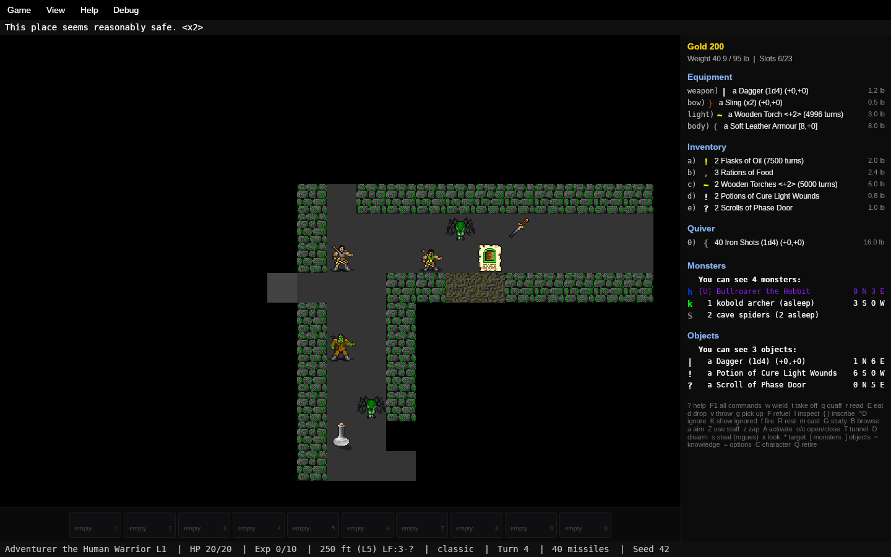

## Screenshots

| | |
|---|---|
| 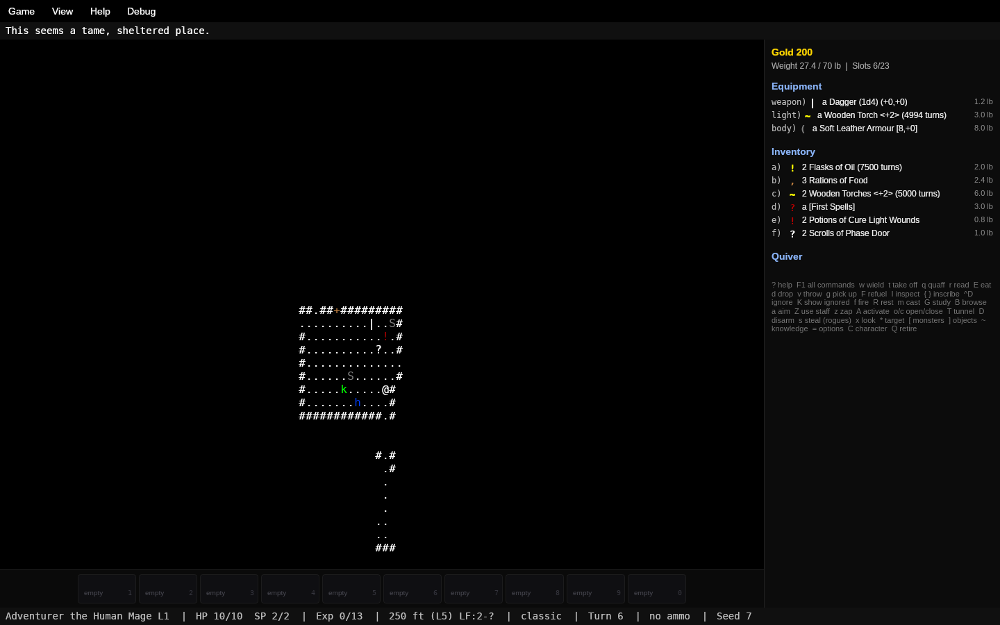 | 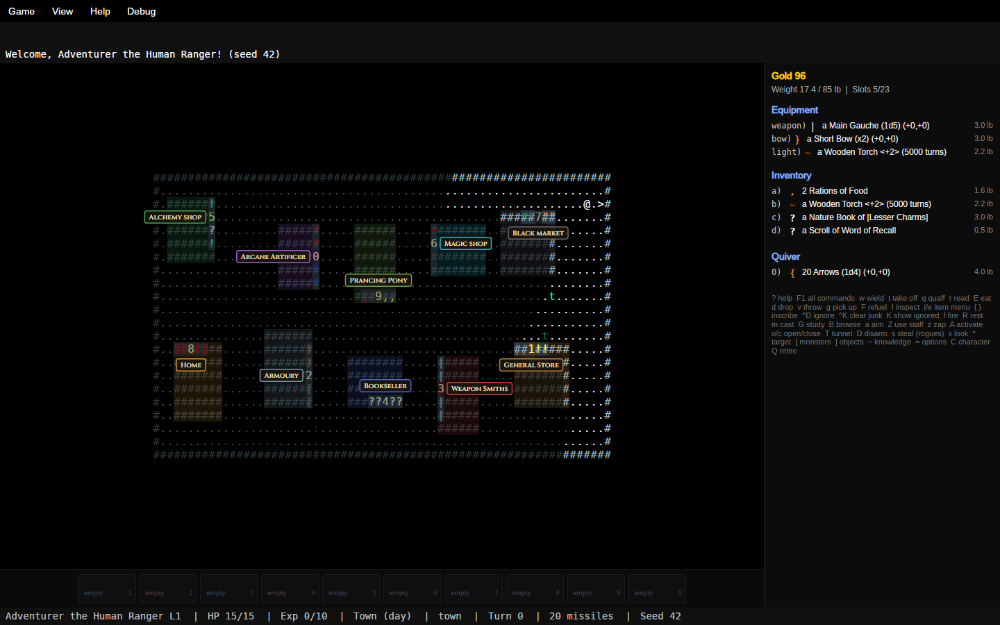 |
| Classic ASCII, the original look | The town (the numbers are the shops) |
| 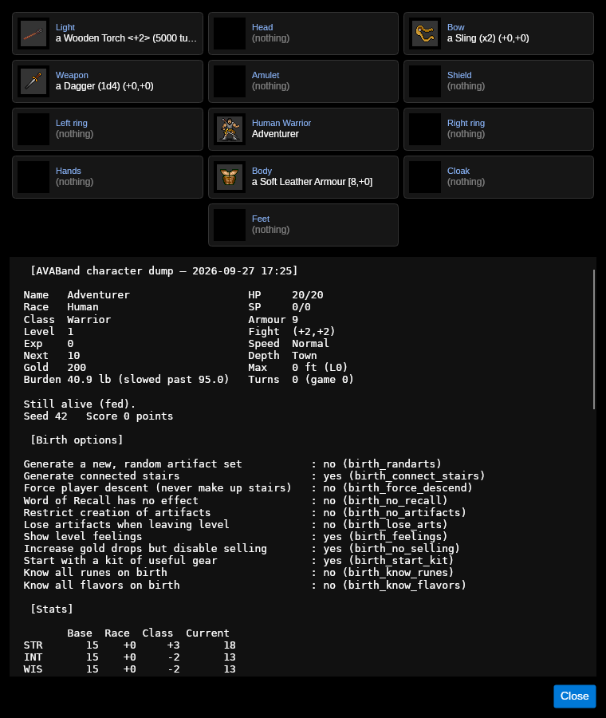 | 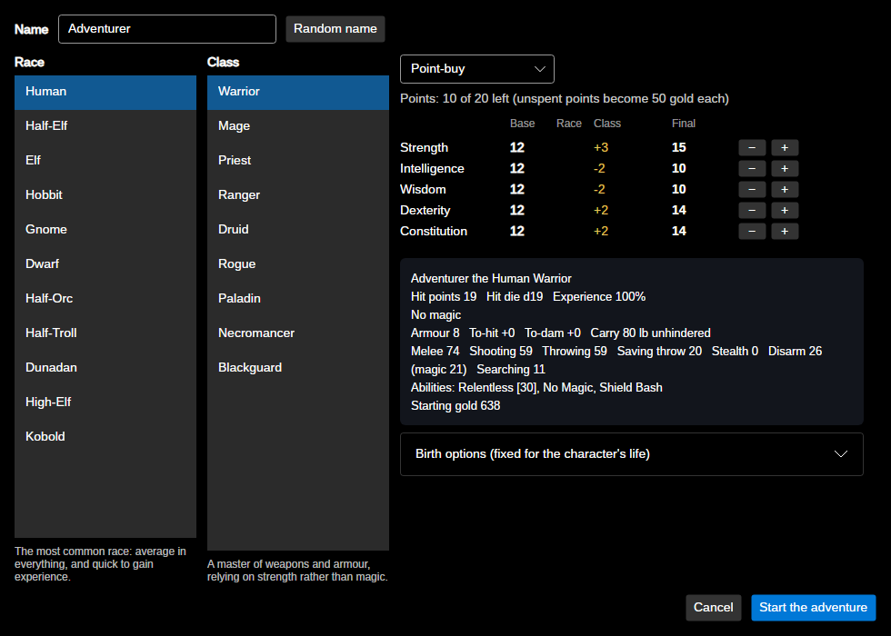 |
| Character sheet with paper doll | Character creation |
| 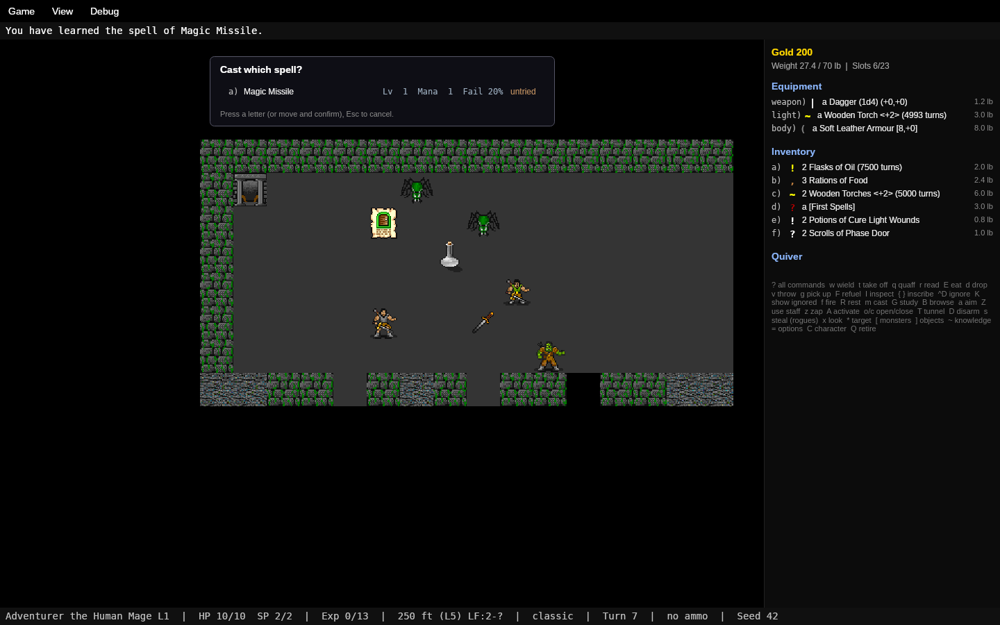 | 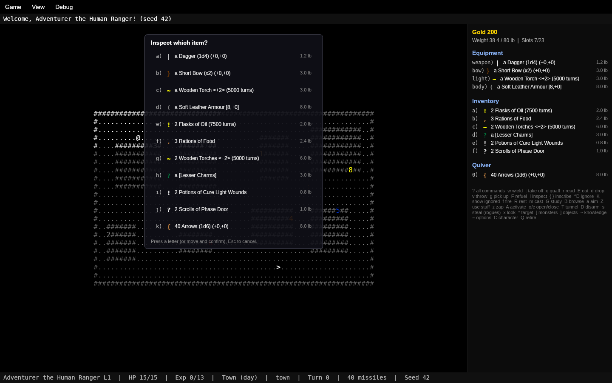 |
| Casting a spell | Choosing an item |
| 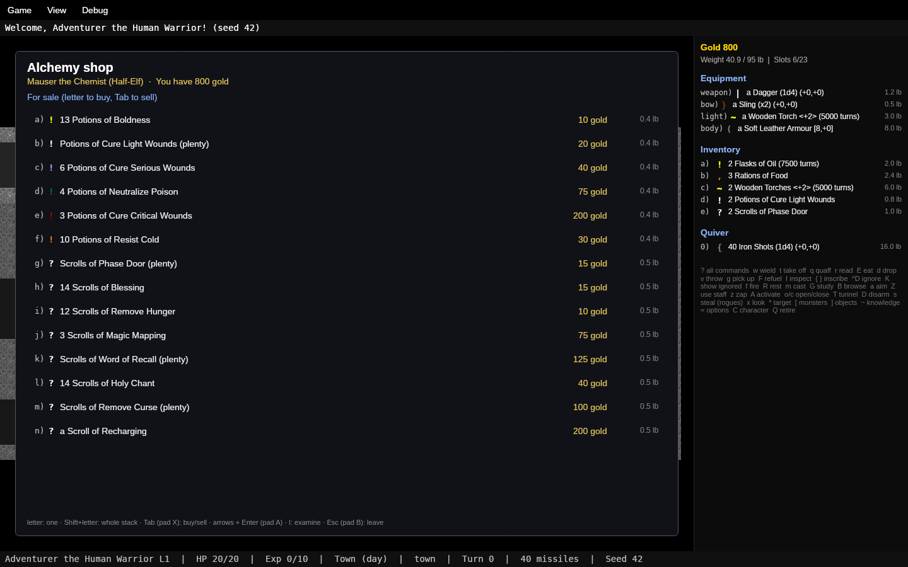 | 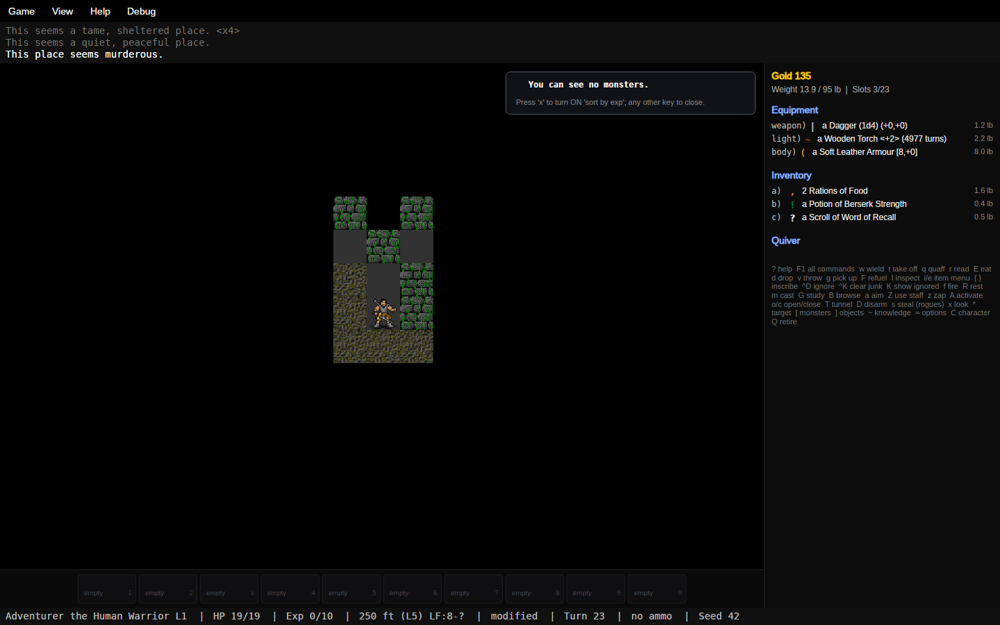 |
| The Alchemist (4.2's store stock) | Monster list (`[`) |
| 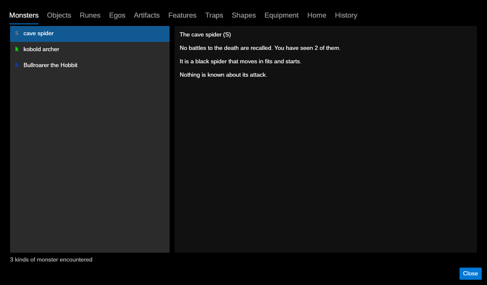 | 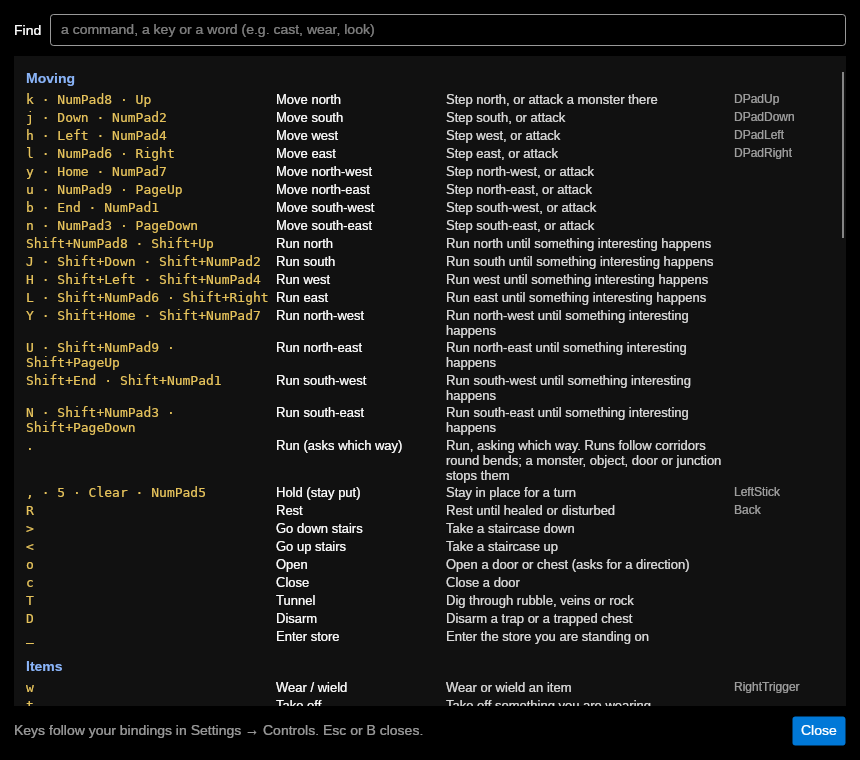 |
| Knowledge (`~`) | Keyboard commands (`?` or F1) |
| 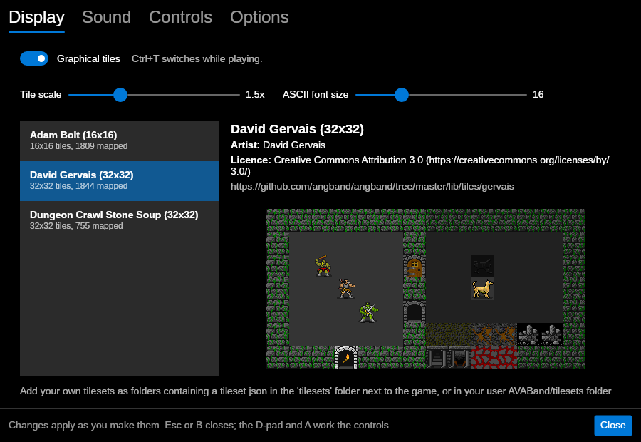 | |
| Settings | |

The screenshots are rendered by the real windows without a display, from fixed seeds:
`tools/screenshots.sh` regenerates them all (`tests/Angband.Avalonia.Tests/ReadmeScreenshots.cs`
sets up each scene).

## Download and run

Every push is built and tested by GitHub Actions (`.github/workflows/build.yml`), which then
publishes AVABand as a single self-contained file — no .NET install needed — for:

| Windows | Linux (glibc) | Linux (musl, e.g. Alpine) | macOS |
|---|---|---|---|
| `win-x64`, `win-x86`, `win-arm64` | `linux-x64`, `linux-arm64`, `linux-arm` | `linux-musl-x64`, `linux-musl-arm64` | `osx-x64`, `osx-arm64` |

Each build is attached to its workflow run; the newest build of `main` is also on the **latest**
pre-release, and tagging a commit `v*` (e.g. `v0.1.0`) makes a proper release. Unpack it and run
`AVABand` (`AVABand.exe` on Windows). The game data, tilesets and sound packs are inside the file;
saves, scores, monster memory and settings go to your user folder (`AVABand` under the system's
application-data folder).

Notes: the musl builds have no sound or gamepad support (OpenAL Soft and SDL ship no musl
libraries; the game runs silently without them). The macOS builds are not signed, so the first
run needs right-click → Open (or `xattr -d com.apple.quarantine AVABand`).

To build one yourself:

```
dotnet publish src/Angband.Avalonia/Angband.Avalonia.csproj -c Release -r linux-x64 --self-contained \
  -p:PublishSingleFile=true -p:IncludeNativeLibrariesForSelfExtract=true \
  -p:IncludeAllContentForSelfExtract=true -p:EnableCompressionInSingleFile=true -o publish/linux-x64
```

or just `dotnet run --project src/Angband.Avalonia` to play from source.

## Solution layout

```
AVABand.sln
├─ src/Angband.Core        Pure engine (no UI): RNG, geometry, world model, level generation,
│                          energy/turn scheduler, game session, commands, event bus
├─ src/Angband.Data        JSON content (data/) + DataLoader with mod layering
├─ src/Angband.Audio       Sound: OpenAL engine, WAV/Ogg/MP3 decoders, sound packs, event→sound director
├─ src/Angband.Input       Input actions, rebindable key/button bindings, SDL2 gamepad provider
├─ src/Angband.Avalonia    MVVM front end (CommunityToolkit.Mvvm), DrawingContext map control
├─ tools/                       angband_prf_to_tileset.py (Angband tileset converter)
├─ tests/Angband.Tests          xUnit tests for the core systems
└─ tests/Angband.Avalonia.Tests Headless UI tests (real window, simulated keyboard)
```

Dependencies flow one way: `Avalonia → Audio/Input/Data → Core`; `Tests → Audio/Input/Data → Core`.

## Determinism
All randomness comes from `GameRandom` (xoshiro256**, integer-only helpers, serializable state).
A `GameSession` created with a seed and fed the same commands replays identically; a
`LevelRequest(depth, seed)` always yields the same level.

## Implemented so far
- **Level generation** (`Angband.Core/Generation`), chosen per depth from `dungeon_profiles.json`:
  - `classic`: block-grid room placement, wandering tunnels that pierce room walls, junction doors,
    magma/quartz streamers with treasure. Rooms: simple, overlap, crossed, large (5 inner-room
    variants), circular, monster pits/nests, JSON templates, lesser/medium/greater vaults.
  - `fortress` (a classic-generator theme for depth 30+), `cavern` (cellular automata),
    `labyrinth` (perfect maze, may be lit/known/permanent), and `town` (8 shops, fixed per game).
  - Stairs, rubble, depth-gated traps, connected stairs, spawn hints and population budgets for
    the future monster/object systems. Every level is checked by `LevelValidator` (permanent border,
    stairs present, all walkable squares reachable); failed attempts are retried.
- **Turn system** (`Angband.Core/Time`): Angband's speed→energy table and a scheduler where the
  most energetic actor goes first, with world upkeep every 10 game turns.
- **Field of view & light** (`Angband.Core/Sight`): symmetric shadowcasting (exact integer
  slopes) out to `maxSight` (20); carried light sources (player torch radius 2); glowing rooms;
  bright terrain; glowing walls only seen from their lit side; blindness. Seen squares are stored
  in the player's `KnownMap` (which can go out of date, as in Angband); traps are revealed on sight.
  The town has day and night (`dayLength` 10000 game turns); at night only shop entrances glow.
- **Combat** (`Angband.Core/Combat`, `Game/GameSession.Combat.cs`): Angband 4.2 formulas —
  `test_hit` (12% auto-hit, 5% auto-miss, armour ×2/3, unseen targets halved), melee and missile
  criticals, fractional blows (leftover energy), slays/brands with immunities, missile range and
  distance penalty, armour soak, elemental resistance (data-driven divisors, double resist,
  immunity, vulnerability), monster criticals causing cuts/stuns, monster fear on damage,
  experience with fractional carry, death. `ProjectionPath` ports `project_path` (used for missiles
  and line-of-fire).
- **Status effects** (`Effects/TimedEffects.cs`, `timed_effects.json`): poison, cuts, stun
  (to-hit/dam penalty, knock-out), confusion (40% random steps), fear (no melee), paralysis
  (lost turns, non-stacking), blindness, slow/haste. Angband fixed-point HP regeneration, resting.
- **Monsters & AI** (`Game/GameSession.Monsters.cs`, `GameSession.MonsterSpells.cs`,
  `GameSession.MonsterPowers.cs`): 624 races in `monsters.json` — Angband 4.2's whole bestiary from
  the town to Morgoth, imported with `tools/angband_monster_import.py`
  (see *Game data from Angband* below) alongside 27 hand-written ones, with depth/rarity
  allocation with out-of-depth rolls, packs, vault/pit/nest population (one theme per pit).
  - **Groups and escorts**, as Angband 4.2 places them (`mon-make.c` `place_new_monster`,
    `place_friends`): each race's `friends` entries, imported from `monster.txt`, give a percent
    chance, a number (dice) and who comes — more of the same race, a named race, or any race of a
    base (e.g. "person", matched by its symbol, drawn for the leader's level). Groups shrink within
    five levels of their native depth (a wild-dog pack of 2d7 is halved on level 1), escorts more
    than four levels out of depth don't come at all, a group puddles out from its leader (others
    start within 5 squares) up to 25, and a unique escort comes once. So a soldier sometimes
    brings one or two more and a few "persons"; a hill orc on level 1 comes alone. Names are
    resolved as Angband's `lookup_monster` does (an exact name, else the first containing it).
  - Powers: thieves that steal gold or items and vanish in a puff of smoke (killing them returns
    the loot), eaters of food and light, stat drain (sustains protect; gaining a level restores),
    experience drain that can cost levels (hold life protects; Restore Life Levels undoes it),
    disenchantment, charge draining; invisible monsters (seen with see invisible), ghosts that
    pass through walls, tunnellers that bore through them, creatures of rock hurt by stone to mud.
    Spells: breaths of all thirteen elements and more, bolts, balls and beams (damage grows with
    the caster's level), wounds, mind blast and brain smash, drain mana, haste-self, forget,
    create traps, teleport away / level / to, darkness, heal kin, and summons of kin, animals,
    spiders, hounds, hydras, undead, demons and dragons. Vault letters place monsters of that kind.
  - **Mimics & lurkers** (`GameSession.Mimics.cs`, Angband `UNAWARE`): creeping coins look like a
    pile of gold, potion/scroll/ring/chest mimics like a tempting potion, scroll, ring or chest (drawn with that
    object's tile, named by look, remembered on the map and found by object detection), and lurkers
    and trappers like bare floor. They lie in wait — no moving or spells — until found out: bump
    into one ("The Potion of Healing was really a monster!"), let it strike from beside you, or hurt
    it with anything. Monster detection doesn't see through the disguise, they can't be targeted,
    and a revealed lurker is still invisible without see invisible.
  - Senses: sight via the symmetric FOV, **sound** by following the player's noise flow (hearing
    minus stealth/3), **scent** from the trail the player leaves (races with `smell`).
  - Behaviour: stealth-based waking; hunting; **wandering** when the player can't be sensed;
    **fleeing** toward safety (out of view, far along the sound flow), turning to fight when
    cornered; **pack tactics** (`GROUP_AI` waits out of sight while the player is in a corridor);
    **breeding** (`MULTIPLY`, capped per level); opening, unlocking and bashing doors; pushing
    past or trampling weaker monsters (`MOVE_BODY`/`KILL_BODY`).
  - **Spells** (`monster_spells.json`): arrows, boulders, bolts, balls, breaths
    (damage from the caster's HP), wounds, blind/confuse/scare/slow/hold (saving throw and
    protections apply), heal, blink, teleport, teleport-to, summon (kin), shriek. Bolts need a clear
    shot; non-innate spells can fail; frightened casters prefer escapes. As in Angband 4.2, a race
    has two frequencies, imported from `monster.txt`: `spellFrequency` (its `spell-freq`) for
    spells, and `innateFrequency` (`innate-freq`) for innate attacks — breaths, arrows, boulders,
    spit, shrieks — each "1 in N", a 100/N percent chance. Each turn it rolls for a spell first,
    then for an innate attack, and uses one of that kind (`make_ranged_attack`); taunting halves
    both chances. So a scout fires arrows 1 time in 3 but hastes itself only 1 time in 10, and a
    kobold archer shoots every other turn. Kinds with no frequency given use Angband's 1 in 4.
    Both chances double when the monster is exactly at its preferred range (below), so a kobold
    archer right beside you shoots every turn, as in 4.2.
  - **Combat ranges and morale** (`Game/GameSession.MonsterRange.cs`, 4.2's `get_move_find_range`):
    each turn a monster works out the least distance it will keep and the one it likes best. A
    monster that judges you too strong — your level against its level + 25 (+8 for some), and when
    close, your health against its own — keeps right away instead of closing in, though it isn't
    afraid: cornered beside you it fights. So a high-level character sees shallow monsters scatter,
    and a badly hurt monster of about your strength backs off. Monsters that never move, and
    casters that never strike, want 3 more squares (unless you're within 5); archers that shoot
    rarely and casters that cast often (over 24%) like 3 more; breathers in good health don't mind
    point blank. Taunting cancels it all.
  - **Bodyguards** (4.2's `bodyguard` escort role, `get_move_bodyguard`): the escorts marked so in
    `monster.txt` — Bolg's, Azog's and Uglúk's uruks, Gothmog's greater balrogs, the Queen Ant's
    army ants and five more — are bound to their leader. While it lives they never lose heart, and
    whenever they are more than a step from it they close back in (by a square nearer you, if there
    is one) rather than charging — unless it is out of sight and more than 10 squares off. When
    the leader dies they fight as ordinary monsters. The bond is kept in the save.
- **Character creation** (`Game/Birth.cs`, `races.json`; Game → New character, Ctrl+N): name,
  11 races (Human, Half-Elf, Elf, Hobbit, Gnome, Dwarf, Half-Orc, Half-Troll, Dunadan, High-Elf,
  Kobold) with stat/skill adjustments, hit dice, experience factors, infravision and innate
  abilities (free action, blindness/poison/light/dark resistance, regeneration); 9 classes; stats by
  Angband's 20-point point-buy (unspent points become gold) or Angband's rolled dice. Stats now
  matter: STR gives to-damage and carrying capacity, DEX to-hit and armour, WIS saving throw, CON
  hit points per level, INT/WIS spell points and failure rates. The screen previews the result by
  creating the character in the engine; Quick start reuses the last character.
- **Shops** (`Game/GameSession.Shops.cs`, `stores.json`): General Store, Armoury, Weapon Smiths,
  Bookseller, Alchemy shop, Magic shop, Black market and your Home, stocked as in Angband 4.2.5
  (`stores.json` is converted from `store.txt`; the upkeep follows `store.c`):
  - Four keepers per store, each with a purse (the most they pay for one item); one in 25 store
    days a keeper retires and another takes over (as when you buy a store out).
  - *Staples* (`always`) never run out: a full pile of 40 that buying doesn't reduce — the General
    Store's food, oil, torches, cloaks, shovels, picks and ammunition; the Alchemist's Cure Light
    Wounds, Phase Door, Word of Recall and Remove Curse; and every one of the ten town books at the
    Bookseller (the dungeon books are only found below). Enchanted copies of a staple sell out.
  - Other stock (`normal`) comes and goes: each store day up to `turnover` piles are sold to other
    customers (ammunition whole or down to a multiple of five; other piles one, half or all) and as
    many new ones made, keeping between the store's `minItems` and `maxItems` piles besides its
    staples, 24 at most. New stock gets magic for levels 1 to 5 (deeper once you've been below dlvl
    20), and is never damaged, cursed or worthless; cheap things come in piles (Angband
    mass_produce: 20 or 40 cheap arrows, up to 25 cheap potions...).
  - The black market makes anything from 5 to 20 levels below your deepest (never artifacts), but
    only what no other store sells, unless it is an ego item or well enchanted, and nothing under 10
    gold; it charges three times the value and pays a sixth.
  - Store days are counted only while you are in the dungeon, one per 10 × `storeTurns` (1000)
    game turns, and the stores catch up on them when you return to town.
  - Selling: stores pay two thirds of the value — the lower of what it is really worth and what you
    know it to be worth, so unidentified bonuses earn nothing — up to the keeper's purse, but by default (Angband
    4.2's *birth_no_selling*) nothing at all, with dungeon gold multiplied by the depth (up to 5×)
    instead; turn the birth option off for classic selling (`constants.json`'s `noSelling` sets its
    default). What you sell is identified, loses its inscription, joins a matching pile, and wands and
    staves the store deals in are recharged; lights are refuelled. With no selling on, the store says so
    and calls it giving (as 4.2's "Give which item?"), showing no price. What you are wielding or
    wearing is tagged *wielded* or *worn* in the list and is never sold, given or stored at a keypress:
    the store asks first (y/n, or Enter / controller A). Debug → *Shops pay gold when you sell*
    turns selling on mid-game.
  - Bought items are fully known. The home stores up to 24 stacks.
  Walk onto an entrance (or press `_` / Confirm on it) to open the store screen: letters buy or sell
  one, Shift+letter the whole stack, Tab (pad X) switches buying/selling, Esc (pad B) leaves.
- **Object values** (`Items/ObjectPower.cs`, `Items/ItemValue.cs`; Angband 4.2 `obj-power.c`): what
  things are worth, for store prices, level feelings and the like.
  - Wearables and ammunition are priced by their *power* (`object_power`): damage dice, to-damage
    (double off weapons), launcher multiplier and the ammunition it fires, extra blows, shots and
    might, slays and brands (by their `slay.txt`/`brand.txt` power, with extra for several), to-hit,
    armour for its weight, to-AC (steeply above +26), jewellery, modifiers (by `object_property.txt`
    power and type multiplier, plus a term for many stat bonuses), sustains, protections and
    abilities (more off weapons, with extra for sets), resistances (with extra for several low or
    high ones), an artifact's activation or a kind's effect (powers imported from `activation.txt`
    and `object.txt`), and curses (their own objects' power). A power *p* is worth *p × (p + 5)*
    gold — a long sword (2d5) 15 × 20 = 300, a (+5,+5) one 34 × 39 = 1326 — a twentieth of that
    for ammunition and ordinary torches, at least 1, and nothing if the power is negative.
  - Everything else costs its kind's price; wands and staffs a twentieth more per charge.
  - What you know (`object_value`): unlearned runes and curses don't count, and unfamiliar
    flavours are guessed at by type (20 for a potion or scroll, 45 for jewellery, 50 for a wand...).
  - Random artifacts are balanced with the same power.
  - Not modelled: items ignoring elements (only artifacts do, as in Angband), and each curse's own
    strength (AVABand's curses have none), so a curse costs its object's power.
- **Classes, levels & magic** (`Game/GameSession.Magic.cs`, `classes.json`, `realms.json`, `spells.json`):
  Warrior, Mage and Rogue (arcane), Priest and Paladin (divine), Ranger and Druid (nature),
  Necromancer and Blackguard (necromantic), each with skills that grow
  every 10 levels, stat adjustments, hit dice and a starting kit. Angband's experience table and
  level-ups (hit points, skills, spell points). Spells live in Angband 4.2's books (below); you study them
  once you reach their level (`G`), then cast them (`m`) with Angband's failure formula (base, minus
  3 per level above the spell, minus the stat bonus, plus 5 per missing mana point, with a stat-based
  minimum, which only ZERO_FAIL classes — mage, priest, druid, necromancer — can take below 5%).
  Casting without enough mana is allowed after confirmation but makes you faint. The first cast of
  each spell gives experience. Spell points regenerate like hit points.
  - **The books** (`spells.json` and `objects.json` follow Angband 4.2.5's
    `class.txt`): 20 books, 4 realms, 144 spells.
    - *Arcane*: [First Spells], [Attacks and Knowledge], [Magical Defences] (town), [Arcane Control],
      [Wizard's Tome of Power] (dungeon) — the mage's 30 spells, from Magic Missile, Electric Arc
      and Fire Ball through Acid Spray, Resistance, Tap Magical Energy and Mana Channel to Mana
      Bolt, Dimension Door, Thrust Away, Explosion, Banishment and Mana Storm; the rogue's 10.
    - *Divine*: [Novice's Handbook], [Cleansing Power] (town), [Healing and Sanctuary], [Battle
      Blessings], [Wrath of the Valar] (dungeon) — the priest's 28 (Orb of Draining, Spear of Light,
      Dispel Undead/Evil, Portal, Remembrance, Restoration, Glyph of Warding, Banish Evil, Word of
      Destruction, Holy Word, Spear of Oromë, Light of Manwë...) and the paladin's 16.
    - *Nature*: [Lesser Charms], [Gifts of Nature] (town), [Creature Dominion], [Nature Craft],
      [Wild Forces] (dungeon) — the druid's 27 (Stinking Cloud, Confuse/Slow Monster, Lightning
      Strike, Earth Rising, Trance, Mass Sleep, Púkel-man/eagle/bear forms, Tremor, Revitalize,
      Rapid Regeneration, Meteor Swarm, Rift, Ice Storm, Volcanic Eruption, River of Lightning...)
      and the ranger's 11 (Cover Tracks, Create Arrows, Decoy, Brand Ammunition...).
    - *Necromantic*: as below.
    - New kinds of spell (`Game/GameSession.RealmMagic.cs`): bolts that are sometimes beams (one
      time in the caster's level %, half that for non-mages — Angband BEAM), short beams, arcs
      (cones), strikes (explosions right at the target), meteor swarms, spheres around the caster,
      holy orbs (double against evil), trap and life detection, doors made and unmade, tapping a
      wand or staff for mana, Mana Channel (spells take ¾ of a turn), Dimension Door (to the target),
      holding the monsters next to you, targeted tremors, healing 30 a turn, covering your tracks
      (no scent, unseen beyond a quarter of sight), arrows made from a staff, branded ammunition,
      and decoys (monsters that can see one go for it, and break it). Spells that pick an item
      (recharging, tapping, arrows, branding) choose the likeliest one rather than asking.
    - Class abilities that come with them (`class.txt` player-flags): BEAM (mages), ZERO_FAIL,
      CHARM (druids' sleep, confusion and holding are half as strong again against animals),
      FAST_SHOT (rangers: +0.1 shots per 3 levels with a bow), BRAVERY_30 (warriors fear nothing
      from level 30), and SHIELD_BASH for warriors too.
    - Older saves: the four original books become their 4.2 successors, and spells no longer in
      the game are forgotten (the rest, kept under the same names, stay learned).
  - Effects: bolts and balls (damage falls off with distance, immune monsters take 1/9,
    vulnerable ones double), light that burns light-sensitive monsters, detection (monsters, evil,
    objects), mapping, teleports (range can scale with level: `teleport:L*3`), stone to mud,
    healing and curing, blessing, heroism, regeneration, temporary resistances, identify rune,
    dispel curse. Spell strength scales with level through expressions like `3+(L-1)/5`, and
    braces put them inside dice: `bolt:nether:{L/4+3}d4`, `timed:berserk:{L+5}+1d{L+5}`.
- **Rogue, Paladin, Necromancer, Blackguard** (`Game/GameSession.ClassMagic.cs`; stats, skills,
  hit dice and spell levels/mana/failure from Angband 4.2.5's `class.txt`; mechanics checked against
  its source):
  - *Rogue* (arcane, from level 5; 10 spells in [First Spells] and [Arcane Control]: detect
    monsters, phase door, object detection, detect stairs, recharging, reveal monsters, teleport
    self, Hit and Run, teleport other, teleport level). `s` + direction **steals** from an adjacent monster (Angband
    steal_monster_item): its guard (level, ×4/3 for uniques, plus its speed over yours, halved while
    asleep) plus the item's weight against your stealth and dexterity. A clean theft barely stirs it,
    a near miss wakes it, a bungle makes it cry out and wakes everything in sight. Monsters carry
    their treasure as in Angband: it is rolled into their pack the first time anyone tries, so what
    you steal is what they would have dropped. For other classes `s` still holds.
  - *Paladin* (divine; 16 prayers in [Novice's Handbook], [Healing and Sanctuary] and [Battle
    Blessings]): +2 to-hit and to-dam with a hafted or blessed weapon,
    and **shield bashes**.
  - *Necromancer* (the new necromantic realm, "rituals" you *perform*; 21 rituals in four new books
    — [Into the Shadows], [Dark Rituals] and [Fear and Torment] in the Bookseller, [Deadly Powers]
    in the dungeon): **unlight** — they start with the torch in the pack, see squares within
    1 + level/6 without light, resist darkness, get one less light from lamps, and fail 25% more
    often on a lit square. Rituals: nether bolt, sense invisible, create darkness, bat form, read
    minds (detect minds and map around them), tap unlife (drain an undead into mana), crush (kill
    everything in view under 4× your level in HP, at a cost), sleep evil, shadow shift,
    disenchant, frighten, vampire strike (leap to a living monster and drink), dispel life, dark
    spear, warg form, banish spirits, annihilate, Grond's blow, unleash chaos, fume of Mordor
    (darken and map the level), storm of darkness.
  - *Blackguard* (necromantic; 13 rituals): **combat regeneration** as in Angband — mana doesn't
    return with rest but ebbs at half the normal rate (the loss healing them), each attack gives 5%
    of it, losing X% of hit points gives X% of it, and casting heals a little; they heal slowly
    (IMPAIR_HP) and shield-bash. Rituals: seek battle, berserk strength, whirlwind attack (blows at
    every neighbour), shatter stone, leap into battle (run up to 4 squares, a quarter of the blows
    lost per square), grim purpose (no slowing, paralysis or confusion), maim foe (stunning blows),
    howl of the damned, venom (poison-coated weapon, ×3), werewolf form, unholy reprieve, forceful
    blow (knock-back), quake.
  - **Shield bash** (Angband attempt_shield_bash): with a shield, against a monster at least half
    your level, a chance (melee skill/8 + DEX, ×4 unarmed, ×2 with a puny weapon, out of 200 +
    its level) to slam it first; damage from the shield's dice (shields now have Angband's
    1d1–1d6), weight and your skill and level; it may stun or confuse, and you may stumble and lose
    part of the turn.
  - The later spells (`Game/GameSession.ArenaAndCommand.cs`), from the 4.2.5 source:
    - *Hit and Run* (rogue, 23): after the next attempt to steal, "You vanish into the shadows!" (a
      short teleport).
    - *Relentless Taunting* (blackguard, 24): monsters are half as likely to cast or shoot.
    - *Bloodlust* (blackguard, 30): +1 to-dam per 2 points and +1 blow per 20; each kill adds 10 (to
      50) and may confuse you; blows sometimes scramble your stats or drain CON; as it fades you may
      cry out in pain, bleed or slow; and while hit points + bloodlust + level stay non-negative
      "your lust for blood keeps you alive"; a kill may also bring on a few turns of hallucination.
    - [Corruption of Spirit] (a new dungeon necromantic tome): *Power Sacrifice* (50 hit points for
      50 mana), *Zone of Unmagic* (disenchantment around you, you included), *Vampire Form* (a quarter
      of your hit points, then your bite heals you as it drains the living — the vampire shape now
      does this, as in `shape.txt` — and you leap to feed), *Curse* ((level/12 + 1) dice of 50 plus
      the percentage of hit points the target has already lost, at a cost of 100 of yours) and
      *Command*: a monster that fails its save is yours for 5+1d10 turns — the direction keys move
      it instead of you, walking it into another monster attacks with its blows (no experience for
      you), holding keeps it still, and anything else lets it go.
    - *Clairvoyance* (paladin and priest, 37, in [Healing and Sanctuary]): lights, maps and senses the
      whole level.
    - [Battle Blessings] (a new dungeon holy book): *Smite Evil* (blows slay evil ×2), *Demon Bane*
      (demons ×5), *Enchant Weapon* (1d4 tries at each bonus), *Enchant Armour* (1+1d3 tries) and
      *Single Combat*: you and the target are sealed in a stone cell until one dies (monsters of high
      level may resist); the level waits, and when you win you're back where you stood. No recall,
      deep descent or teleport level from the cell; a save made mid-duel keeps both levels.
  - Enchanting now rolls its dice ("1d4" was read as one try).
- **Items** (`Angband.Core/Items`, `Game/GameSession.Items.cs`, `GameSession.Devices.cs`): 373 object
  kinds, 89 egos and 124 artifacts (most of Angband 4.2's, imported by `tools/angband_object_import.py`
  and `tools/angband_ego_artifact_import.py`), 11 curses, per-game flavours (potion colours, ring
  stones, wand metals, staff woods, mushroom caps, random scroll titles). Weapons and armour up to
  mithril and dragon scale mail, crowns; rings and amulets with rolled bonuses (Angband's
  `B+dXMY` values: Strength `1+M5`, Protection `5+d5M10`...); gear can raise stats and grant
  see invisible, free action, sustains, hold life, regeneration, slow digestion and telepathy.
  - **Magic devices**: wands (`a` aim), staffs (`Z` use) and rods (`z` zap) with charges or
    recharge times, used with Angband's device skill (per class and race). Bolts, beams, balls,
    dragon breath, monster slow/confuse/sleep/hold/stun/scare, teleport other, polymorph, clone,
    drain life, stone to mud, lines of light, trap disarming, wonder; staffs of detection,
    mapping, curing, healing, dispelling, slowing or sleeping all in view, speed, teleportation,
    earthquakes and *Destruction*.
  - **Activations** (`A`, Angband's `act`/`time` from `activation.txt`): 58 artifacts and 18 kinds —
    dragon scale mail breathes (multi-hued, balance and the like pick one of their elements each
    time), rings of Flames/Acid/Ice/Lightning fire a ball and grant a temporary resistance, the
    Phial lights the room, Narthanc/Nimthanc/Dethanc shoot bolts, others heal, haste, map, detect,
    recall, teleport, restore life levels, dispel evil, drain life... Only worn items activate; it
    uses the device skill (harder for deeper items), aimed ones target the nearest monster or ask
    for a direction, then the item recharges (shown as *(charging)*, with a message when ready).
    Inspect describes the activation and its recharge time. Not imported: Probing, Door
    Destruction and Banishment (three artifacts).
  - **Potions & scrolls**: stat gain (and Brawn-style trades), restore life levels, experience,
    healing to *Healing* and Life, restore mana, heroism, berserk strength, resistances, true
    seeing, infravision, enlightenment; Word of Recall (to your deepest level and back), Deep
    Descent, Teleport Level, enchanting, recharging, acquirement, protection from evil,
    banishment of everything nearby, summoning, aggravation and more.
  Generation ports Angband's `m_bonus` and `apply_magic` (good/great/bad rolls, egos, artifacts
  created once per game, cursed bad items), plus depth-scaled gold and monster drops
  (`DROP_60/90/1/2`, `DROP_GOOD/GREAT`, `ONLY_GOLD/ITEM`).
  - 4.2 rune-based identification: properties (accuracy, slays, brands, resistances, curses,
    modifiers) are learned once and then recognised everywhere; hitting teaches a weapon's runes,
    being struck teaches armour's, element damage teaches resistances; flavours are learned by use.
  - Pack (23 slots), quiver (every 40 missiles use a slot), 12 equipment slots, weight limit with
    speed penalty. Equipment drives armour, to-hit/dam, speed, stealth, blows, shots (counted in
    tenths, as Angband's SHOTS[10] is one extra shot) light and resistances. Torches burn out; lanterns refuel from flasks of oil.
  - Stacking follows 4.2's `object_stackable`: the same kind with the same enchantments, dice,
    modifiers, resistances, flags, curses and ego stacks (up to 40), so identical armour and
    weapons stack too ("2 Soft Leather Armours"; wielding takes one); artifacts and chests never do,
    nor gear recharging an activation. Wands and staves stack whatever their charges — the stack
    shares them ("2 Wands of Magic Missile (10 charges)"), and splitting it shares them out.
    Rods stack whatever their recharging: the stack keeps one recharge timer that counts one rod
    per recharge time, so you can zap while any rod is ready ("3 Rods of Treasure Location
    (1 charging)"), they recharge together, and one taken off the stack takes its share of the time.
  - Commands: pick up, drop, wield, take off, quaff/read/eat, throw (oil burns), fire (missiles land
    on the floor or break), refuel. Gold and matching ammo are picked up automatically.
- **Save/load** (`Angband.Core/Persistence`): the complete game state — RNG state, player,
  pack/quiver/equipment, rune and flavour knowledge, the current level (terrain, traps, locks,
  monsters with their AI state, floor objects, map memory, scent), stores, created artifacts, killed
  uniques and the scheduler (including actors still due to move this game turn) — as versioned,
  gzipped JSON. Game data is referenced by id, so saves survive reordered or extended data files;
  missing ids, damaged files and saves from newer versions are rejected with a clear message. A loaded
  game continues exactly as the original would have (tested by playing both side by side).
  Saves live in `<AppData>/AVABand/saves/` (one file per character, written atomically). Ctrl+S
  saves, Ctrl+O opens the list of saved characters (load or delete). The game autosaves on every
  level change, when switching characters and on exit, and continues the most recent living
  character on start-up. Death deletes the save (permadeath).
- **Character dumps and scores** (`Angband.Core/Records`): `C` opens the character sheet, a
  plain-text dump in the style of Angband's (summary, stats with race/class adjustments, skills,
  a per-slot resistance grid that shows unknown runes as `?`, equipment, pack, quiver, home, spells
  with failure rates, uniques slain, last messages), under a **paper doll**: your character in
  the middle and each piece of equipment where it is worn — head, amulet, body armour and boots
  down the centre, light, weapon, left ring and gloves on one side, bow, shield, right ring and
  cloak on the other — drawn with the map's own tiles (or coloured letters in ASCII mode), named,
  and described in full on hover. While the sheet is open the doll keeps up with the game: putting
  things on or taking them off, a torch burning down, a rune learned, hit points colouring the
  `@`, or a change of tiles redraw it (the text below stays as it was when opened). "Save to file" writes it to
  `<AppData>/AVABand/dumps/`. Ctrl+H shows the high-score table (`<AppData>/AVABand/scores.json`,
  top 100). Points follow Angband: experience + 100 × max dungeon level, ties going to the fewer
  turns. The living character is shown where they would place, without entering the table. On
  death the score is recorded, a dump is written automatically and the table opens with the new
  entry highlighted.
- **Hunger** (`Game/GameSession.Hunger.cs`, food thresholds in `constants.json`): Angband 4.1's
  model. Every 100 game turns you digest twice your per-turn energy (so speed makes you hungrier),
  +30 with regeneration, a fifth with slow digestion. Levels: Starving < 100 ≤ Faint < 500 ≤ Weak
  < 1000 ≤ Hungry < 2000 ≤ Fed < 10000 ≤ Full < 15000 ≤ Gorged. Weak and Faint slow hit point
  regeneration (Starving stops it), Faint characters pass out now and then, Starving ones take
  damage and can die of it, and Gorged characters are slowed (−10). Changes are announced (and play
  the `HUNGRY` sound when worse); getting hungry interrupts resting. New characters start just below
  Full. Food: rations, slime molds, biscuits; Scroll of Satisfy Hunger (alchemist) fills you to just
  below Gorged. New gear: Amulet of Slow Digestion and Ring of Regeneration (their runes are
  learned on wearing). The status bar shows the level whenever you're not simply Fed.
- **Chests & traps** (`Game/GameSession.Traps.cs`, `chest_traps.json`): Angband's six chests —
  small and large, wooden, iron and steel — with its chest traps: one in ten is merely locked,
  the rest get a trap for their level (gas, poison needles, summoning runes, paralysis gas, an
  explosion that destroys the contents), sometimes two or more. The chest shows its state:
  *(Locked)*, *(Gas Trap)*, *(Multiple Traps)*, *(Disarmed)*, *(Empty)*. `o` opens a chest
  next to you (or underfoot: `o` then `5`): the lock is picked with the disarm skill (less the
  trap value; always at least 2%), the traps go off, and out come one, two or three good objects
  (wooden, iron, steel) from five levels deeper — great ones from large chests. `D` disarms a
  chest or a floor trap: success removes it (and teaches experience), a near miss can be retried,
  a bad fumble sets it off. Blindness, darkness and confusion cut the skill to a tenth.
  Floor traps now do what they say: pits and spiked pits hurt (and cut), darts (which can miss
  against your armour) slow or weaken, gas poisons, confuses or puts you to sleep (resistances
  and free action protect), runes burn, corrode, teleport or summon, sirens wake the level, and
  trap doors drop you to the next level.
- **Monster memory** (`Monsters/MonsterLore.cs`, `Records/MonsterRecall.cs`, `Game/GameSession.Lore.cs`):
  Angband's lore, shared by every character in `<AppData>/AVABand/lore.json` (kills per character
  travel in the save). It records sightings, kills, the characters each monster has slain, every
  attack watched, spells seen cast, and what play reveals: obvious traits at first sight (unique,
  sex, never moving), what kind of creature it is from its corpse, resistances and weaknesses when
  elements, light, known brands or stone to mud strike it (whether it has them or not), "evil" from
  detect evil and slays, immunity to
  confusion/sleep/fear/stun from wands that fail, breeding, passing or boring through walls, and
  invisibility. Recall writes it out as Angband does — kills and deaths, the description, depth and
  speed (once killed or seen often), experience value, armour and life (after 3 kills), nature and
  resistances, spells and attacks (with damage after 10 of each).
  - **Resistances, found by testing them** (Angband 4.2 `project_m` and `lore_append_abilities`):
    a visible monster hit by your spell, wand, beam of light or known brand shows whether it resists
    or is hurt by that element either way, so recall can say "It is hurt by fire, but resists cold,
    and does not resist acid or lightning, and cannot be slept". Light or stone to mud that doesn't
    hurt a monster counts as resisted (Angband's own wording). Probing marks every element tested.
  - **Its spells** (`lore_append_spells`, with each spell's lore phrase and colours imported from
    `monster_spell.txt` into `monster_spells.json`): innate attacks, breaths and spells in separate
    sentences — "It may fire small arrows (6)", "It may breathe fire (29)", "It may cast spells
    intelligently which produce fire bolts (72), confuse, or blink-self". The most a spell can do is
    shown; for a breath, only once one has been killed (its life is known then). Wound spells are
    described by power (light to mortal wounds). Each sentence gives its own frequency (innate or
    spell), guessed as Angband does ("about 1 time in 2") once one is seen, and known after 50
    innate attacks or 50 spells.
  - **Colours**: each spell is shown green, yellow, orange or red for how dangerous it is to *you*,
    given the resistances, protections and saving throw you know you have (gear whose rune you
    haven't learned doesn't count), as Angband's `spell_color` does; resistances are umber and
    weaknesses violet. The recall window (now wrapped) and the Monsters tab of `~` both show them.
  `x` looks at visible monsters in turn — "The cave orc (wounded, asleep)" — with `r` for the
  recall and Esc to stop; the Monsters tab of `~` (Game → Knowledge) lists everything met, with kills.
- **Monster and object lists** (`Game/GameSession.Lists.cs`, `ViewModels/MainWindowViewModel.Lists.cs`;
  Angband 4.2's `mon-list.c`/`ui-mon-list.c` and `obj-list.c`/`ui-obj-list.c`):
  - `[` lists the monsters you can see — "You can see 3 monsters:" — one line per race: "[U]" for
    uniques (in violet), a count otherwise, how many are asleep, and for a lone monster where it is
    ("2 N 4 E"). Monsters out of depth are red. Those you only sense (detected, out of line of
    sight) follow under "You are aware of 2 other monsters:". Deepest first; `x` re-sorts by the
    experience a kill would give you, any other key closes the list.
  - `]` lists the objects you know of on the level, each with where it is: piles in view, then
    ("You are aware of...") things seen or sensed elsewhere as you last saw them. Gold and ignored
    items are left out. Known artifacts come first (violet), then kinds you haven't learned (light
    red), then the rest by type, nearest first; worthless things are slate.
  - Angband's subwindows: View → *Monster list in the sidebar* / *Object list in the sidebar* keeps
    either list below the inventory, updated every turn (remembered in the settings).
  - AVABand remembers only the top object of a pile out of view, so such piles list that one item.
    While you hallucinate the monster list just says "Your hallucinations are too wild to see
    things clearly."
- **Targeting** (`Game/GameSession.Targeting.cs`, `ViewModels/MainWindowViewModel.Targeting.cs`):
  Angband's look/target cursor. `*` (or numpad `*`) steps through the monsters you could shoot,
  nearest first (space/`+` next, `-` back); `x` does the same for every visible monster. A yellow
  box marks the cursor; `p` or any direction key frees it to roam (the view follows it), describing
  each square. `t`, `5` or Enter targets the monster or spot under the cursor, and a click in
  cursor mode targets the clicked square; `r` recalls the monster there. The target is marked with
  red corners and named on the status line. Firing, throwing, aimed spells, wands, rods and
  activations aim at it while it stays alive, in view and in a clear line (at any range — a
  short-ranged shot just falls short); otherwise they aim at the nearest monster. In a direction
  prompt (stone to mud and other lines), `t`, `'` or Enter means "toward the target". Changing
  level clears it.
- **Special effects** (`Game/GameSession.Special.cs`): the last of Angband's item effects.
  *Banishment* (scroll, staff, Celeborn's activation) asks for a monster letter and removes every
  non-unique of that kind from the level, at 1d4 hit points each; *probing* (rod, Olórin) shows
  hit points and reveals everything in recall; *door destruction*; a *rune of protection* inscribes
  a glyph of warding that monsters must break to reach (d550 against their level) and can't attack
  through; *monster confusion* makes your hands glow until the next blow confuses its target;
  *curse weapon/armour*; items with random outcomes (potion of Surprise, scrap of flesh, mushroom
  of Debility); stat *scrambling*; and the mushrooms of Terror (+10 speed, too afraid to fight),
  Stoneskin (+40 armour, −5 speed), Sprinting (+10 speed, then exhausted) and Shadows (+10 stealth).
  **Shapechanges**: Angband's eight player shapes (`shapes.json`, from `shape.txt`) — fox, Púkel-man,
  bear, eagle, bat, warg, vampire, werewolf — change your bonuses, protections and the verbs of
  your blows; in a shape items and spells ask to change you back first. Druids learn *Fox Form*
  ([Lesser Charms], level 1), *Become Pukel-man*, *Eagle's Flight* and *Bear Form*; the potion of Surprise may turn you into a bat. Monsters with the
  SHAPECHANGE spell take one of their shapes (Sauron becomes Wolf-, Serpent- or Vampire-Sauron;
  the Maiar become elementals and vortices) and later change back, dying as what they really are.
- **Quests** (`Game/GameSession.Quests.cs`, `quests.json`, from Angband's `quest.txt`): Sauron
  waits on level 99 (4950 ft) and Morgoth on level 100. A quest level always holds its guardian,
  has no down staircases or trap doors, and nothing — Deep Descent, trap doors, teleport level —
  carries you past an unfinished quest. Quest monsters (`QUESTOR`) never appear at random or by
  summoning, and `FORCE_DEPTH` monsters are never out of depth. Killing Sauron raises a magical
  staircase where he fell; killing Morgoth wins the game (*WINNER* on the status line and in the
  character dump). A winner can keep playing and retire when ready (`Q` or Game → Retire, with a
  confirmation): the game ends and the victory goes on the high-score table as *Retired
  victorious*. Quest progress is saved and shown on the character sheet.
- **Vaults & rooms** (`templates/*.json`): 69 interesting rooms and 93 lesser, medium and greater
  vaults (65 and 89 of them Angband's, via `tools/angband_vault_import.py` — all but 8 sealed by
  permanent rock). Many vaults, as in Angband, are entered by tunnelling through their granite,
  and some treasure pockets are sealed: level generation leaves those alone instead of carving a
  way in. The template legend gained Angband's deeper monster/object symbols and letters for
  monsters of a given kind. As in Angband 4.2 (`get_vault_monsters`, `build_vault`): a letter's
  monster is drawn at the level's depth in an interesting room and 2/4/6 deeper in a
  lesser/medium/greater vault, placed awake and without escorts, and left out if no monster of
  that symbol is native that shallow (the "Birds of a feather" room stays mostly empty on level 1,
  where no bird is native); `,` (Angband's `1`) is a monster (50%), else an object (50%), else a
  trap (25%), at the level's depth. Interesting rooms are as rare as in 4.2's usual profile —
  about 1 room in 60 on level 1.
- **Tunnelling** (`Game/GameSession.Tunnel.cs`; `T` + direction): Angband 4.2's digging. Skill
  comes from race (dwarves +40), Strength (`adj_str_dig`) and the best tool carried — the wielded
  weapon or any digger in the pack (shovel, pick, mattock: +20 per point of digging, plus a tenth
  of the weight; egos *of Digging* and *of Earthquakes*). Each attempt succeeds with a chance out
  of 1600: rubble 8×skill, magma 4×(skill−10), quartz 2×(skill−20), granite skill−40, doors
  (4×skill−119)/3. The command repeats up to 99 times, stopping when you're hurt or a new monster
  comes into view; hopeless rock just gets one futile chip. Rubble may hide an object, treasure
  veins give gold, secret doors are found, permanent rock and the level edge refuse. The General
  Store sells shovels and picks; the character sheet shows your digging skill.
- **What breaths, balls and bolts do besides damage** (`Game/GameSession.ElementEffects.cs`, 4.2's
  `project-player.c`): acid, lightning, fire and cold harm your pack — each vulnerable thing may be
  destroyed ("One of your Scrolls of Phase Door was destroyed!"), weapons and armour lose a point
  of enchantment instead, rods are four times safer, and immunity, artifacts, what you wear and
  things proof against the element (a Lantern against fire, Mithril arrows against acid and fire,
  egos *of Resistance*…; 4.2's IGNORE flags) are spared; elemental melee blows do it too. Very
  strong fire and cold (from casters of level 80+) may also drain STR or DEX, blind, poison or
  wither your life. Poison poisons; light and darkness blind (strong light also dazzles, strong
  darkness drains experience and slows); sound stuns (and strongly, disorients); shards cut; nexus
  scrambles your stats and teleports you — to the breather, off the level, or far away; nether
  drains experience (hold life or resistance protect; strong nether dulls the mind and saps
  energy); chaos hallucinates, confuses and drains; disenchantment dulls your gear; water confuses
  and stuns; ice cuts, stuns and chills the pack; gravity warps you a few squares, slows and stuns;
  inertia slows; force stuns and throws you back; time drains experience or stats; plasma stuns.
  Resisting the element (or the status — free action, protection from confusion, stunning,
  blindness) stops the side effect as in 4.2. Plasma, ice, water, gravity, inertia, force and time
  are their own kinds now, not fire and cold: no gear resists them, as in 4.2.
- **Hallucination** (`image`, Angband's TMD_IMAGE; `Game/GameSession.Search.cs` and the map view):
  the Mushroom of Emergency, monster blows that "cause hallucinations" (a magic mushroom patch's
  spores, a silent watcher's gaze…), chaos (which also confuses and drains experience) and a
  blackguard's bloodlust bring it on; resisting chaos keeps the mind clear. While it lasts every
  monster and object you see looks like a random one, a new one each turn; looking or clicking says
  only "something strange" (and monster recall is refused); the monster list is "too wild to see";
  disarming and picking locks are ten times harder, stealing four times, devices a fifth; and
  secret doors aren't noticed. The Mushroom of Clear Mind, the Potion of Life and the Staff of
  Holiness cure it; resting waits it out.
- **Secret doors** (`Game/GameSession.Search.cs`, Angband 4.2's `search()`): there is no search
  command, as in 4.2. Any secret door beside you is found by itself after every step, when you hold
  still (`5` / `,`) and when you arrive on a level ("You have found a secret door.", which stops a
  run) — unless you are blind, confused or standing in the dark. It becomes an ordinary closed door,
  locked one time in four. The rogue's *Find Traps, Doors and Stairs* reveals those within range.
- **Object knowledge** (`Records/ObjectInfo.cs`, `ViewModels/KnowledgeViewModels.cs`): Angband's
  knowledge menu and object info. `~` (Game → Knowledge) opens one window with five tabs:
  *Monsters* (the recall browser above), *Objects* (every kind the character has seen — on the
  floor, carried or in a shop — grouped by type; unidentified flavours are listed by appearance
  and say only whether you have tried them), *Runes* (those learned, out of every rune in the game,
  each explained), *Egos* (identified ego types, with the bonuses they can give) and *Artifacts*
  (identified artifacts, with their full properties, activation and story). Each line opens a
  description built from what the character knows: damage or armour, launcher multiplier, light
  fuel, charges and recharge time, the effect in plain English ("When quaffed, it heals 20 hit
  points or 15% of your hit points, whichever is more, cures blindness and reduces cuts" — written
  from the effect strings, merging stat gains and temporary resistances), the activation, the
  known runes (modifiers, slays and brands with multipliers, protections, abilities, curses) and
  the kind's description. `I` (Inspect) now uses the same text. What has been seen is saved with
  the character; browsing never creates objects or uses up artifacts.
- **Options** (`Game/GameOptions.cs`, `Game/GameSession.Options.cs`,
  `ViewModels/MainWindowViewModel.Options.cs`; `=` or Game → Options, the last tab of Settings):
  Angband 4.2.5's options menu (`list-options.h`), each behaving as in its source.
  - *User interface* (kept in `settings.json`, for every character): show damage ("You hit the
    orc (12)."), use old target (off: aimed commands take the nearest monster), always pick up /
    pick up items matching the pack (each object picked up costs a tenth of a turn), show flavours
    ("an Icky Green Potion of Speed"), disturb whenever a viewable monster moves (a monster coming
    into view always stops running, travel and tunnelling; with this on, one in view moving does too), notify
    on recharge; and display options: highlight target, highlight player, solid walls, shaded
    walls, yellow torchlight, centre the map continuously (off: Angband's panel scrolling, when
    within 3 squares of the edge), purple uniques, player colour by hit points, mouse movement,
    and speed as a multiplier ("Fast (x2.0)"). Defaults are Angband's, except that use old target,
    yellow torchlight and centring start on, as AVABand has always behaved.
  - *Birth* (chosen on the creation screen, fixed for the character's life, saved with it, listed
    in the character dump): random artifacts (below), connected stairs, forced descent (up stairs do nothing; stairs, recall
    and teleport level go below the deepest level reached), no recall (until Morgoth is dead), no
    artifacts, lose artifacts (otherwise an artifact left behind that you never found can turn up
    again), no selling, the starting kit (without it only one food and one light, the rest as
    gold), know all runes, know all flavours.
  - *Cheat*: peek into monster creation (uniques on the level), peek into dungeon creation (the
    level profile and its vaults), and avoid death (you are healed, cured and sent to town). Once
    one is used the character is marked as a cheater and, as in Angband, its score is not recorded.
  - Connected stairs now work as in 4.2.5 (`gen-util.c`): you arrive on a way *back* (an up
    staircase after going down), where AVABand used to put you on a staircase leading onward.
  - Not offered: the roguelike keyset (AVABand's keys are rebindable instead), use sound (see the
    Sound tab), animate flicker, auto-more, cheat_xtra, and the birth options for floor stacking,
    monster learning, persistent levels and percentage damage, which
    AVABand doesn't have.
- **Inscriptions** (`Items/Inscription.cs`, `Game/GameSession.Inscriptions.cs`,
  `ViewModels/MainWindowViewModel.Inscriptions.cs`): Angband's notes on objects. `{` picks an item
  (carried, worn or underfoot) and asks for the text; `}` removes one; neither takes game time.
  They show in the item's name with Angband's other notes, in one pair of braces:
  `a Dagger (1d4) {@w1, ??}`. What they do, as in Angband 4.2.5:
  - `@<cmd><n>` or `@<n>`: in that command's item menu, pressing the digit picks it (`@q1`, then `q1`
    quaffs it). Commands go by Angband's keys: `q r E w t d v g F I a u z A`.
  - `!<cmd>` or `!*`: the command asks "Really drop …? (y/n)" before using it; `!f` guards firing.
  - `=g`: always pick it up; `=g5`: pick up until five are carried (on the object or the stack you
    carry, the carried one winning); `!g`: never (though *pickup_always* still does), following
    `auto_pickup_okay` — a partly wanted stack is split.
  - `@f<n>` / `@v<n>` on ammunition orders the quiver; the first stack is what `f` fires.
  - Differently inscribed objects don't stack; an uninscribed one joins an inscribed stack and takes
    its inscription.
  - **Auto-inscriptions**: in `~` → Objects, a kind can be given an inscription that every object of
    that kind takes when noticed (the ones you carry at once); an object's own inscription wins.
  - Inscriptions and auto-inscriptions are saved. Not done: `@m` for spell books (AVABand's casting
    menu lists spells, not books).
- **Level feelings** (`Game/LevelFeelings.cs`, `Game/GameSession.Feelings.cs`): Angband 4.2's.
  Each monster generated adds its level² to the level's danger rating (and again per level it is
  out of depth), each floor object (value/100)²; divided by the depth, they give Angband's feelings,
  from "Omens of death haunt this place" to "This seems a quiet, peaceful place", and from "there
  are superb treasures here" to "there is naught but cobwebs here" (any artifact means at least
  "something worthwhile"; with *birth_lose_arts* one is "an item of wondrous power"). The danger is
  sensed on arriving in the dungeon; the treasure once you have seen 10 of the 100 hidden feeling
  squares ("You feel that…", which stops a rest). Ctrl+F (Game → Level feeling) repeats it, taking
  no time, and the status bar shows Angband's `LF:5-3` — danger 1–9 (higher is worse), then treasure
  1–9 (higher is better), `$` for a special find, `?` until known. Saved with the level; the birth
  option *birth_feelings* turns them off. With AVABand's monster populations, deep levels often feel
  very dangerous (at 2500 ft, a sample of 40 levels gave "Omens of death" 7 times).
- **Ignoring items** (`Items/Ignoring.cs`, `Game/GameSession.Ignore.cs`,
  `ViewModels/MainWindowViewModel.Ignore.cs`): Angband 4.2.5's `obj-ignore.c`. Ctrl+D (Angband's
  roguelike key, as `k` moves here) picks an item and offers Angband's menu: *This item only*,
  *All <kind>* (potions, scrolls, food, devices, jewellery, books, lights, flasks — separately for
  unidentified flavours, which stop being ignored once identified), *All <type> <ego>* (an ego on
  one item type), and *All <quality> <type>* (bad, average, good or non-artifact, for 26 types of
  equipment: sharp/blunt/great weapons, slings, bows, … lights). Quality follows
  `ignore_level_of`: bonuses against the kind's (damage counting most), egos count as "non-artifact",
  and an item with unknown runes that you've walked over or carried counts as non-artifact too;
  jewellery is only ever bad or average. Artifacts and anything inscribed `!k`/`!*` are only ignored
  by hand. Ignored objects disappear from the map, the floor list and menus, aren't picked up or
  mentioned, and carried ones are dropped (not worn ones, not those inscribed `!d`, not in a shop —
  AVABand drops them free where Angband queues a drop). `K` shows ignored items again (marked
  `{ignore}`). Quality thresholds are also on the Options page (*Item ignoring*); kinds and egos can
  be ignored from the Knowledge window. All of it is saved with the character.
- **Throwing weapons** (Angband 4.2's `obj-gear.c` and `player-attack.c`): daggers, spears,
  throwing axes and hammers, flasks of oil, rounded pebbles and mithril shots are made for throwing
  (THROWING). Thrown by hand they do (2 + weight/12) times their damage — ×3 for a dagger, ×6 for a
  spear — and Inspect says so. Inscribed `@v1` (or `@f1`) one goes in the quiver, counting as five
  missiles towards its slots, at most eight to a stack, one kind to each number; taking the
  inscription off puts it back in the pack. `v` lists throwing weapons first (the quiver's, then the
  pack's) and a digit throws the one tagged for it. Throwing range is Angband's
  ((adj_str_blow + 20) × 10 / weight, at most 10), and the wielded melee weapon can be thrown too.
  The status bar counts them apart ("40 missiles + 2 to throw").
- **Random artifacts** (`Items/Randarts.cs`; birth option *birth_randarts*): Angband 4.2.5's
  `obj-randart.c`. The standard set is studied — the power of each kind of item's artifacts (a port
  of `obj-power.c`'s object power: dice, bonuses, blows and shots, slays and brands, armour for its
  weight, modifiers, sustains/protections/abilities with their set bonuses, resistances,
  activations, curses) and how often each ability appears on each kind of item — and a new set of
  the same size is designed: at least 80% as many of each kind as before; for each a target power
  around the average for its kind, a base item that isn't already too strong, starting bonuses, a
  chance of being supercharged (huge dice, extra blows, big speed or armour), then abilities by
  those frequencies until the power lands within 95–115% of the target (rolling back overshoots);
  a few are made bad (bonuses turned negative, curses), as often as the standard set has harmful
  artifacts; rarity and depth follow power. Activations are borrowed from standard artifacts of
  similar power. Names come from W. Sheldon Simms' Markov generator (`randname.c`) trained on
  Angband's Tolkien word list (`names.json`): *'Mengilos'*, *of Egonaxe*. The One Ring, Grond and
  Morgoth's crown stay as they are. The set is rebuilt from a seed kept in the save, so it is the
  same every time for that character. Not modelled: 4.2 properties AVABand lacks (immunities,
  feather fall, stun protection, extra might and moves), and individual activation and curse powers
  (AVABand counts 20 each).
- **Minimal play loop**: walk, open/close/lock-pick doors, stairs, debug level jumps.

## Tilesets
Press **Ctrl+T** to switch between ASCII and graphical tiles, and **F10** (View → Display settings)
to pick a tileset and a scale (0.5x–4x), with a live preview. The choice is saved to
`<AppData>/AVABand/settings.json`.

Bundled (in `src/Angband.Avalonia/tilesets/`):

| Tileset | Size | Licence |
|---|---|---|
| Adam Bolt (from Angband) | 16×16 | Redistributable for any purpose |
| David Gervais (from Angband) | 32×32 | CC BY 3.0 — attribution required, see its `LICENSE.txt` |
| Dungeon Crawl Stone Soup (selection) | 32×32 | CC0 public domain |

Angband's Shockbolt tiles are *not* included: their licence only allows distribution with Angband.

A tileset is a folder with a `tileset.json` and its images, placed in `tilesets/` next to the
game or in `<AppData>/AVABand/tilesets/`:

```json
{
  "name": "My tiles", "author": "Me", "license": "CC0",
  "tileWidth": 16, "tileHeight": 16,
  "sheets": { "main": "sheet.png" },
  "opaque": false,
  "tiles": {
    "terrain:floor":  { "lit": "main:1,0", "torch": "main:3,0", "dark": "main:2,0" },
    "terrain:granite_wall": "main:5,2",
    "monster:jackal": "creatures/jackal.png",
    "monster-name:cave orc": "main:12,40",
    "player": ["doll/body.png", "doll/armour.png", "doll/sword.png"],
    "trap:pit": "main:9,1"
  }
}
```

- A reference is `"sheet:column,row"` or a PNG path; a list draws layers bottom to top.
- `lit` / `torch` / `dark` give art for lit, torch-lit and remembered squares. Missing variants
  are shaded automatically.
- `opaque: false` draws terrain beneath creatures and traps (for transparent sprites).
- Anything a tileset doesn't define is drawn as its ASCII glyph, so partial tilesets work.
- `monster-name:<name>` keys let a tileset cover monsters added to the data later.
- Objects use `object:<id>`, `flavor:<group>:<flavour>` (e.g. `flavor:potion:cloudy`),
  `object:pile`, and a per-base fallback `object-base:<base>`.
- `tools/angband_prf_to_tileset.py` converts an Angband 4.2 tileset (`graf-*.prf` + sheet).

## Sound
`Angband.Audio` plays sound through OpenAL Soft (Silk.NET, which ships native libraries for
Windows, Linux and macOS on x64 and ARM), decoding WAV itself, Ogg Vorbis with NVorbis and MP3 with
NLayer. A `SoundDirector` subscribes to the engine's event bus and turns events into sounds, so the
engine knows nothing about audio (and sound never touches the game's RNG). Without an audio device
(or with `--no-audio`) the game is silent. Sounds are **levelled** as they load (`Loudness.cs`): packs are recorded at very
different levels — the Angband effects sit 10-30 dB under the bundled music, and the music tracks
differ by 30 dB among themselves — so each effect is brought to about -20 dB average and each music
track, measured over its first 30 seconds, to -30 dB, putting swings, hits and deaths clearly over
the music. Boosts stop at 16x (so faint recordings don't turn to hiss) and peaks stay under -1 dB.
The **Audio buffer** choice (Settings → Sound) sets how much sound
OpenAL mixes at a time: *Automatic* — the default — uses OpenAL's own small buffer, or a large
one (2048 frames, about 43 ms) when AVABand finds it is running in a virtual machine, whose
emulated sound card otherwise underruns and crackles (measured in a QEMU VM on PipeWire: about 25
dropouts a second at the default size, none at 2048). *Small*, *Medium* (1024) and *Large* force a
size; a change applies the next time the game starts. It works through a one-line OpenAL Soft
config file in the temp folder named by `ALSOFT_CONF` (your own `alsoft.conf` still applies; if
you set `ALSOFT_CONF` yourself, AVABand leaves it alone). Settings → Sound (F10) has master/effects/music volumes,
separate effects and music packs, and Ctrl+M mutes.

Bundled packs (in `src/Angband.Avalonia/soundpacks/`):

| Pack | Content | Licence |
|---|---|---|
| Angband sounds (Dubtrain) | 246 effects for 149 events | CC BY 4.0, see its `LICENSE.txt` |
| CC0 dungeon music | 16 tracks (about 55 minutes): 2 for the town by day, 2 by night, 7 for the dungeon, 5 for the deep levels (the town's never overlap the dungeon's, so going back up always changes the tune) | CC0, see its `CREDITS.txt` |

A sound pack is a folder with a `soundpack.json` (in `soundpacks/` next to the game or
`<AppData>/AVABand/soundpacks/`):

```json
{
  "name": "My sounds", "author": "Me", "license": "CC0",
  "sounds": { "HIT": ["hit1.ogg", "hit2.ogg"], "MISS": ["whoosh.wav"], "LEVEL": ["fanfare.mp3"] },
  "volumes": { "HIT": 0.7 },
  "music": { "town": ["town.ogg"], "town_night": ["night.ogg"], "dungeon": ["cave1.ogg", "cave2.ogg"], "deep": ["abyss.ogg"] }
}
```

Event names are Angband's message names (HIT, HIT_GOOD…, MISS, SHOOT, SHOOT_HIT, KILL, KILL_UNIQUE,
MON_BITE/MON_CLAW…, OPENDOOR, SHUTDOOR, LOCKPICK(_FAIL), STAIRS_UP/DOWN, MONEY1-3, DROP, WIELD,
QUAFF, EAT, RUNE, LEVEL, STUDY, SPELL, PRAYER, TELEPORT, BLIND/CONFUSED/POISONED/…/RECOVER,
HITPOINT_WARN, DEATH, monster spells such as BR_FIRE and SHRIEK, SUM_MONSTER, MULTIPLY, and
AMBIENT_DAY/NITE/DNG1-5). One file is picked at random per play; `town_night` falls back to `town`
and `deep` to `dungeon`. Music is a **playlist**: each track plays through once and then another
from the same mood follows (never the same one twice running, unless it's the only one); taking
the stairs changes the mood, and a track that also belongs to the new mood's list carries on.
The music moods: `town` by day, `town_night`, `dungeon` for levels 1-19 and `deep` from level 20. `tools/angband_sound_prf_to_soundpack.py` converts Angband's `sound.prf`.

## Modding
Data loads from `data/` next to the executable, then from each folder in
`<AppData>/AVABand/mods/*`. Entries with the same `id` replace base entries; new ids are added.
Templates use Angband vault.txt-style symbols (see `TemplateLegend`).

## Controls and input
Every device produces the same `InputAction`s (`Angband.Input`), and one router in the view model
decides what they mean right now: menu navigation, a yes/no answer, a direction (open/close/aim),
the context action, or a game command.

- **Keyboard**: bindings are chords — key names (`Up`, `NumPad8`, `Ctrl+T`, `F7`) or typed
  characters (`Char:>`), so symbols follow the keyboard layout. Letters still pick menu entries.
- **Running** (`Core/Game/GameSession.Run.cs`, a port of 4.2's `player-path.c` `run_init` /
  `run_test` / `run_step`): Shift+direction keeps stepping one way, following a corridor round its
  bends, and stops when anything interesting happens: a monster comes into view (or one in view
  moves, with *disturb whenever viewable monster moves*), a visible monster is about to come
  alongside, an object, visible trap, door, stairs or shop comes alongside, the corridor branches
  or opens into a room, a wall is ahead, or you are hurt, get hungry, faint or feel the level. The
  first step is checked like a walk (a known wall says so and takes no time; a monster there is
  attacked, a closed door opened), and only that step can be sent astray by confusion. In menus,
  stores, lists and look mode Shift+direction moves like the plain direction. The gamepad has no
  default run button: bind *Run (asks which way)* or a *Run north*… action in Settings → Controls.
- **Mouse**: left-click travels to a known square along the shortest known path (stopping when a
  monster comes into view or you are hurt; adjacent monsters are attacked); right-click shoots a
  monster or describes the square; the wheel zooms.
- **Gamepad** (SDL2 via Silk.NET, native libraries for Windows/Linux/macOS; `--no-gamepad` disables):
  D-pad or left stick move in eight directions with hold-to-repeat and navigate menus; A confirms
  (or takes the stairs / picks up), B cancels, X fires, Y casts, LB quaffs, RB reads, LT throws,
  RT wields, Back rests, Start opens settings, left stick click holds, right stick click toggles tiles.
- **Rebinding**: Settings → Controls lists every action with its keys and button; *Key…*/*Button…*
  capture the next press. Bindings are saved to `<AppData>/AVABand/bindings.json`; actions added in later versions get their default keys when those keys are still free (so a saved `bindings.json` that still has `s` as hold keeps it; rebind Steal in Settings).

Default keys:
Arrows / numpad / `hjklyubn` move; Shift+arrow or Shift+keypad (or `H` `J` `L` `Y` `U` `N` — `K` and `B` stay toggle-ignore and browse) runs, and `.` + direction runs too; `<` `>` stairs, `o`/`c`/`T`/`D` + direction open/close/tunnel/disarm (`5` for underfoot), `5` or `,` hold, `s` + direction steal (rogues; others hold), `f` fire at the nearest visible monster, `R` rest, walk into a monster to attack,
`w` wield, `t` take off, `q` quaff, `r` read, `E` eat, `d` drop, `v` throw, `g` pick up, `F` refuel,
`I` inspect, `a` aim a wand, `Z` use a staff, `z` zap a rod, `A` activate (these open an item list: press its letter, or Esc), `m` cast, `G` study, `B` browse spells,
Debug menu: F5 regenerate the level, F8 jump to the next level, F6 go 5 levels deeper, F9 jump straight back to town (no recall delay or message), F7 show the whole map — the jumps land on a random open square, as Word of Recall does — and a *Shops pay gold when you sell* tick that switches the "no selling" birth option for the game in progress (kept in the save; dungeon gold goes back to normal while it's on); the first debug command a character uses asks first, then marks it for good, as Angband's debug mode does: it is kept in the save, shown in the character dump ("Cheated (debug): not scored.") and Options, and never enters the high scores (`--depth` marks it too); Ctrl+T tiles/ASCII, F10 display settings, Ctrl+N new game, Ctrl+S save, Ctrl+O load, `C` character sheet, Ctrl+H high scores, `Q` retire (winners), `x` look, `*` target, `~` knowledge (monsters, objects, runes, egos, artifacts), `=` options, `{`/`}` inscribe/uninscribe, Ctrl+D ignore, `K` show ignored, Ctrl+F level feeling, `M` the level map (Angband's `M`: the whole level squeezed to fit its window, each block showing what matters most — you, then any monster, object or trap, then stairs and doors over walls over floor; View → Level map), Ctrl+V repeat the last command (Angband's `n`, which moves here: cast the same spell, fire or throw again, use another of the same item, keep digging or disarming — aimed commands aim afresh, and casting beyond your mana is asked about again), Ctrl+P message history (Angband's log of the last 2048 messages, repeats shown as `<x3>`, with a Find box; it starts afresh with each game), Ctrl +/- zoom.

**`?` or F1** (Game → Keyboard commands) lists every command by group — moving, items, fighting
and devices, magic, looking and information, menus, game and display — with what it does, the
keys and controller button bound to it right now (rebinding in Settings → Controls shows up
there), and the keys that only work in menus, look/target mode, direction prompts and stores, and
the mouse; a Find box narrows it to a word, a command or a key.

Every dialog (settings, options, knowledge, character sheet, commands, scores, load, new character) closes with
**Esc** or the controller's **B** and has a Close or Cancel button, so none relies on a window title bar — tiling window managers
such as Hyprland/Omarchy draw none. Esc first closes an open drop-down, or cancels a key or button
being rebound in Settings → Controls. While a dialog is open the controller works the dialog instead of the game behind it: the
D-pad moves between controls (Up/Down; in a list or an open drop-down they choose within it,
Left/Right leave a list, move a slider or change tab), and **A** presses a button, toggles a check
box or switch, opens or closes a drop-down, or picks a list entry. Deleting a saved character
asks twice ("Really delete?").
Each dialog is shrunk to fit the screen it opens on (less a margin for the bar and borders) before it
is shown; its contents scroll. At 200% scaling a small display has only about 800 points of height, and
Hyprland shrinks a floating window asked for taller than the screen to a fraction of its size, leaving
the character sheet tiny and unreadable.
Launch with `--seed N` and/or `--depth N` to reproduce a game or jump straight to a level (`--seed` skips resuming the last save).

Text: the ASCII map, the status line and every column of text (character sheet, lists, menus) use DejaVu Sans Mono, built into the program, so columns line up whatever fonts the system has (Omarchy, for one, has none of Cascadia Mono, Consolas, Menlo or DejaVu Sans Mono).

Rendering: seen squares in full colour (torch-lit floor tinted yellow), remembered squares dimmed
(stairs, doors and shops stay bright), unknown squares blank.

## Game data from Angband
Most monsters, objects, egos, artifacts, shop lists and vaults are converted from Angband 4.2.5's
`lib/gamedata` files by the scripts in `tools/` (the originals are not part of this repository;
fetch them from https://github.com/angband/angband). Angband is distributed under the GNU GPL
version 2 or the Angband licence, and data derived from it carries the same terms. What AVABand
can't model yet is left out and listed by the importers:
the mushroom of Turbulence, the wand of Dragon's Breath, and eight vaults sealed by permanent rock.

Tiles for the new content: the Adam Bolt and Gervais sets map every Angband monster and object by
name (`tools/angband_prf_to_tileset.py`); DCSS monsters and items are matched by name and keyword
(`tools/dcss_monster_tiles.py`, `tools/dcss_object_tiles.py`), and every tileset has a fallback
creature per monster letter (`monster-glyph:<letter>`, `tools/tileset_glyph_fallbacks.py`).

## Roadmap
Natural next steps: amnesia (4.2's TMD_AMNESIA, from very strong darkness and some monster
spells), and the three weapon egos *of Fury*, *of Flame* and *of Frost*, which aren't in AVABand's
data yet.

## Licence

Copyright (c) 2026 Lonnie Watson. AVABand is free software, released under the GNU General Public
License, version 2 (`LICENSE`) — the licence Angband itself is available under, since AVABand's
game data is converted from Angband 4.2.5 and its rules follow Angband's source. The bundled
tilesets and sounds carry their own (Creative Commons and similar) licences. See
`THIRD-PARTY-NOTICES.md` for the details and credits.
