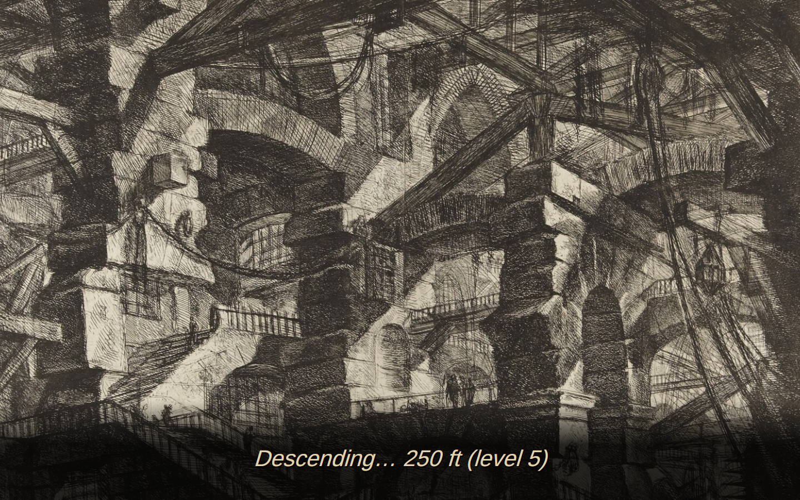
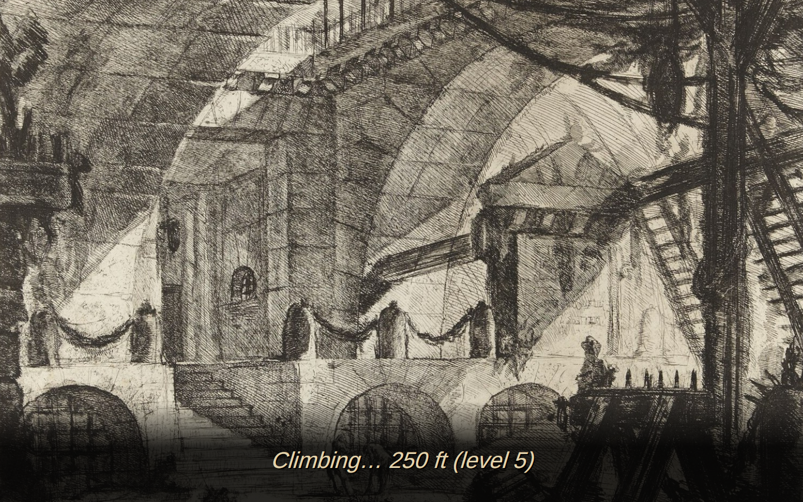
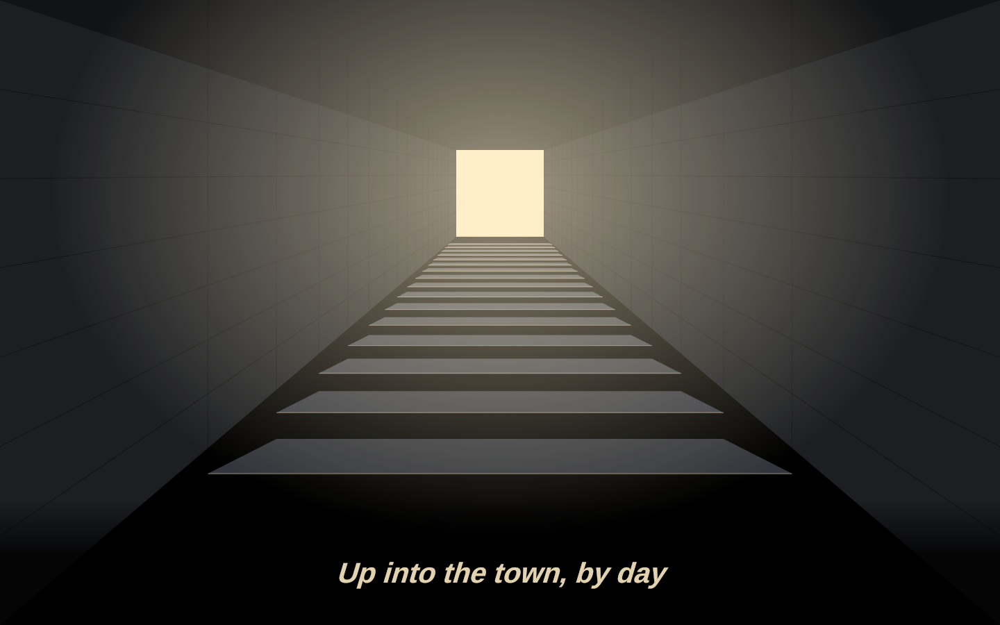
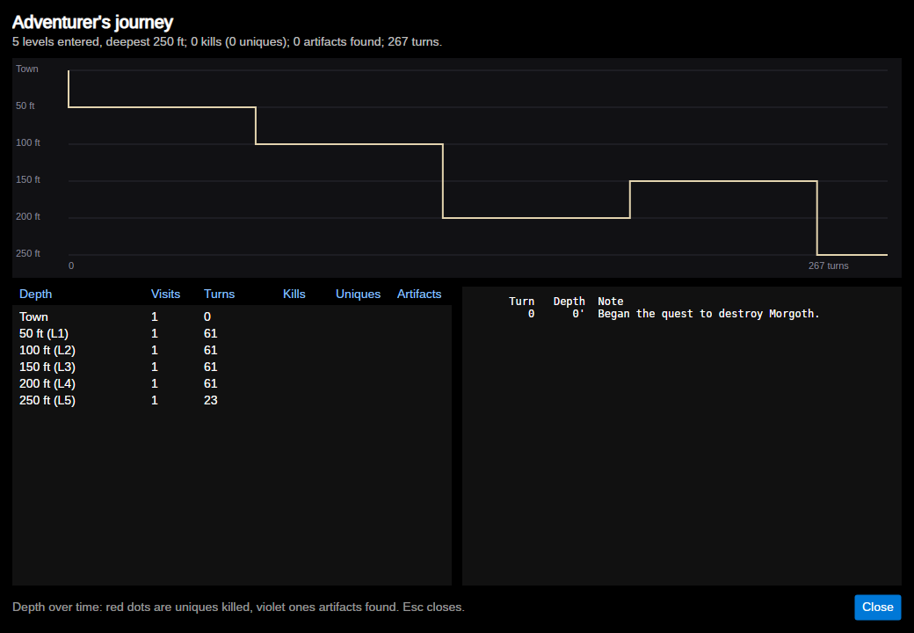

# AVABand

A cross-platform Angband clone in C# / .NET 10 (LTS) and Avalonia 12.


## Screenshots

| | |
|---|---|
|  |  |
| Classic ASCII, the original look | The town (the numbers are the shops) |
|  |  |
| Character sheet with paper doll | Character creation |
|  |  |
| Casting a spell | Choosing an item |
|  |  |
| The Alchemist (4.2's store stock) | Monster list (`[`) |
|  |  |
| Knowledge (`~`) | Keyboard commands (F1) |
|  |  |
| Settings | Taking the stairs down |
|  |  |
| Taking the stairs up | ...and up into the town |
|  | |
| Your journey | |

The screenshots are rendered by the real windows without a display, from fixed seeds:
`tools/screenshots.sh` regenerates them all (`tests/Angband.Avalonia.Tests/ReadmeScreenshots.cs`
sets up each scene). The character dump is dated 2025-01-01 and animations are let finish, so a
rerun gives byte-identical pictures and only a real change to the game's look shows up in git.

## Download and run

Every push is built and tested by GitHub Actions (`.github/workflows/build.yml`), which then
publishes AVABand as a single self-contained file — no .NET install needed — for:

| Windows | Linux (glibc) | Linux (musl, e.g. Alpine) | macOS |
|---|---|---|---|
| `win-x64`, `win-x86`, `win-arm64` | `linux-x64`, `linux-arm64`, `linux-arm` | `linux-musl-x64`, `linux-musl-arm64` | `osx-x64`, `osx-arm64` |

Each build is attached to its workflow run; the newest build of `main` is also on the **latest**
pre-release, and tagging a commit `v*` (e.g. `v0.1.0`) makes a proper release. Unpack it and run
`AVABand` (`AVABand.exe` on Windows). The game data, tilesets and sound packs are inside the file;
saves, scores, monster memory and settings go to your user folder (`AVABand` under the system's
application-data folder).

**Feats** (AVABand's own, `Records/Feats.cs`): milestones across every character you play — 500,
1000, 2000, 3000, 4000 and 5000 ft; character levels 10 to 50; the first, tenth and fiftieth unique
slain; 100,000 gold carried; an artifact worn; a first and then every one of the Prancing Pony's
quests done well; the deep quests' own (the Heart given back, the watchtower held all 200 turns
rather than won by Grishnag's death, the palantír kept and looked into ten times — the stone quest
counts the looks); ten notice-board jobs; the daily dungeon's (a first try, 1000 ft in one, and
seven days running — these from the daily board, `FeatBook.CheckBoard`, as each try is recorded and
at start-up); Sauron and Morgoth slain; and a win with each class.
They are checked after each command, said in the messages ("Feat: Into the Deep! (Reach 1000
ft.)"), kept in `feats.json` beside the scores with who did each first and when, and listed on
the Knowledge screen's **Feats** page. A character that cheated or used a debug command, the
tutorial and replays earn none. The first time, the feats characters did before there were feats
are filled in from the high-score table (the depths, levels and wins it records; no cheat ever
enters it), each credited to the first to do it.

**The graveyard** (AVABand's own, `Records/Graveyard.cs`; Game → The graveyard..., and on the title
screen once someone lies there): a headstone for every character that died or retired — not just
the hundred best the high-score table keeps — carved with its name, race and class, level and
deepest depth, what killed it and where, a date, and an epitaph chosen to suit its end ("Went down
to 1650 ft, and did not come back."), over the death scene at dusk. Choose a stone to read that
character's last dump beside it, or **Watch their last moments**: the game's replay (every game is
recorded), fast-forwarded to when they came to the level where they fell (or its last 150 steps,
if they were there long) and played on from there in the main window. **Character cards**: Game →
*Save a character card...* (the character in play) and the graveyard's *Save a card* (a headstone's
words) draw a 1200×675 picture to share — name, race and class, level, depths, points, uniques or
what killed them and the epitaph, over the scene that suits (the kind of level they're on, or the
graveyard at dusk) — saved in `cards/` beside the records and opened in your picture viewer. Kept in `graveyard.json` beside the scores; the first time, the
dead the high scores remember are brought in. Cheats, the tutorial and replays aren't buried.

**The daily dungeon** (AVABand's own, `Game/DailyDungeon.cs`; Game → Daily dungeon..., and on the
title screen): one dungeon a day, the same for everyone — the seed is FNV-1a of the UTC date, and
the day's character (race, class and rolled stats; your name) is drawn from it, with the default
birth options — so on the same AVABand everyone plays the same levels. Each try (a death or a
retirement; not a cheat's) goes in its own table, `daily.json` beside the scores, numbered and
best-first by depth, with its replay: watch a try from the window, or send the replay to a friend
(they open it with Watch a replay → Open a replay file…). The window opens on today's best try;
*Copy result* puts a line on the clipboard ("AVABand daily 2026-09-30 (try 2): Dain the Dwarf
Priest reached 1450 ft (level 18), 12,345 points — killed by …", `DailyEntry.ShareLine`) and *Save
replay as…* saves the try's replay wherever you like as `AVABand-daily-<day>-try<n>.avareplay`.
Daily characters are ordinary games in
every other way: saved, scored, buried.

**Bags of holding** (AVABand's own, `Game/GameSession.Bags.cs`; base `bag` in `ava_object_bases.json`):
carried in the pack, not worn — only the best one counts. A *Sack of Holding* (from 500 ft) lets
you carry 25% more before you're slowed; a *Bag of Holding* (from 1500 ft) 50% more and two more
things in the pack; a *Greater Bag of Holding* (from 3000 ft) twice as much and four more
(`carryPercent` and `packSlots` on the object kind; `Player.WeightLimit`, `Inventory.PackSize`). A
bag burns like cloth; lose it — burnt, stolen, sold, dropped — and what no longer fits spills onto
the floor ("Your pack overflows!", Angband's `pack_overflow`, checked after every command). The
*Bag of Devouring* (AVABand's curse `devouring`, in `ava_curses.json`) passes for a Bag of Holding —
same name, and no `{??}` — until, one player turn in 800 or so, it swallows something in the pack
for good and shows its curse. The General Store buys bags.

**Monster trophies** (AVABand's own, `Game/GameSession.Trophies.cs`; base `trophy`, seven kinds of
commonness 0 — only ever taken from what you kill): a dragon leaves a scale in the colour of its
breath (red fire, white cold, blue lightning, black acid, green poison; a many-coloured one any of
them), a troll its hide, a great spider (from 750 ft) its silk — a unique always, others now and
then (a dragon one time in 25, a spider or a troll one in 50 — they come in crowds; `TrophiesOf`), thief or
not. The **Armoury**'s armourer works one into a piece of armour you wear or carry (its *Services*,
or `!`: *Work a trophy*, or *The armourer's work* beside gem removal) for the trophy's worth in
gold: the piece gains the trophy's resistance — the troll's hide, regeneration — one trophy to a
piece (`Item.Trophy`, saved), never an artifact, and only where it adds something. The piece's
description names the trophy worked into it.

**Hoards** (AVABand's own, `Cave.Levels.cs` `PlaceHoard`; Angband's lairs and gauntlets have
none): a lair's cavern holds a hoard at its heart — a great object and four piles of gold, made ten
levels deeper, with one of AVABand's stones half the time and a pair of bracers a quarter of the
time — and the cavern beyond a gauntlet's maze from where you came in holds a good object, gold and
the same chances, five levels deeper. Added after Angband's own placement, so the rest of each
level is as 4.2.5 makes it.

**Lamps and gear for delvers** (AVABand's own kinds, `ava_objects.json`): the *Dwarven Lamp* (light
2, never needs oil, +1 digging) and the *Elven Lantern* (light 2, never needs oil, +1 stealth), the
*Miner's Helm* (4 armour, +1 light, +1 digging; the Armoury stocks it) and *Delver's Gloves* (2
armour, +1 digging). Worn tunnelling now counts for digging as it does in 4.2.5's calc_bonuses
(`GameSession.DiggingSkill`: +20 a point for everything worn besides the best tool) — which also
makes Angband's own Ring of Digging work; before, only the digging tool counted.

**Gem sets** (AVABand's own, `Game/GameSession.GemSets.cs`): stones set together in one pair of
worn bracers answer one another. Three of a kind, of any quality, give a stronger form of their
virtue — three rubies immunity to fire, three sapphires to cold, three topazes to lightning; three
emeralds, garnets or amethysts +2 CON, STR or INT; three diamonds +10 armour; three opals +3
infravision — and a ruby, a sapphire and a topaz together resist acid too, the fourth base element.
A set needs three sockets (mithril bracers, or Celebrimbor's iron ones) and counts only while worn
(`RecalculateBonuses`); completing one says so, and the bracers' description lists their sets.

**Curses for bracers and bags** (AVABand's own, `ava_curses.json`, `Game/GameSession.AvaCurses.cs`):
*loose settings* (bracers: about one turn in 1000, a stone works loose and falls at your feet,
taking what it gave with it; a cursed stone holds fast), *greed* (bags: about one turn in 600 it
eats a twentieth of your gold) and *lead* (bracers and bags: twice the weight, `Item.Weight`; felt,
and so known, the first time you carry one). Each shows itself when it first acts, and Remove Curse
takes it off as any other. Bags, carried not worn, are cursed one time in 20 like worn things now,
but only with the curses made for bags (greed, lead, devouring — so any bag may turn out to
devour, not only the Bag of Devouring).

**Egos for bracers and bags** (AVABand's own, `ava_egos.json`, in Angband's ego format plus three
AVABand fields on `EgoItemDef`): bracers *of the Archer* (+1–2 DEX, +3–6 to hit), *of Warding*
(+4–8 armour and a random base resistance), *of the Duelist* (`offHandBonus`: the off hand's −15
to hit becomes −5, `GameSession.OffHandPenalty`) and *(Celebrimbor's)* (from 1750 ft, rare:
`extraSockets`, one more socket — mithril bracers with four); bags *(Fireproof)* and *(Insulated)*
(`guards`: carried, the pack's contents are safe from fire, or cold, in `InventoryDamage`; the
quiver isn't). Made as Angband makes egos, on great items; the inspect text names what each does
once its runes are known.

**AVABand's artifacts** (`ava_artifacts.json`, loaded beside Angband's 138 with three AVABand
fields on `ArtifactDef`), made as Angband's are: the mithril Bracers *of Narvi* (+2 INT/DEX, resist
fire and cold, sustain DEX, three empty sockets), the iron Bracers *of Beorn* (+3 STR, +2 CON,
regeneration, no fear) and *of the Hornburg* (+14 armour, resist acid and shards), the leather
Bracers *of Haldir* (+2 stealth, +1 DEX, free action, resist lightning), the Bag of Holding *of
Bilbo Baggins* (`guards`: the pack safe from fire and cold), two off-hand blades for Humans — the
Dagger *'Thorn'* (slays orcs, see invisible) and the Main Gauche *of Dol Amroth* (slays evil, free
action) — the Mattock *of Narvi* (+4 digging; `goldPercent`: half as much gold again from every vein,
`GameSession.VeinGold`) and the Leather Boots *of Strider* (`carryPercent`: a third more before
you're slowed). Each has its own description, and a name no Angband artifact has.

**Weapon oils** (AVABand's own; base `oil` in `ava_object_bases.json`, six kinds in
`ava_objects.json`): applied (`U`, or *Apply* in the item's menu; the `oil` base's verb), each sets
one of Angband 4.2's own temporary brands or slays (`timed_effects.json`'s `att_pois`, `att_fire`,
`att_cold`, `att_elec`, `att_acid`, `att_evil`, which melee already uses): *Venom Oil*, *Burning
Oil*, *Frost Oil*, *Storm Oil*, *Corrosive Oil* and *Holy Water* (slay evil), each in three grades
(the effect `oil:<brand>:<grade>:<turns>`; `Player.OilGrades`, saved): *Lesser* (10+1d10 turns, the
multiplier one less — a brand ×2), ordinary (20+1d20, Angband's ×3) and *Greater* (40+1d40, one more
— ×4; Holy Water's slay ×2, ×2, ×3). The grade goes with its brand (when it ends, or Angband's own
spell brands it afresh; `GameSession.TemporaryAttackModifiers`). Lesser oils from the first levels,
ordinary from 50 to 1000 ft, Greater from 1500 ft and rare. The Alchemist stocks Lesser Venom and
Burning Oil and Holy Water (`avabandNormal`) and buys oils. Each has its own flask tile in every bundled tileset
(`tools/avaband_quest_tiles.py`).

**Pack room** (with bags, worth managing): Game → *Tidy pack* (`TidyPackCommand`, recorded;
`Inventory.CombinePack`, Angband's `combine_pack`) merges stacks that have come to match (a kind
learned, an inscription removed) and reports "N of M slots used" and how much looks like junk (for
Game → *Clear out junk*); the sidebar marks the slots "(1 left)" and "(full)"; and the first time a
full pack stops you picking something up a hint says what to do.

**Socketed bracers and gems** (AVABand's own, `Game/GameSession.Gems.cs`): bracers have a slot of
their own, *arms*, beside the gloves (last in the equipment list, so older saves line up), with 1
(leather), 2 (iron) or 3 (mithril) sockets; the Armoury sells leather and iron ones. Gems — ruby
(resist fire, to-dam), sapphire (resist cold, armour), topaz (resist lightning, to-hit), emerald
(CON; resist poison from flawed), diamond (armour), opal (see invisible; stealth), amethyst (INT
and WIS; protection from confusion from flawed) and garnet (STR), each chipped, flawed or
flawless for +1, +2 or +3 — are found from 250 ft down; three cursed ones give more at a price:
the bloodstone (+3 STR, +2 CON; slow healing), black onyx (stealth and infravision; hallucination)
and star sapphire (+2 speed; random teleportation). Set a gem from its item menu or the
bracers' (`SetGemCommand`, recorded; it takes a turn): its properties are merged into the
bracers, and the resistances, flags and curses it brought are recorded on it, so taking it out
takes away only those. Only the Armoury's armourer takes one out — from the shop screen's
*Remove a gem* button (or `!`; `StoreServicesCommand`, `GameSession.ShopServices.cs`), for
50 gold plus a fifth of the gem's worth, and one gem in eight cracks — and not while its curse
holds (break it with Remove Curse first). The bracers' name lists their gems: "a Pair of Iron
Bracers (-1,+3) [5,+0] (Ruby, 1 empty socket)". The Magic shop buys gems. Shop notes compare
bracers as any armour, say what a gem would add to your bracers, and a bag against yours; the
tiles (a bag, bracers, and a gem drawn in each kind's colour) are drawn by
`tools/avaband_quest_tiles.py`.

**What's new** (`Assets/Help/11-whats-new.md`, a dated section for each round of changes, newest
first): after an update, the sections newer than the last one you were shown open once over the
title screen (a new player is spared it; `WhatsNewSeen` in the settings remembers); the whole page
is in Help (Help → What's new...). Each change a player would notice gets a line there.

**Help → Check for updates...** asks GitHub (only when you choose it) for the newest release and
compares its commit with the one your build was made from (stamped into the program as
`1.0.0+<commit>`), using GitHub's compare API. It says you are up to date, or that a newer build
is out and how many changes newer, and offers to open the download page, naming the file for your
platform. Builds newer than the release, or local builds GitHub hasn't seen, are said as such
(`Services/UpdateChecker.cs`). The option *Check GitHub for a newer AVABand when the game starts*
(off by default) does the same quietly at start-up: if a newer build is out it says so on the title
screen (click it for the download page) and in the messages; otherwise, or offline, nothing.

Notes: the musl builds have no sound or gamepad support (OpenAL Soft and SDL ship no musl
libraries; the game runs silently without them). The macOS builds are not signed, so the first
run needs right-click → Open (or `xattr -d com.apple.quarantine AVABand`).

To build one yourself:

```
dotnet publish src/Angband.Avalonia/Angband.Avalonia.csproj -c Release -r linux-x64 --self-contained \
  -p:PublishSingleFile=true -p:IncludeNativeLibrariesForSelfExtract=true \
  -p:IncludeAllContentForSelfExtract=true -p:EnableCompressionInSingleFile=true -o publish/linux-x64
```

or just `dotnet run --project src/Angband.Avalonia` to play from source.

## Solution layout

```
AVABand.sln
├─ src/Angband.Core        Pure engine (no UI): RNG, geometry, world model, level generation,
│                          energy/turn scheduler, game session, commands, event bus
├─ src/Angband.Data        JSON content (data/) + DataLoader with mod layering
├─ src/Angband.Audio       Sound: OpenAL engine, WAV/Ogg/MP3 decoders, sound packs, event→sound director
├─ src/Angband.Input       Input actions, rebindable key/button bindings, SDL2 gamepad provider
├─ src/Angband.Avalonia    MVVM front end (CommunityToolkit.Mvvm), DrawingContext map control
├─ tools/                       angband_prf_to_tileset.py (Angband tileset converter) and the other tileset builders, old-saves/ (save fixtures), perf/ (deep-dungeon speed check), compare_with_angband.py and sync_with_angband.py (data drift from 4.2.5), balance/ (depth tables, bot play, soak, record-replays)
├─ tests/Angband.Tests          xUnit tests for the core systems; Replays/ (bot-played games) and Saves/ (old-version saves) as fixtures
└─ tests/Angband.Avalonia.Tests Headless UI tests (real window, simulated keyboard)
```

Dependencies flow one way: `Avalonia → Audio/Input/Data → Core`; `Tests → Audio/Input/Data → Core`.

## Determinism
All randomness comes from `GameRandom` (xoshiro256**, integer-only helpers, serializable state).
A `GameSession` created with a seed and fed the same commands replays identically; a
`LevelRequest(depth, seed)` always yields the same level.

The interface's timers are kept out of the tests' way the same way: each clock that moves something
on by itself — a scene (`SceneView.RunsByItself`), a run's steps (`RunStepDelay`), two-arrow
diagonals (`MainWindow.ArrowClock`), the input dropped around a scene (`SceneClock`), a replay being
watched (paused first), autosave (`Clock`) — can be held or set by a test, so a slow machine (CI)
can't move something on between two lines of one. The UI suite passes three times running with every
core kept busy.

## Implemented so far
- **AVABand's quests** (`Game/GameSession.AvaQuests*.cs`, `Quests/AvaQuestLog.cs`; data in the
  `ava_*.json` files beside Angband's — `ava_quests.json`, `ava_objects.json`, `ava_object_bases.json`,
  `ava_monsters.json`, `ava_terrain.json`, `templates/ava_vaults.json` — which the drift check doesn't
  read, so Angband's own files stay untouched; a later file replaces an earlier one's entry of the
  same id, so a test checks they never reuse an Angband id). On by default; the birth option *AVABand's quests*
  (`birth_ava_quests`) turns them off. Angband's own quests (Sauron, Morgoth, the win) are unchanged.
- **Blows and armour weight, as Angband 4.2.5** (`Game/GameSession.AngbandBlows.cs`; the birth
  option *Angband 4.2's blows*, `birth_angband_blows`, on by default — off, each class's fixed blows
  as before): `calc_blows` from `player-calcs.c` — Strength for the weapon's weight (`adj_str_blow` ×
  the class's strength-multiplier ÷ the weight, the class's min-weight at least) and Dexterity
  (`adj_dex_blow`) index `blows_table` for the energy a blow costs; blows are 100 ÷ that, up to the
  class's max-attacks, plus extra blows from gear — so a starting warrior swings a dagger about 1.7
  times, and a strong, quick one five or six; a weapon heavier than `adj_str_hold` allows is wielded
  with trouble (-2 to hit a pound over, one blow, "You have trouble wielding such a heavy weapon."); and
  a caster's armour beyond the class's spell weight costs a point of mana a pound ("The weight of your
  armor encumbers your movement."). The class figures (max-attacks, min-weight, strength-multiplier,
  spell weight) are 4.2.5's `class.txt`, in `ava_classes.json` beside `classes.json`. (4.2.5 has no
  glove penalty for casters; older versions did.) The shop notes and inspecting a weapon say the blows
  you'd have with it, and the trial kit and the balance bot choose weapons by damage a turn.
- **Encumbrance** (`Game/GameSession.Burden.cs`): Angband 4.2's rule — Strength sets a weight limit
  (`adj_str_wgt`), half of it carried unhindered, -1 speed for each tenth beyond — with the birth
  option *AVABand's encumbrance* (`birth_ava_burden`, on by default): Strength keeps counting where
  Angband's table stalls (flat at 13–14, stopping at 18/70): `StatTables.AvaCarryLimit` adds 10 lb of
  limit a step from STR 14, 20 lb a step through 18/100 and 10 lb beyond (80 lb unhindered at 14,
  100 at 18, 150 at 18/50, 200 at 18/100, 260 at 18/220); Constitution adds 2 lb unhindered a step
  above 15; worn gear counts three quarters (`BurdenWeight`); Heroism and Berserk Strength +10%; and
  the burden is named by its cost — Burdened (-1), Strained (-2, -3), Overloaded (-4 or worse) — in
  the sidebar ("Weight 112.0 / 100 lb · Strained (-2 speed)") and the status bar. What raises the limit
  by a share adds up (`CarryPercent`): the best bag of holding, (Porter) boots and cloaks
  (`ava_egos.json`, +20% each), the potions, and the race (`carryPercent` in `ava_races.json`, with the
  racial abilities: Half-Trolls +20%, Dwarves +10%, Hobbits and Kobolds -10%).
- **AVABand's racial abilities** (`ava_races.json`, beside Angband's `races.json`, which the drift
  check compares; `Game/GameSession.RaceAbilities.cs`, and `GameSession.DualWield.cs` for Humans;
  the birth option `birth_ava_races`, on by default, turns them off): each race gains one —
  Humans fight with two weapons (a weapon of up to 15 lb in the shield's place, `WieldOffHandCommand`,
  "Wield in off hand" on its menu, the sidebar's "off hand": an extra blow at the end of each round
  at -15 to hit, its to-hit, to-dam, blows, slays and brands counting only for that blow); Half-Elves
  get 10% better prices and learn one unknown rune of anything they put on; Elves +15 to hit with
  bows; Hobbits +20 with slings and throws and digest two-thirds as fast; Gnomes +10 device skill
  and half the recharge backfires; Dwarves +20 digging without a pick or shovel and half as much
  gold again from a vein with one; Half-Orcs are five stealthier to a sleeping orc and have
  protection from fear; Half-Trolls rage once a level below a quarter of their hit points
  (berserk, a sixth of their life back) and clear rubble at a blow; the Dúnedain have a level's
  whole feeling on arrival and hold life; High-Elves +1 light radius, with undead and demons in it
  at -2 speed (`Monster.AuraSlow`); Kobolds +10 searching, +15 disarming, and bare hands that
  poison (+1d6 unless immune). The creation screen and the character sheet show each race's; the
  creation screen's *Compare races* sets them all side by side — stat changes, hit die, experience,
  and each race's abilities by name (AVABand's, while the birth option keeps them, its carrying,
  infravision and Angband's own) — with the chosen race marked and a click choosing another.
  - **Multiclasses** (AVABand's own, `Game/Multiclass.cs`): the *Warrior/Mage*, *Warrior/Priest*,
    *Warrior/Druid* and *Warrior/Necromancer*, made from the two classes when the data loads
    (`GameData.Multiclasses`; ids `warrior_mage`... — a class like any other to the rest of the game,
    saved by its id): skills (first level and per level), hit die, stat bonuses and blows (most
    attacks, least weight, Strength multiplier) halfway between; the caster's realm, books and
    spells, its armour-weight limit for mana, and both classes' abilities but the caster's
    zero-fail; each spell needed at half as many levels again (`Multiclass.SpellLevelPercent`, never
    past 50) and cast — its power, and your mana — as at two-thirds of your level
    (`GameSession.CasterLevel`); the warrior's kit (without its torch for the Necromancer's pair, which
    keeps to the dark) and the caster's first book; and 50% more experience for every level
    (`ExpFactor`). Each has its own victory feat, and the soak plays one game of each. Measured with
    the bot at 250-1500 ft (`play 30 <class>`): at the same character level each pair survives about
    as its two classes do (docs/balance.md) — its cost is the experience it takes to get there.
  - **Portraits** on the creation screen (`Controls/Portraits.cs`, `art/portraits/`): the race
    chosen in the class chosen, large beside the character's name, and small beside each race (in
    plain clothes) and each class (on the race chosen) — 11 races in 13 classes and alone, 154
    pictures composed by `tools/portrait_art.py` from Dungeon Crawl Stone Soup's player paper-doll
    tiles (CC0; `art/CREDITS.md`): a race's body, hair or beard, and a class's armour or robes, helm or
    hat, cloak, boots and what it holds, in DCSS's own doll order, scaled up four times unsmoothed.
  - **The Prancing Pony** (the town's ninth building, `9`): Butterbur offers the story quests your
    level allows, and its **notice board** has three jobs at a time — hunt 4-10 of a monster from
    near your depth, bring 2-4 of a potion, scroll or food no shop sells, a **bounty** on a living
    unique no deeper than two levels past your deepest (not a quest's own), or **scouting** down to
    a depth three to five levels past it — two taken at once, renewed whenever you come back up,
    paid at the inn.
  - **The Arcane Artificer** (the town's tenth building, `0`, kept by SlatriBartSlow;
    `Game/GameSession.Artificer.cs`, `GameSession.AvaQuests.Artificer.cs`): walking in, he offers to
    cut a socket for gems into anything of yours that could take one (`ArtificerSocketLimit`: body
    armour and shields 2, helms, gloves, boots, cloaks, weapons and launchers 1, bracers 1 beyond
    their own; no rings, amulets, lights or artifacts), each at its price — 2,500 gold plus a quarter
    of the piece's worth, a second three times as much (`SocketCost`) — and one try in ten
    (`SocketFailChance`) the piece loses a point of enchantment, no socket is cut and half the fee
    comes back. Sockets he cuts are `Item.AddedSockets` (saved); gems go in and come out (at the
    Armoury) as with bracers. Every shop's door — Angband's eight, the Pony's and his — is drawn for
    AVABand in every bundled tileset (`tools/avaband_quest_tiles.py`: a sign over the door with the
    shop's number and an emblem of its trade, in the shop's own colour), so no two look alike. A game saved in town before he came has its town built
    anew on loading (`GameSession.RebuildTownIfOutdated`, from the character's own town seed). From
    level 20 he offers his own quest, **The Artificer's Chisel**
    (`chisel`, found rather than offered at the inn): his star-forged chisel lies in his fallen
    workshop (`quest_artificer_workshop`) 3 levels past your deepest (1000 to 2000 ft), guarded.
    Given back ("returned"), he cuts one socket free, asks half after and never slips; kept, it cuts
    one socket by your own hand (use it), even into an artifact, and is spent. The soak's quest bot
    plays it (`Chisel`), and its town trips buy a socket. Measured with `BOT_SOCKETS=1` (the bot's kit
    with every socket filled): survival within noise of the unsocketed kit at 500-2500 ft
    (docs/balance.md).
  - Each story quest has a **room of its own** (`templates/ava_vaults.json`, type "AVABand quest",
    never chosen at random) built into the level that needs it as its first room — the classic
    profile, as Angband's quest levels are — with three new vault symbols: `(` the quest's feature,
    `)` its monster, `[` its item. Its **place** is used by walking into it or onto it, which asks
    what to do (`QuestPromptEvent`, answered with a `QuestChoiceCommand` — recorded in replays like
    any command; only the answers just offered count).
  - *The Sealed Door*: Durgash the Keybearer's hall; his key (straight into your pack when he dies)
    opens a sealed door 3-5 levels deeper (permanent, no digging or spell moves it), with a great
    item behind it. *The Burden*: the Seal of Angmar (+4 speed, +2 STR and CON; sticky, with the
    siren and impaired-healing curses; carried unworn it still calls the level now and then) waits in
    a shrine on the first level with rooms from 400-700 ft (fixed by the character's seed); a dwarven
    forge 6-9 levels deeper unmakes it. *The Broken Blade*: three shards at three depths, each with a
    guardian; the Weapon Smiths make a Reforged Blade (3d5, +10 to +14) with two powers chosen from
    the slays, brands and resistances whose runes you know (or the smith's suggestions). *Consecration*:
    Hathol, Lord of the Barrow, rises whole while his altar is profaned; the Water of Ulmo, poured on
    it, lets him die. *The Letter*: to a hermit below; read it or not, deliver it (a Magic shop
    discount), show it to the Alchemist (his discount, the Magic shop's prices up) or burn it.
    *The Thief of the Black Market*: ledger pages on monsters give three clues that fit only one of
    four suspects, who roam at their depths; only the thief has the strongbox (Black market prices
    down for returning it). *The Apprentice* (`GameSession.AvaQuests.MoreStories.cs`): the
    Alchemist's apprentice, pinned behind a rockfall and guarded; give him your own Scroll of Word
    of Recall (home at once: the Alchemist's reward and a sixth off his prices) or send him up alone
    — whether he makes it is settled then (the deeper, the worse his odds) and learned at the
    Alchemy shop. *The Cartographer*: map three quarters of a cavern, a labyrinth and one of the old
    mines (magic mapping counts; checked as you go), then the Bookseller pays, with a Rod of
    Treasure Location and a discount. He names where each is, a few levels past your deepest, and
    the first new level made at each of those depths is that kind (any other you find counts too) —
    left to chance they're rare, and never above 750 ft (`docs/quest-playtest.md`). *The Warden's Fires*: the Shade of the Stair can't be harmed
    while its hall's three braziers are cold; step onto each with the Warden's Taper to light it —
    and the Shade, lingering by a lit one, puts it out again (about one turn in six).
    Three deep quests for seasoned characters (`GameSession.AvaQuests.DeepStories.cs`): *The Heart
    of the Mountain* (from level 30, 1900–2500 ft): Skorvath the Cold-drake lies on a hoard with
    the dwarves' lost jewel; give it back at the inn (5000 gold, a great object, Armoury and
    Weaponsmith discounts) or keep it — a relic amulet (+3 STR and CON, +2 DEX) with the dragon
    summon curse. *The Last Watch* (from level 32, 2600–3200 ft): stay 200 turns on the
    watchtower's level while an orc-host sends a war-band of orcs, trolls and giants every thirty,
    or kill Grishnag the Warchief and it breaks. *The Seeing Stone* (from level 38, 2500–3100 ft):
    a palantír in a drowned vault, kept by the Keeper of the Stone; used, it maps the level and
    shows every monster on it, and one time in three wakes them all and sends two greater undead;
    give it to the White Council's messenger at the Bookseller (two great objects) or keep it.
    `docs/quest-playtest.md` has what the quest bot and the level counts said about every quest.
  - Quest items (`QUEST_ITEM`) can't be dropped, thrown, sold, ignored, stolen or burnt, and carry a
    `QuestTag` in the save; the journal is the Knowledge screen's **Quests** page. One a monster
    drops on a full pack's account and left behind on the level turns up at the Prancing Pony
    ("Someone found this down below with your name on it"), so no quest can be lost that way. Every tileset draws the
    quest places and the key with small tiles of AVABand's own (`ava_*.png`, CC0), sized to the set,
    and the other quest things with its nearest tiles (the inn a shop door, the relic an amulet, the
    shards a sword...), and the quests' own monsters with the nearest Angband monster's (Durgash an
    orc chief, Hathol a barrow-wight, Nar the Red-handed Nar the Dwarf, the Shade a ghost, Skorvath
    an ancient white dragon, Grishnag an orc captain, the Keeper a nether wraith...);
    `tools/avaband_quest_tiles.py` makes them and writes the mappings — re-run it
    after rebuilding a tileset.
  - `tools/balance quests [seeds]` has the bot play each quest end to end (and the soak plays one of
    each, recorded and replayed, on every push); its first runs had the bosses brought down to
    their depth's measure (see `docs/balance.md`).
- **Title screen** (`ViewModels/MainWindowViewModel.Title.cs`): the game opens on Thangorodrim —
  the three smoking peaks over the gates of Angband (`art/title.jpg`, drawn by `tools/title_art.py`)
  under the AVABand logo (`art/title-logo.png`, Cinzel Decorative) — to its own music, "The Pits of
  Angband" (`title_theme.ogg`, the music packs' `title` mood; composed and synthesised by
  `tools/title_theme.py`: an organ drone, tolling bells and wind, strings, a harp, a horn, a
  wordless choir and timpani in D minor, 1:51, starting and ending on the drone so it loops). The
  menu fits what there is: *Continue <name>* (the level, race, class and where, and after a crash
  when the save was made), or *Play again as <name>* if the last character died (and what killed
  them), *Create a new character* (*Begin your first adventure* the first time), *Load a saved
  character*, *High scores* and *Exit*. Letters, arrows and Enter, a click or the gamepad choose; it
  stays up behind any dialog it opens and goes when a game starts or loads. Your own `title.png` and
  `title-logo.png` in the art folder replace the pictures. `--seed`, `--depth` and `--no-title` skip it.
- **Level generation** (`Angband.Core/Generation`, the `Cave` class): a port of Angband 4.2.5's
  `generate.c`, `gen-cave.c`, `gen-room.c`, `gen-util.c`, `gen-chunk.c` and `gen-monster.c`, driven by
  4.2.5's own data — `dungeon_profiles.json` (`dungeon_profile.txt`), `templates/vaults.json`
  (`vault.txt`, all 162, in 4.2.5's symbols), `templates/room_templates.json` (`room_template.txt`,
  all 500) and `pits.json` (`pit.txt`, all 40 themes), each synced and compared with the original.
  - **Choosing a level** (`choose_profile`): the town; classic on a quest level; now and then a
    labyrinth (2 in 100 from level 13, more on levels divisible by 3, 5, 7, 11 or 13); between
    levels 10 and 39 one time in forty a moria level; otherwise by the profiles' allocations among
    those deep enough — classic and modified from the start, caverns from 15, lairs and gauntlets
    from 20, hard centres from 50. A hundred attempts, each its builder's.
  - **Classic**: 198 × 66, rooms placed block by block (each block tried once in random order, the
    room chosen by a percentile key against each room profile's cutoff at a rolled rarity), joined
    in a scrambled ring by `build_tunnel` (turning, sometimes at random, piercing room walls — through
    a room's marked entrances where it has them — noting junctions, perhaps stopping at one), doors
    at junctions and piercings, all regions joined, magma and quartz streamers with treasure, 3-4
    down and 1-2 up stairs a quarter of the level apart, rubble and a few traps in corridors.
  - **Modified** and **moria**: sized 75-100% of the dungeon, rooms that find their own space until
    a seventh of the area is floor; moria levels use ragged starburst rooms and fill with Moria
    dwellers. **Lair**: half a modified level, half a cavern crowded with one pit theme's monsters.
    **Gauntlet**: two caverns either side of a hard, unmappable labyrinth — no teleporting in the
    arrival cavern or the maze (a blink of ten squares still works), up stairs on the left, down on
    the right. **Hard centre**: a greater vault in the middle, caverns all round. **Cavern**:
    cellular automata, small pockets filled, the rest joined. **Labyrinth**: randomised Kruskal,
    lit, known, soft or permanent at random; unlit ones hide good objects, hard ones great.
  - **Rooms**: simple (sometimes pillared or ragged), overlapping, crossed (solid middle, inner
    vault, pinched, plus or pillar), large (five inner rooms), circular (with a middle chamber),
    moria rooms and huge rooms (starbursts), rooms of chambers (magma chambers hollowed into a
    maze of doors), room templates (optional walls, numbered secret doors, treasure of a kind),
    interesting rooms and lesser, medium and greater vaults (old and new), pits (ranked, toughest
    in the middle) and nests (a jumble) of one `pit.txt` theme, and staircase rooms joining
    persistent levels. Vaults, pits and chambers add to the level's danger rating; no random
    monsters go in vaults or chambers.
  - **What's on it**: monsters, objects, gold and traps are planned as 4.2.5 places them — vault
    symbols (0-9, `&`, `~`, `$`, `]`, `|`, `=`, `"`, `!`, `?`, `_`, `-`, `,`, letters for a
    monster of that symbol), guardians about room treasure, 14 + 1d8 + k sleeping monsters with
    their groups anywhere but vaults and the player's square, objects in rooms and anywhere, gold
    — and put in place when you arrive. The town is AVABand's own (`town`: 8 shops, fixed per game).
  - Stairs, rubble, depth-gated traps, connected stairs, spawn hints and population budgets. Every level is checked by `LevelValidator` (permanent border,
    stairs present, all walkable squares reachable); failed attempts are retried.
- **Turn system** (`Angband.Core/Time`): Angband's speed→energy table and a scheduler where the
  most energetic actor goes first, with world upkeep every 10 game turns. 4.2.5's constants: a new
  monster one world turn in 500, 4 town residents by day and 8 by night, a new lantern half full
  (7500 turns), up to 10 stacks in the quiver.
- **Field of view & light** (`Angband.Core/Sight`): symmetric shadowcasting (exact integer
  slopes) out to `maxSight` (20); carried light sources (player torch radius 2); glowing rooms;
  bright terrain; glowing walls only seen from their lit side; blindness. Seen squares are stored
  in the player's `KnownMap` (which can go out of date, as in Angband); traps stay hidden until your
  search skill is up to them (see *Chests & traps*).
  The town has day and night (`dayLength` 10000 game turns); at night only shop entrances glow.
- **Combat** (`Angband.Core/Combat`, `Game/GameSession.Combat.cs`): Angband 4.2 formulas —
  `test_hit` (12% auto-hit, 5% auto-miss, armour ×2/3, unseen targets halved), melee and missile
  criticals, fractional blows (leftover energy), slays/brands with immunities, missile range and
  distance penalty, armour soak, elemental resistance (immunity, vulnerability, double resist),
  monster criticals causing cuts/stuns, monster fear on damage,
  experience with fractional carry, death. `ProjectionPath` ports `project_path` (used for missiles
  and line-of-fire).
- **Elements** (`elements.json`, synced from and compared with 4.2.5's `projection.txt`): all 25 —
  the thirteen gear resists (acid to disenchantment) and water, ice, gravity, inertia, force, time,
  plasma, meteors, magic missiles, mana, holy power and arrows — with their names and
  descriptions, colours, breath sounds, breath divisors and damage caps. Resistance works as 4.2.5's
  `adjust_dam`: damage × numerator / denominator once per level of resistance, the denominator
  rolled once (so double resistance to chaos is 36/k² of it, k 9–12); light, dark, sound, shards,
  nexus, nether, chaos and disenchantment are 6/(8+1d4) (they were 3.x's figures), the base five
  1/3, and cold resistance covers ice. The character sheet lists the thirteen.
- **Status effects** (`Effects/TimedEffects.cs`, `timed_effects.json`): poison, cuts, stun
  (to-hit/dam penalty, knock-out), confusion (40% random steps), fear (no melee), paralysis
  (lost turns, non-stacking), blindness, slow/haste. Angband fixed-point HP regeneration, resting.
  All 52 of 4.2.5's `player_timed.txt` effects (all but FOOD; hunger is kept apart), synced and
  compared whole: the *grades* (a graze, light cut… deep gash, mortal wound; stun, heavy stun,
  knocked out; bloodlust's six) with their status-bar labels, colours and messages — going up a
  grade always says so, falling one is quiet; `on-increase`/`on-decrease` messages; what
  *prevents* an effect (its `fail` lines: Free Action stops slowing and paralysis, resisting chaos
  stops hallucination, opposing poison stops poisoning, stone can't bleed, being vulnerable to
  acid rules out a temporary resistance to it) — except for 4.2.5's `TIMED_INC_NO_RES` effects
  (the salt water's paralysis, a trap's slowness); the flag synonyms (heroism and berserking are
  fearlessness while they last); temporary brands and slays from the data (a fire, cold, acid,
  lightning or poison coating, Smite Evil, Demon Bane), with the weapon named in the message
  ("Flames surround your Dagger!"). Cuts, poison and stunning wear off as fast as Constitution
  heals them (Angband adj_con_fix: five a turn at 18/100), a mortal wound not at all; knocked out
  is past 150. New from 4.2.5: the mystic shield (+50 AC), invulnerability (+100 AC, and no hurt
  short of 9000), safety from traps. (AVABand's own `regen` and `grim_purpose` statuses are gone;
  Grim Purpose was already 4.2.5's two effects.)
- **Monsters & AI** (`Game/GameSession.Monsters.cs`, `GameSession.MonsterSpells.cs`,
  `GameSession.MonsterPowers.cs`): 623 races in `monsters.json` — Angband 4.2.5's whole bestiary from
  the town to Morgoth, each synced with `monster.txt` (see *Game data from Angband* below), with depth/rarity
  allocation with out-of-depth rolls, packs, and vault, pit, nest, chamber and lair monsters as
  4.2.5 chooses them.
  - **Groups and escorts**, as Angband 4.2 places them (`mon-make.c` `place_new_monster`,
    `place_friends`): each race's `friends` entries, imported from `monster.txt`, give a percent
    chance, a number (dice) and who comes — more of the same race, a named race, or any race of a
    base (e.g. "person", matched by its symbol, drawn for the leader's level). Groups shrink within
    five levels of their native depth (a wild-dog pack of 2d7 is halved on level 1), escorts more
    than four levels out of depth don't come at all, a group puddles out from its leader (others
    start within 5 squares) up to 25, and a unique escort comes once. So a soldier sometimes
    brings one or two more and a few "persons"; a hill orc on level 1 comes alone. Names are
    resolved as Angband's `lookup_monster` does (an exact name, else the first containing it).
  - Powers: thieves that steal gold or items and vanish in a puff of smoke (killing them returns
    the loot), eaters of food and light, stat drain (sustains protect; gaining a level restores),
    experience drain that can cost levels (hold life protects; Restore Life Levels undoes it),
    disenchantment, charge draining; invisible monsters (seen with see invisible), ghosts that
    pass through walls, tunnellers that bore through them, creatures of rock hurt by stone to mud.
    Spells: breaths of all thirteen elements and more, bolts, balls and beams (damage from 4.2.5's
    dice, worked out from the caster's spell power; breaths use `projection.txt`'s divisors and caps), wounds, mind blast and brain smash, drain mana, haste-self, forget,
    create traps, teleport away / level / to, darkness, heal kin, storms, webs, and summons of kin,
    animals, spiders, hounds, hydras, undead, demons and dragons — and the greater summons: an
    Ainu, greater demons, greater undead, ancient dragons, the Ringwraiths and uniques. All 91 of
    Angband 4.2's monster spells are there. Vault letters place monsters of that kind.
  - **The last of 4.2's monster spells** (`GameSession.MonsterSpells.cs`):
    - *WOUND*, as in 4.2 one spell (not four) that grows with the caster's spell power — (power/3×2)d5
      damage, cuts from power 55, and words from "points at you and curses!" to "screams the word
      'DIE!'" (and "Your body tingles/shudders/spasms briefly" when you save). A dozen monsters'
      spell power differs from their level (Sauron's is 130), as in `monster.txt`.
    - *STORM* (storm giants, Ossë, Sauron's vampire form…): water, lightning and ice at once.
    - *WEAVE* (giant, Mirkwood and phase spiders, Ungoliant…): webs on the open floor around the
      spider (wider for the strongest), your square included. A web (`%`) is a trap that does
      nothing but hold: trying to move out of one clears it instead ("You clear the web.", a
      turn); a run stops at one; monsters in a web pass through (`PASS_WEB`, ghosts), tear it
      down (wall-borers), spend a turn clearing it (`CLEAR_WEB`) or are stuck.
    - Summoning is 4.2.5's (`GameSession.Summons.cs`, `summons.json` from `summon.txt`): each
      kind names the monster bases (`base` in `monster.txt`: hounds are zephyr hounds and
      canines, greater undead vampires, wraiths and liches) or the flag that may answer, whether
      uniques may, and a fallback (the Ringwraiths and uniques fall back on greater undead when
      none came); kin share the caster's base and are never unique. A monster keeps summoning —
      up to the spell's dice in tries — until the summoned levels, squared and added up, reach
      depth × its level, so a deep caster calls more; "But nothing comes." when none answer.
      Summons appear up to four squares from the caster (in view of it), drawn for
      (depth + caster level) / 2 + 5. Traps, curses and the scroll and staff summon around you
      instead: the newcomers wait for you to act (a faster one is held for the turns it would
      gain), and one time in four a monster of the kind already on the level, out of sight, is
      called over instead.
  - **Mimics & lurkers** (`GameSession.Mimics.cs`, Angband `UNAWARE`): creeping coins look like a
    pile of gold, potion/scroll/ring/chest mimics like a tempting potion, scroll, ring or chest (drawn with that
    object's tile, named by look, remembered on the map and found by object detection), and lurkers
    and trappers like bare floor. They lie in wait — no moving or spells — until found out: bump
    into one ("The Potion of Healing was really a monster!"), or hurt it with anything — standing
    beside you it still waits (4.2.5's process_monsters skips a mimicking monster). Monster detection doesn't see through the disguise, they can't be targeted,
    and a revealed lurker is still invisible without see invisible.
  - Movement is a port of 4.2.5's `mon-move.c`. Senses: sight (the monster's square is in view),
    **sound** (the noise flow `make_noise` lays each game turn — one step louder per square, four
    while covering tracks — against hearing minus stealth/3) and **scent** (`update_scent`'s ageing
    5×5 trail, none while covering tracks, against the race's `smell`). A monster that can't sense
    the player and is unhurt is **inactive** and takes no turn at all.
  - Behaviour: stealth-based waking (`monster_reduce_sleep`); `get_move`'s preferred range (strong
    players scare weaker monsters to flee range); advancing by sight, then sound, then scent;
    following a **group tracker**, bodyguards keeping by their leader, **pack tactics** (`GROUP_AI`
    hides for an ambush while the player is in a corridor, and surrounds in the open); **fleeing**
    to safety or hiding; a frightened monster with nowhere to go **freezes** (its fear becomes
    being held); the five-way `side_dirs` search, staggering from confusion and `RAND_25/50`;
    **breeding** (`MULTIPLY`, capped per level; and AVABand's own limit, each breeder race at most
    250 young on a level, counted from your arrival — Angband's cap counts only breeders alive at
    once, so a swarm thinned as fast as it bred could refill a corridor for ever —
    `GameSession.Breeders.cs`, the count kept in the save and begun again on each arrival, even on a
    persistent level you come back to); opening, unlocking and bashing doors ("You hear a
    door burst open!"), tunnelling, pushing past or trampling weaker monsters
    (`MOVE_BODY`/`KILL_BODY`), glyphs and decoys.
  - **Spells** (`monster_spells.json`): arrows, boulders, bolts, balls, breaths
    (damage from the caster's HP), wounds, blind/confuse/scare/slow/hold (saving throw and
    protections apply), heal, blink, teleport, teleport-to, summon (kin), shriek. Bolts need a clear
    shot; non-innate spells fail 25% of the time at most (4.2.5's `monster_spell_failrate`), 20% more
    often when the caster is afraid and 50% more when confused or disenchanted. As in Angband 4.2, a race
    has two frequencies, imported from `monster.txt`: `spellFrequency` (its `spell-freq`) for
    spells, and `innateFrequency` (`innate-freq`) for innate attacks — breaths, arrows, boulders,
    spit, shrieks — each "1 in N", a 100/N percent chance. Each turn it rolls for a spell first,
    then for an innate attack, and uses one of that kind (`make_ranged_attack`); taunting halves
    both chances. So a scout fires arrows 1 time in 3 but hastes itself only 1 time in 10, and a
    kobold archer shoots every other turn. Kinds with no frequency given use Angband's 1 in 4.
    Both chances double when the monster is exactly at its preferred range (below), so a kobold
    archer right beside you shoots every turn, as in 4.2.
  - **Combat ranges and morale** (`Game/GameSession.MonsterRange.cs`, 4.2's `get_move_find_range`):
    each turn a monster works out the least distance it will keep and the one it likes best. A
    monster that judges you too strong — your level against its level + 25 (+8 for some), and when
    close, your health against its own — keeps right away instead of closing in, though it isn't
    afraid: cornered beside you it cowers and doesn't strike. So a high-level character sees shallow monsters scatter,
    and a badly hurt monster of about your strength backs off. Monsters that never move, and
    casters that never strike, want 3 more squares (unless you're within 5); archers that shoot
    rarely and casters that cast often (over 24%) like 3 more; breathers in good health don't mind
    point blank. Taunting cancels it all.
  - **Bodyguards** (4.2's `bodyguard` escort role, `get_move_bodyguard`): the escorts marked so in
    `monster.txt` — Bolg's, Azog's and Uglúk's uruks, Gothmog's greater balrogs, the Queen Ant's
    army ants and five more — are bound to their leader. While it lives they never lose heart, and
    whenever they are more than a step from it they close back in (by a square nearer you, if there
    is one) rather than charging — unless it is out of sight and more than 10 squares off. When
    the leader dies they fight as ordinary monsters. The bond is kept in the save.
- **Character creation** (`Game/Birth.cs`, `races.json`; Game → New character, Ctrl+N): name,
  11 races (Human, Half-Elf, Elf, Hobbit, Gnome, Dwarf, Half-Orc, Half-Troll, Dunadan, High-Elf,
  Kobold) with stat/skill adjustments, hit dice, experience factors, infravision and innate
  abilities as in 4.2.5's `p_race.txt` (the experience factor is the race's alone, as in 4.2.5,
  whose classes have none; disarming is two skills, physical and magical, as 4.2.5 has it) — Elves and Half-Elves sustain DEX, Half-Trolls STR (and
  regenerate), Dúnedain CON; Hobbits hold on to their life force, High-Elves see invisible,
  Gnomes have free action, Dwarves can't be blinded, and resistances to light, dark and poison —
  and three knacks: Hobbits know a mushroom as soon as they pick it up ("Mushrooms for
  breakfast!"), Gnomes a wand, staff or rod, and Dwarves sense veins of treasure in the rock a
  few squares around them each turn (unless confused, stunned, afraid and the like). A character
  saved before an ability was added gains it on loading; 9 classes; stats by
  Angband's 20-point point-buy (unspent points become gold) or Angband's rolled dice — or
  AVABand's **heroic** methods (`Game/HeroicBirth.cs`): a *heroic roll* (each stat 11 + 3d4:
  14 to 18/50, about 18/10 on average, against the ordinary 8–17) and a *heroic point-buy* (50
  points, stats up to 18/50 at 3 points a step past 18). Rolled methods have an **autoroller**, as
  Angband 3.x had: a minimum for each final stat (after race and class), then *Autoroll* rerolls
  up to 100,000 times until a set meets them all ("Met every minimum after 1,234 rolls"), or says
  at once which minimum that roll can never reach. The minimums are remembered with the last
  character. Heroic characters' scores count **75%** (`Scoring.HeroicPercent`), and they are
  tagged: *[Heroic]* in the high scores and a line in the character dump (kept in the save). How much easier they are is measured by `tools/balance heroic`
  (`docs/heroic-balance.md`): little for warriors, but a young heroic mage survives about half as
  often again, and a ranger at 1000 ft 45 → 73% of the time. Stats now
  matter: STR gives to-damage and carrying capacity, DEX to-hit and armour, WIS saving throw, CON
  hit points per level, INT/WIS spell points and failure rates. The screen previews the result by
  creating the character in the engine; Quick start reuses the last character.
- **Shops** (`Game/GameSession.Shops.cs`, `stores.json`): General Store, Armoury, Weapon Smiths,
  Bookseller, Alchemy shop, Magic shop, Black market and your Home, stocked as in Angband 4.2.5
  (`stores.json` is converted from `store.txt`; the upkeep follows `store.c`):
  - Four keepers per store, each with a purse (the most they pay for one item); one in 25 store
    days a keeper retires and another takes over (as when you buy a store out).
  - *Staples* (`always`) never run out: a full pile of 40 that buying doesn't reduce — the General
    Store's food, oil, torches, cloaks, shovels, picks and ammunition; the Alchemist's Cure Light
    Wounds, Phase Door, Word of Recall and Remove Curse; and every one of the ten town books at the
    Bookseller (the dungeon books are only found below). Enchanted copies of a staple sell out.
  - Books are named with their kind, as in 4.2 ("a Magic Book of [First Spells]", "a Holy Book of
    [Novice's Handbook]", a Nature Book, a Necromantic Tome), and in a shop, buying or selling, each
    carries a badge — **for you** if the class can read it (`GameSession.BookNote`, Angband's
    `obj_kind_can_browse`), else "not for a Priest" — so a newcomer doesn't buy the wrong realm's
    book or sell their own.
  - **The Alchemist identifies** (AVABand's own, `GameSession.Identify.cs`): with anything carried
    or worn that you don't fully know (an untried flavour, or runes you haven't learned), the shop
    screen shows an *Identify something* button (or `!`; shops' services are asked for from inside,
    `GameSession.ShopServices.cs`, never at the door) — then each such item with its price (50 gold, 50
    more for each unknown rune and 50 for an unknown kind; untried flavours listed once each), or
    everything at once. The item's kind and every rune on it become known, curses included (so a
    Bag of Devouring is found out), as selling it would teach you; you're asked again while
    anything unknown is left, then go on into the shop. 4.2.5 has no *Identify*; this is a paid
    shortcut to what use would show.
  - **Will this suit me?** (`GameSession.ShopAdvice.cs`): under anything you could wear or wield, a
    line says how it compares with what it would replace ("Better — vs your Dagger: +17 damage a turn
    (about 26), +3 to hit"; "Better — for your empty helm slot: +7 armour"; "Mixed — vs your Soft
    Leather Armour: +25 armour, -2 to hit, resist cold") — armour, damage a turn (an average blow times your blows),
    to-hit and to-dam, a launcher's multiplier and the missiles it fires, speed, stats, stealth and
    light, the resistances and abilities it would bring or take away, a curse, and whether it
    would leave you slowed — each note led by its verdict in words ("Better —", "Worse —", "Mixed —",
    "Much the same —") and coloured to match (green, red, amber: the map's palette, so the
    colour-blind option applies); missiles say whether
    they fit your launcher. Your own things for sale are compared too, once all their runes are
    known. The same note is added when you inspect something in your pack (`I`, or its menu) or look at
it on the floor (`x`), and it sits under each choice in the *Wear or wield* prompt (`w`; things not
    fully known say so, and from the floor, whether its weight would slow you). Only what the game's rules count is compared: with Angband's blows (the default) a weapon's
    note gives the blows you'd have with it ("1.2 blows a turn (now 1.7)") or says it's too heavy for
    you; gloves don't hamper spells (4.2.5 has no such rule).
  - AVABand's one addition: the General Store also always has **lanterns** (`avabandAlways` in
    `stores.json`, kept apart from 4.2.5's `always` list so the drift check still compares that
    untouched). In 4.2.5 no shop sells them — the black market might, and the dungeon has plenty
    from dlvl 5 — so the oil the store sells had nothing to go in until then. A new lantern comes
    half full (7500 turns). A store in an older save gets any staple it lacks as you walk in.
  - Other stock (`normal`) comes and goes: each store day up to `turnover` piles are sold to other
    customers (ammunition whole or down to a multiple of five; other piles one, half or all) and as
    many new ones made, keeping between the store's `minItems` and `maxItems` piles besides its
    staples, 24 at most. New stock gets magic for levels 1 to 5 (deeper once you've been below dlvl
    20), and is never damaged, cursed or worthless; cheap things come in piles (Angband
    mass_produce: 20 or 40 cheap arrows, up to 25 cheap potions...).
  - The black market makes anything from 5 to 20 levels below your deepest (never artifacts), but
    only what no other store sells, unless it is an ego item or well enchanted, and nothing under 10
    gold; it charges three times the value and pays a sixth.
  - Store days are counted only while you are in the dungeon, one per 10 × `storeTurns` (1000)
    game turns, and the stores catch up on them when you return to town.
  - Selling: stores pay two thirds of the value — the lower of what it is really worth and what you
    know it to be worth, so unidentified bonuses earn nothing — up to the keeper's purse, but by default (Angband
    4.2's *birth_no_selling*) nothing at all, with dungeon gold multiplied by the depth (up to 5×)
    instead; turn the birth option off for classic selling (`constants.json`'s `noSelling` sets its
    default). What you sell is identified, loses its inscription, joins a matching pile, and wands and
    staves the store deals in are recharged; lights are refuelled. With no selling on, the store says so
    and calls it giving (as 4.2's "Give which item?"), showing no price. What you are wielding or
    wearing is tagged *wielded* or *worn* in the list and is never sold, given or stored at a keypress:
    the store asks first (y/n, or Enter / controller A). Game → *Shops pay gold when you sell*
    turns selling on (or off) mid-game — an AVABand addition, and not a cheat: either setting is
    a legitimate 4.2 game, so the character is still scored.
  - Bought items are fully known. The home stores up to 24 stacks.
  Walk onto an entrance (or press `_` / Confirm on it) to open the store screen: a letter buys or
  sells, asking "Quantity (1-N)?" as Angband does when there is more than one to have (Enter for
  one, or type a number; on the controller up/down change it by one, right/left by ten, A takes
  it), Shift+letter the whole stack at once, Tab (pad X) switches buying/selling, Esc (pad B) leaves.
- **Object values** (`Items/ObjectPower.cs`, `Items/ItemValue.cs`; Angband 4.2 `obj-power.c`): what
  things are worth, for store prices, level feelings and the like.
  - Wearables and ammunition are priced by their *power* (`object_power`): damage dice, to-damage
    (double off weapons), launcher multiplier and the ammunition it fires, extra blows, shots and
    might, slays and brands (by their `slay.txt`/`brand.txt` power, with extra for several), to-hit,
    armour for its weight, to-AC (steeply above +26), jewellery, modifiers (by `object_property.txt`
    power and type multiplier, plus a term for many stat bonuses), sustains, protections and
    abilities (more off weapons, with extra for sets), resistances (with extra for several low or
    high ones), an artifact's activation or a kind's effect (powers imported from `activation.txt`
    and `object.txt`), and curses (their own objects' power). A power *p* is worth *p × (p + 5)*
    gold — a long sword (2d5) 15 × 20 = 300, a (+5,+5) one 34 × 39 = 1326 — a twentieth of that
    for ammunition and ordinary torches, at least 1, and nothing if the power is negative. A
    burnt-out torch (no turns left) is worth nothing at all, so no store buys it — an AVABand rule;
    4.2.5 prices it like a lit one. Empty lanterns, wands and staffs keep their worth (they can be
    refilled or recharged).
  - Everything else costs its kind's price; wands and staffs a twentieth more per charge.
  - What you know (`object_value`): unlearned runes and curses don't count, and unfamiliar
    flavours are guessed at by type (20 for a potion or scroll, 45 for jewellery, 50 for a wand...).
  - Random artifacts are balanced with the same power.
  - Not modelled: items ignoring elements (only artifacts do, as in Angband). A curse costs its
    object's power (its bonuses, flags and resistances), whatever its strength.
- **Classes, levels & magic** (`Game/GameSession.Magic.cs`, `classes.json`, `realms.json`, `spells.json`):
  Warrior, Mage and Rogue (arcane), Priest and Paladin (divine), Ranger and Druid (nature),
  Necromancer and Blackguard (necromantic), each with skills that grow
  every 10 levels, stat adjustments, hit dice and 4.2.5's starting kit (`equip` lines: 1–3 rations
  and torches, a weapon, a book for casters, a Word of Recall unless recall is off — worn where it
  can be), paid for out of 600 gold (plus 50 for each unspent point). Angband's experience table and
  level-ups (hit points, skills, spell points). Spells live in Angband 4.2's books (below); you study them
  once you reach their level (`G`: mages, druids, necromancers, rogues, rangers and blackguards choose
  the spell; priests and paladins choose a book and are granted one of its prayers at random, as in
  4.2), then cast them (`m`) with Angband's failure formula (base, minus
  3 per level above the spell, minus the stat bonus, plus 5 per missing mana point, with a stat-based
  minimum, which only ZERO_FAIL classes — mage, priest, druid, necromancer — can take below 5%).
  Casting without enough mana is allowed after confirmation but makes you faint. The first cast of
  each spell gives experience. Spell points regenerate like hit points.
  - **The books** (`spells.json` and `objects.json` follow Angband 4.2.5's
    `class.txt`): 20 books, 4 realms, 144 spells.
    - *Arcane*: [First Spells], [Attacks and Knowledge], [Magical Defences] (town), [Arcane Control],
      [Wizard's Tome of Power] (dungeon) — the mage's 30 spells, from Magic Missile, Electric Arc
      and Fire Ball through Acid Spray, Resistance, Tap Magical Energy and Mana Channel to Mana
      Bolt, Dimension Door, Thrust Away, Explosion, Banishment and Mana Storm; the rogue's 10.
    - *Divine*: [Novice's Handbook], [Cleansing Power] (town), [Healing and Sanctuary], [Battle
      Blessings], [Wrath of the Valar] (dungeon) — the priest's 28 (Orb of Draining, Spear of Light,
      Dispel Undead/Evil, Portal, Remembrance, Restoration, Glyph of Warding, Banish Evil, Word of
      Destruction, Holy Word, Spear of Oromë, Light of Manwë...) and the paladin's 16.
    - *Nature*: [Lesser Charms], [Gifts of Nature] (town), [Creature Dominion], [Nature Craft],
      [Wild Forces] (dungeon) — the druid's 27 (Stinking Cloud, Confuse/Slow Monster, Lightning
      Strike, Earth Rising, Trance, Mass Sleep, Púkel-man/eagle/bear forms, Tremor, Revitalize,
      Rapid Regeneration, Meteor Swarm, Rift, Ice Storm, Volcanic Eruption, River of Lightning...)
      and the ranger's 11 (Cover Tracks, Create Arrows, Decoy, Brand Ammunition...).
    - *Necromantic*: as below.
    - New kinds of spell (`Game/GameSession.RealmMagic.cs`): bolts that are sometimes beams (one
      time in the caster's level %, half that for non-mages — Angband BEAM), short beams, arcs
      (cones), strikes (explosions right at the target), meteor swarms, spheres around the caster,
      holy orbs (double against evil), trap and life detection, doors made and unmade, tapping a
      wand or staff for mana, Mana Channel (spells take ¾ of a turn), Dimension Door (to the target),
      holding the monsters next to you, targeted tremors, healing 30 a turn, covering your tracks
      (no scent, unseen beyond a quarter of sight), arrows made from a staff, branded ammunition,
      and decoys (monsters that can see one go for it, and break it). Spells that pick an item
      (recharging, tapping, arrows, branding) choose the likeliest one rather than asking.
    - Class abilities that come with them (`class.txt` player-flags): BEAM (mages), ZERO_FAIL,
      CHARM (druids' sleep, confusion and holding are half as strong again against animals),
      FAST_SHOT (rangers: +0.1 shots per 3 levels with a bow), BRAVERY_30 (warriors fear nothing
      from level 30), and SHIELD_BASH for warriors too.
    - Older saves: the four original books become their 4.2 successors, and spells no longer in
      the game are forgotten (the rest, kept under the same names, stay learned).
  - Effects: bolts and balls (damage falls off with distance, immune monsters take 1/9,
    vulnerable ones double), light that burns light-sensitive monsters, detection (monsters, evil,
    objects), mapping, teleports (range can scale with level: `teleport:L*3`), stone to mud,
    healing and curing, blessing, heroism, regeneration, temporary resistances, identify rune,
    dispel curse. Spell strength scales with level through expressions like `3+(L-1)/5`, and
    braces put them inside dice: `bolt:nether:{L/4+3}d4`, `timed:berserk:{L+5}+1d{L+5}`.
- **Rogue, Paladin, Necromancer, Blackguard** (`Game/GameSession.ClassMagic.cs`; stats, skills,
  hit dice and spell levels/mana/failure from Angband 4.2.5's `class.txt`; mechanics checked against
  its source):
  - *Rogue* (arcane, from level 5; 10 spells in [First Spells] and [Arcane Control]: detect
    monsters, phase door, object detection, detect stairs, recharging, reveal monsters, teleport
    self, Hit and Run, teleport other, teleport level). `s` + direction **steals** from an adjacent monster (Angband
    steal_monster_item): its guard (level, ×4/3 for uniques, plus its speed over yours, halved while
    asleep) plus the item's weight against your stealth and dexterity. A clean theft barely stirs it,
    a near miss wakes it, a bungle makes it cry out and wakes everything in sight. Monsters carry
    their treasure as in Angband: it is rolled into their pack the first time anyone tries, so what
    you steal is what they would have dropped. For other classes `s` still holds.
  - *Paladin* (divine; 16 prayers in [Novice's Handbook], [Healing and Sanctuary] and [Battle
    Blessings]): +2 to-hit and to-dam with a hafted or blessed weapon,
    and **shield bashes**.
  - *Necromancer* (the new necromantic realm, "rituals" you *perform*; 21 rituals in four new books
    — [Into the Shadows], [Dark Rituals] and [Fear and Torment] in the Bookseller, [Deadly Powers]
    in the dungeon): **unlight** — they start with the torch in the pack, see squares within
    1 + level/6 without light, resist darkness, get one less light from lamps, and fail 25% more
    often on a lit square; and **evil** (4.2's EVIL flag) — they resist nether but holy orbs hurt
    them a third more. Rituals: nether bolt, sense invisible, create darkness, bat form, read
    minds (detect minds and map around them), tap unlife (drain an undead into mana), crush (kill
    everything in view under 4× your level in HP, at a cost), sleep evil, shadow shift,
    disenchant, frighten, vampire strike (leap to a living monster and drink), dispel life, dark
    spear, warg form, banish spirits, annihilate, Grond's blow, unleash chaos, fume of Mordor
    (darken and map the level), storm of darkness.
  - *Blackguard* (necromantic; 13 rituals): **combat regeneration** as in Angband — mana doesn't
    return with rest but ebbs at half the normal rate (the loss healing them), each attack gives 5%
    of it, losing X% of hit points gives X% of it, and casting heals a little; they heal slowly
    (IMPAIR_HP) and shield-bash. Rituals: seek battle, berserk strength, whirlwind attack (blows at
    every neighbour), shatter stone, leap into battle (run up to 4 squares, a quarter of the blows
    lost per square), grim purpose (no slowing, paralysis or confusion), maim foe (stunning blows),
    howl of the damned, venom (poison-coated weapon, ×3), werewolf form, unholy reprieve, forceful
    blow (knock-back), quake.
  - **Shield bash** (Angband attempt_shield_bash): with a shield, against a monster at least half
    your level, a chance (melee skill/8 + DEX, ×4 unarmed, ×2 with a puny weapon, out of 200 +
    its level) to slam it first; damage from the shield's dice (shields now have Angband's
    1d1–1d6), weight and your skill and level; it may stun or confuse, and you may stumble and lose
    part of the turn.
  - The later spells (`Game/GameSession.ArenaAndCommand.cs`), from the 4.2.5 source:
    - *Hit and Run* (rogue, 23): after the next attempt to steal, "You vanish into the shadows!" (a
      short teleport).
    - *Relentless Taunting* (blackguard, 24): monsters are half as likely to cast or shoot.
    - *Bloodlust* (blackguard, 30): +1 to-dam per 2 points and +1 blow per 20; each kill adds 10 (to
      50) and may confuse you; blows sometimes scramble your stats or drain CON; as it fades you may
      cry out in pain, bleed or slow; and while hit points + bloodlust + level stay non-negative
      "your lust for blood keeps you alive"; a kill may also bring on a few turns of hallucination.
    - [Corruption of Spirit] (a new dungeon necromantic tome): *Power Sacrifice* (50 hit points for
      50 mana), *Zone of Unmagic* (disenchantment around you, you included), *Vampire Form* (a quarter
      of your hit points, then your bite heals you as it drains the living — the vampire shape now
      does this, as in `shape.txt` — and you leap to feed), *Curse* ((level/12 + 1) dice of 50 plus
      the percentage of hit points the target has already lost, at a cost of 100 of yours) and
      *Command*: a monster that fails its save is yours for 5+1d10 turns — the direction keys move
      it instead of you, walking it into another monster attacks with its blows (no experience for
      you), holding keeps it still, and anything else lets it go.
    - *Clairvoyance* (paladin and priest, 37, in [Healing and Sanctuary]): lights, maps and senses the
      whole level.
    - [Battle Blessings] (a new dungeon holy book): *Smite Evil* (blows slay evil ×2), *Demon Bane*
      (demons ×5), *Enchant Weapon* (1d4 tries at each bonus), *Enchant Armour* (1+1d3 tries) and
      *Single Combat*: you and the target are sealed in a stone cell until one dies (monsters of high
      level may resist); the level waits, and when you win you're back where you stood. No recall,
      deep descent or teleport level from the cell; a save made mid-duel keeps both levels.
  - Enchanting now rolls its dice ("1d4" was read as one try).
- **Items** (`Angband.Core/Items`, `Game/GameSession.Items.cs`, `GameSession.Devices.cs`): 4.2.5's
  405 object kinds (with its eleven treasures, copper to adamantite by value) and all 107 of its egos
  and 138 artifacts (imported by `tools/angband_object_import.py` and
  `tools/angband_ego_artifact_import.py`, kept in line by `tools/sync_with_angband.py`). Egos are
  4.2.5's in full: lantern and torch egos (*of Brightness*, *of Shadows*, *(Everburning)*, *of True
  Sight*), *of Slow Descent* boots (feather falling), random extra sustains, powers and high resistances, minimum values, extra might, and
  the *of Morgul* blades' aggravation and experience drain. All 27 of 4.2.5's curses (`curses.json`,
  from `curse.txt`): each on an item has a power and its own timer — dullness and sickliness sap
  stats, vulnerability and irritation aggravate, anti-teleportation forbids teleporting, impaired
  recovery slows healing or mana, and the active ones teleport, poison, paralyse, summon demons,
  dragons or undead, blare like a siren, turn your skin to stone or turn your weapon on you, each
  when its time comes. Curses conflict (teleportation and anti-teleportation), won't go on what
  would foil them, and grow stronger when repeated. Remove Curse (20+d20; *Remove Curse* 50+d50;
  the priests' by level) asks, as 4.2.5 does, which item (worn, carried or underfoot, with a curse
  you know of) and then which curse — "Remove which curse (spell strength 50+d50)?", each listed
  with its curse strength — and breaks it if the spell's strength is enough; failure makes the item
  fragile, and a fragile one may be destroyed. A known Remove Curse with nothing to work on isn't
  used up ("You have no curses to remove."). A curse of power 100 (the Rings and Amulets of
  Teleportation) is permanent and never offered; an item's description says what each known curse
  does ("It randomly makes you teleport; this curse cannot be removed."), even before you know
  what kind of item it is. The Knowledge screen's **Curses** page (AVABand's own; 4.2.5 lists them among
  the runes) has each curse you know: what it does, its penalties and weaknesses, how often it
  acts, the kinds of item it can turn up on, the curses it never shares an item with, and the
  items you carry it on, with their strength. Per-game flavours (potion colours, ring
  stones, wand metals, staff woods, mushroom caps, random scroll titles). Weapons and armour up to
  mithril and dragon scale mail, crowns; rings and amulets with rolled bonuses (Angband's
  `B+dXMY` values: Strength `1+M5`, Protection `5+d5M10`...); gear can raise stats and grant
  see invisible, free action, sustains, hold life, regeneration, slow digestion, telepathy,
  feather falling and trap immunity — or saddle you with fear, slow healing, aggravation or
  experience drain. Kinds come in 4.2.5's piles (potions and scrolls often by twos and threes).
  - **Magic devices**: wands (`a` aim), staffs (`Z` use) and rods (`z` zap) with charges or
    recharge times, used with Angband's device skill (per class and race). Bolts, beams, balls,
    dragon breath, monster slow/confuse/sleep/hold/stun/scare, teleport other, polymorph, clone,
    drain life, stone to mud, lines of light, trap disarming, wonder; staffs of detection,
    mapping, curing, healing, dispelling, slowing or sleeping all in view, speed, teleportation,
    earthquakes and *Destruction*.
  - **Activations** (`A`, Angband's `act`/`time` from `activation.txt`): 58 artifacts and 18 kinds —
    dragon scale mail breathes (multi-hued, balance and the like pick one of their elements each
    time), rings of Flames/Acid/Ice/Lightning fire a ball and grant a temporary resistance, the
    Phial lights the room, Narthanc/Nimthanc/Dethanc shoot bolts, others heal, haste, map, detect,
    recall, teleport, restore life levels, dispel evil, drain life... Only worn items activate; it
    uses the device skill (harder for deeper items), aimed ones target the nearest monster or ask
    for a direction, then the item recharges (shown as *(charging)*, with a message when ready).
    Inspect describes the activation and its recharge time. Not imported: Probing, Door
    Destruction and Banishment (three artifacts).
  - **Potions & scrolls**: stat gain (and Brawn-style trades), restore life levels, experience,
    healing to *Healing* and Life, restore mana, heroism, berserk strength, resistances, true
    seeing, infravision, enlightenment; Word of Recall (to your deepest level and back; read below your deepest level it asks, as
    4.2 does, "Set recall depth to current depth?" — yes makes this level the deepest), Deep
    Descent, Teleport Level, enchanting, recharging, acquirement, protection from evil,
    banishment of everything nearby, summoning, aggravation and more.
  Generation is 4.2.5's `make_object` and `apply_magic`: a third and more of things are good (33 +
  level in 100) and three in ten of those great (an ego, or a chance at an artifact — two for a
  great drop, two more for a unique's or acquirement); one wearable in twenty is cursed; great
  melee weapons may get bigger dice and great ammunition an extra side; a Ring of Speed may be
  super-charged; good drops come from 4.2.5's good kinds, ten levels deeper; kinds are allocated no
  deeper than level 100, and now and then from much deeper (egos too). Books your class can't
  read are mostly passed over (three tries, one in five kept anyway), and for the level feeling an
  uncursed object from deeper than it is found counts a fifth more per level out of depth, as
  make_object has it. (4.2.5 parses an ego's `info` cost and rating but prices by object power;
  so does AVABand.) Stores are 4.2.5's too: `mass_produce` piles, `price_item` (the black market
  twice the value at half as much again, paying a sixth), `store_create_random` (only damaged
  weapons and armour, curses and worthless things refused) and `black_market_ok`. Artifacts are 4.2.5's: each has its alloc chance and
  depth range (deeper than its minimum only by luck, never past its maximum), its own weight, and
  immunities where 4.2.5 gives them; the special artifacts (the Phial, the Star, the Arkenstone,
  the rings of power...) turn up as themselves one object in a thousand (one good one in ten), as
  4.2.5's `make_artifact_special` has it. The One Ring and the Iron Crown won't come off
  (STICKY); Belegennon turns aside 5 of every hurt (DAM_RED) and Wormtongue's boots give an extra
  move (MOVES). Plus depth-scaled gold and monster drops
  (`DROP_60/90/1/2`, `DROP_GOOD/GREAT`, `ONLY_GOLD/ITEM`).
  - 4.2 rune-based identification: properties (accuracy, slays, brands, resistances, curses,
    modifiers) are learned once and then recognised everywhere; hitting teaches a weapon's runes,
    being struck teaches armour's, element damage teaches resistances; flavours are learned by use.
  - Pack (23 slots), quiver (up to 10 stacks; every 40 missiles use a slot), 12 equipment slots, weight limit with
    speed penalty. Equipment drives armour, to-hit/dam, speed, stealth, blows, shots (counted in
    tenths, as Angband's SHOTS[10] is one extra shot) light and resistances. Torches burn out; lanterns refuel
    (`F`, or *Refill* on the item menu; Angband's `do_cmd_refill`) from a flask of oil (+7500
    turns) or another lantern (it gives up all its oil; from a stack, one is emptied and set
    apart), carried or underfoot, up to 15000 turns — "You fuel your lamp.", and "Your lamp is
    full." when it is; a torch can't be refilled.
  - Stacking follows 4.2's `object_stackable`: the same kind with the same enchantments, dice,
    modifiers, resistances, flags, curses and ego stacks (up to 40), so identical armour and
    weapons stack too ("2 Soft Leather Armours"; wielding takes one); artifacts and chests never do,
    nor gear recharging an activation. Wands and staves stack whatever their charges — the stack
    shares them ("2 Wands of Magic Missile (10 charges)"), and splitting it shares them out.
    Rods stack whatever their recharging: the stack keeps one recharge timer that counts one rod
    per recharge time, so you can zap while any rod is ready ("3 Rods of Treasure Location
    (1 charging)"), they recharge together, and one taken off the stack takes its share of the time.
  - Commands: pick up, drop, wield, take off, quaff/read/eat, throw (oil burns), fire (missiles land
    on the floor or break), refuel. Gold and matching ammo are picked up automatically.
- **Save/load** (`Angband.Core/Persistence`): the complete game state — RNG state, player,
  pack/quiver/equipment, rune and flavour knowledge, the current level (terrain, traps, locks,
  monsters with their AI state, floor objects, map memory, scent), stores, created artifacts, killed
  uniques and the scheduler (including actors still due to move this game turn) — as versioned,
  gzipped JSON. Game data is referenced by id, so saves survive reordered or extended data files;
  missing ids, damaged files and saves from newer versions are rejected with a clear message. A loaded
  game continues exactly as the original would have (tested by playing both side by side). Saves
  written by earlier versions keep loading: `tests/Angband.Tests/Saves/` holds one save from each
  version that changed the save format (named by commit), and `OldSaveTests` loads each, plays on,
  goes down a level and saves it again in today's format. `tools/old-saves/make-old-save.sh
  <commit>` builds that commit in a scratch worktree and writes a new one. `Saves/Rich/` holds a save
  with everything AVABand has added in use — bracers with a gem and a cursed gem, a bag of holding, a
  second weapon, (Porter) boots, a burdened pack — and `RichSaveTests` checks all of it survives
  loading, playing on and saving again (`RICH_FIXTURE_OUT=… dotnet test --filter RichSaveTests.Make`
  writes another).
- **Balance check**: `dotnet run -c Release --project tools/balance` reports, depth by depth over
  many generated levels, the objects (egos, artifacts, curses), gold, monsters and traps, and how
  often a warrior of the depth's level dies holding still there. `docs/balance.md` compares the
  game before and after the 4.2.5 data sync: egos and artifacts are several times commoner, as
  4.2.5 makes them; the rest is within the noise. `tools/balance play` has a bot play each depth — a warrior of
  the depth's level with depth-made gear, potions and Phase Door exploring, fighting, quaffing and
  blinking for 1000 turns — and reports survival, kills, experience, how much it saw and the
  potions it drank. It rests when things are quiet, backs into a corridor when several foes come at
  it in the open and shoots them with the launcher it's given; `play [runs] <class>` plays any
  class, casting the highest-level attack spell it has learned (bolt, beam, ball, arc...) and its
  healing spells before potions, and `BOT_PLAIN=1` the first, simpler bot. Since the deep quests
  it is kitted for every slot (shield, cloak, helm, gloves, boots, light, amulet, two rings, chosen
  for armour and for free action, see invisible and resistances), carries Teleportation and
  potions for its level, leaves a level filling with breeders, drinks sooner against something
  deeper than itself, and plays a mage or necromancer as a caster (spells at close quarters too,
  each cast the one that does most to its target: nothing against an immunity, double against a
  weakness);
  `docs/balance.md` has it against the bot before.
  `play [runs] [class] [race] [no-abilities]` plays a race (with or without its AVABand abilities;
  a Human fights with a second weapon), `BOT_DEPTHS=5,20,40` just those depths, and `items [levels]`
  counts how often AVABand's own items (bags, bracers, gems, (Porter) gear) turn up by depth.
  `docs/balance.md` compares versions with it. It's a poor player, for comparing versions rather
  than judging difficulty; `one <depth> <seed> [class]` with `BOT_TRACE=1` shows how a run ended.
- **Soak test** (`dotnet run -c Release --project tools/balance soak`, and CI's `soak` job on every
  push): a warrior, a mage and a ranger of level 50, five fixed seeds each (and a priest,
  necromancer, druid and blackguard, two each, casting their own bolts, balls, beams and arcs and
  healing themselves with their spells), played by the bot for
  up to 4000 decisions, jumping deeper whenever a level is done and cured between levels (a debug
  *Cure all*, recorded like any command; they reach 1000 to 3000 ft before they die), and one of
  each from 3000 ft to the very bottom as a "tourist" — cured below half health, never killed
  (cheat_live sends it home, and it's jumped straight back down), two levels deeper every 60
  decisions, so every depth from 3000 to 6350 ft, Sauron's and Morgoth's levels among them, is
  played; each game recorded as a replay. The bot eats when hungry and, badly hurt with nothing to
  drink, runs for the nearest stairs. AVABand's own additions get their turn too: each
  (non-tourist) bot starts with a bag of holding, two gems, bracers to set them in and gold to spend;
  it sets gems when things are quiet, tidies its pack once a level when it's nearly full, weighs
  (Porter) gear in its kit for the room it gives, and every third level down stops in town, where the
  Armoury takes a gem out and the Alchemist identifies everything it carries (each line of the output
  counts the gems set and taken out, things identified and tidies). `soak one <class> <seed>` plays
  a single game. It fails on an exception, a decision slower than 10
  seconds or a game that hangs, and on a replay that doesn't play back to exactly where its game
  ended — naming the first step where they part. A failing game's replay is kept (in CI, as the
  `soak-failures` artifact) to watch with Game → *Watch a replay…*. Four of its games are kept as fixtures
  (`tests/Angband.Tests/Replays`, ReplayFixtureTests): each must still play back to exactly the end
  it was recorded with, so any change to how games play out shows in the tests; when that's meant,
  `dotnet run -c Release --project tools/balance record-replays` records them again.
- **Persistent levels' stairs**: a new level meets its stored neighbours' stairs square for square;
  one that would land in permanent rock (a vault's wall) goes to the nearest square that fits, so
  every way down still comes out somewhere.
- **Drift from 4.2.5's data**: `python3 tools/compare_with_angband.py <angband-4.2.5/lib/gamedata>`
  compares every monster, monster spell, blow effect, object kind, ego, artifact, class (and its
  spells), race, shape, trap, terrain feature, store, curse, constant, summon kind, timed effect,
  element, chest trap, quest, dungeon profile, vault, room template, pit theme, blow method, realm,
  object base, flavour, name list, history chart, pain message, object property, slay, brand, player
  property and hint, the equipment slots and the world's levels with 4.2.5's own files, reusing the importers' parsing, and writes a Markdown report of every field that
  differs (`docs/angband-4.2.5-data-drift.md` is its latest run). Every category matches: 0 field
  differences across 2,891 entries. `python3 tools/sync_with_angband.py <gamedata> [--only
  monsters,objects,...]` keeps it so, rebuilding each entry from 4.2.5 with the importers'
  conversions while keeping ids and AVABand's own fields, and CI checks it on every push: the
  `drift` job fetches Angband 4.2.5 (pinned by checksum) and runs the comparison with
  `--fail-on-diff`. What the report still lists: the 14 special artifact kinds (4.2.5 makes those
  from artifact.txt), and 4.2.5 properties AVABand models another way (the decoy and door locks
  aren't traps; launchers' SHOOTS_* come from their base). EASY_KNOW is carried and does what it
  does in 4.2.5: once you know an EASY_KNOW kind (lights, and the rings and amulets that are no
  more than their flavour), its ego's object flags are known too — a Lantern of True Sight shows
  its see invisible and protection from blindness at once. The last files brought in changed play
  a little: an elemental blow does the greater of its element's harm and, for a physical blow (a
  hit, a bite), its own armour-reduced harm, so fire immunity doesn't stop a fire spirit's fists;
  disenchanting blows aren't resisted; misses of gazes, spores, insults and the like go unannounced;
  insults and moans have their eight lines; nature magic is chanted in verses; shots don't break
  and bolts break one time in five; slings and crossbows burn; weapons, armour, food and treasure
  have their own colours; the rings of power and the like keep their fixed stones; and scrolls are
  titled with 4.2.5's made-up words, as random names are.
- **Monster melee as 4.2.5 fights** (`Game/GameSession.MonsterBlows.cs`): make_attack_normal and
  mon-blows.c ported handler by handler. The hit roll is 4.2.5's test_hit (out of 10,000: 12% always
  hits, 5% always misses — for your blows and shots and trap saves too); a blow that does nothing
  always lands; protection from evil turns a blow only once it has landed; a stunned monster hits a
  quarter less often and less hard; only plain hits and shattering blows are softened by armour
  (the rest land in full); any hit whose method can cut or stun may, not only plain ones; a
  paralysing blow always hurts a little when you're already held; experience drains take 2% of your
  experience whatever the blow, and hold life resists them 95, 90, 75 or 50 times in 100; draining
  charges takes level / (the device's level + 2) + 1 charges, not all; thieves and eaters pick a
  pack slot at random (an empty one wastes the try), and a thief can't take what slays it; a thief
  that got something (or was fended off from your purse, two times in three) finishes its blows
  before the puff of smoke; the blows stop if you're moved; and monster recall counts only the
  blows seen to land.
- **Monster spells, projections and your blows as 4.2.5 has them** (`make_ranged_attack`,
  `project-mon.c`, `project_p`, `py_attack_real`): a monster casts only with you in range and in
  its line of fire (no healing, blinking or summoning out of sight); a spell fails 24% of the time
  for any monster not stupid (4.2.5's formula takes the smaller of spell power and 1), 20 more
  afraid and 50 confused or disenchanted, and a confused one can still try; smart monsters near
  death drop damaging spells half the time, and all but the stupid drop what can't help (healing at
  full health, haste while hasted, a whip or spit out of reach, a bolt without a clear shot, a
  summons with no room). A projection of yours does what 4.2.5's does to a monster: fire burns the
  fire-hating twice as hard ("catches fire!"), light makes orcs cringe, what a monster breathes it
  resists, the undead are immune to nether and the evil half so, sound, ice and force may stun,
  chaos confuses and may polymorph, nexus and gravity may teleport, disenchantment makes a caster's
  spells fail more — with 4.2.5's notes ("resists a lot.") in place of the pain message, and its
  deaths ("The orc dies.", "freezes and shatters!", "You hear a scream of agony!" unseen); hit by
  something while blind or unseen you're told what ("You are hit by fire!"). Your blows wake and
  free a held monster even when they miss; a punch does 1 and your bonuses (no criticals); a
  weapon's to-dam is multiplied by a critical hit; slays and brands on anything worn count; the
  glowing hands confuse as 4.2.5's do.
- **What 4.2.5 says and shows that AVABand didn't** (history.txt, pain.txt, player_property.txt,
  hints.txt, class titles): a character is born with an age, height, weight and a background from
  their race's history charts ("You are one of several children of a Yeoman...") on the character
  sheet, with their title for their level and their abilities as the birth screen names them
  (Relentless [30], No Magic, Shield Bash...; the creation screen lists them so too); a monster hurt
  by a missile, spell or breath shows its pain ("The cave orc grunts with pain.") where it used to
  say only that it was hit; and a shopkeeper may greet you as you come in — a welcome that warms
  with your level, or one of 4.2.5's hints. Object power (so prices and random artifacts) reads
  object_property.txt, slay.txt and brand.txt instead of a copy of them, and counts what an
  object ignores. An artifact is named as soon as you stand on it (Angband object_touch), its runes known or
  not, and the special artifacts' own kinds keep their flavour until then — the One Ring is "a
  Plain Gold Ring" until you step on it.
- **Speed deep down**: `dotnet run -c Release --project tools/perf` holds a character who can't die
  for 1000 turns at 1500, 3000 and 4950 ft among everything that lives there (spells, breaths,
  summons, fights): about a quarter of a millisecond a turn at 3000–4950 ft once warmed up, so
  resting a thousand turns deep takes a quarter of a second; the screen's refresh after a turn is
  under 0.2 ms. Profiling it (`dotnet-trace`) found monster teleports listing every square of the
  level, the noise flow allocating each turn, and pack damage naming every item before rolling —
  all fixed without changing a single roll, so seeded games replay exactly as before. Re-run after
  the racial abilities, burden, bags, gems, dual wielding and Angband's blows went in: 0.11–0.14 ms
  a turn at 1500 ft, 0.06–0.07 ms at 3000 ft and 0.12–0.14 ms at 4950 ft, no slower than before
  them. `PERF_RACE=high_elf` plays a race whose ability runs every turn (the High-Elf's light,
  which slows undead and demons in it); it costs nothing measurable.
  Saves live in `<AppData>/AVABand/saves/` (one file per character, written atomically). Ctrl+S
  saves, Ctrl+O opens the list of saved characters (load or delete). **Backups** (AVABand's own,
  `SaveStore`): as a character's save is replaced, the one before it is kept in `saves/backups/`
  — at most one every ten minutes, the newest five kept — so the Load dialog's *Earlier saves of
  this character* can roll back a damaged or unwanted save ("Restore and load"; the save it replaces
  is kept as a backup too, and the character's history notes the restore). A character whose save
  is missing or unreadable is still listed, from its newest backup. A dead character's backups go
  with its save, so permadeath stays permanent; deleting a character deletes them too. The game autosaves on every
  level change, when switching characters, on exit and every five minutes of play (the option
  *Save every five minutes while playing*, on by default), and continues the most recent living
  character on start-up. If the last session didn't close properly (a crash, a power cut — a small
  `session.lock` beside the saves is left behind), it says so as it opens: "AVABand didn't close
  properly last time. Resume Frodo the Hobbit Warrior from the save made 3 minutes ago?" — yes plays
  on, no opens the list of saved characters. Death deletes the save (permadeath) and opens a small **game-over menu**
  — how it ended and the score, then *Play again as* the same character (name, race, class, birth
  stats and options), *Create a new character…*, *Load a saved character…* (when one is alive),
  *View the high scores*, *Look at the character sheet* or *Exit*; a letter, a click or the
  controller picks, and Esc leaves the dead character on screen. Starting the game with no living
  character to continue shows the same menu ("Your last adventure ended: …") rather than dropping
  a fresh character into town unasked.
- **Character dumps and scores** (`Angband.Core/Records`): `C` opens the character sheet, a
  plain-text dump in the style of Angband's (summary, stats with race/class adjustments, skills,
  a per-slot resistance grid that shows unknown runes as `?`, equipment, pack, quiver, home, spells
  with failure rates, uniques slain, the player history — the start of the quest, levels reached, uniques killed, artifacts found and your notes (`:`); an artifact gone for good — left behind on a level, or sold off by a shop — is marked "(LOST)", and one never found reads "Missed the Phial of Galadriel", as Angband 4.2's history does — last messages), under a **paper doll**: your character in
  the middle and each piece of equipment where it is worn — head, amulet, body armour and boots
  down the centre, light, weapon, left ring and gloves on one side, bow, shield, right ring and
  cloak on the other — drawn with the map's own tiles (or coloured letters in ASCII mode), named,
  and described in full on hover. While the sheet is open the doll keeps up with the game: putting
  things on or taking them off, a torch burning down, a rune learned, hit points colouring the
  `@`, or a change of tiles redraw it (the text below stays as it was when opened). "Save to file" writes it to
  `<AppData>/AVABand/dumps/`. Ctrl+H shows the high-score table (`<AppData>/AVABand/scores.json`,
  top 100). Points follow Angband: experience + 100 × max dungeon level, ties going to the fewer
  turns. The living character is shown where they would place, without entering the table. On
  death the score is recorded, a dump is written automatically and the table opens with the new
  entry highlighted.
- **Hunger** (`Game/GameSession.Hunger.cs`, food thresholds in `constants.json`): Angband 4.1's
  model. Every 100 game turns you digest twice your per-turn energy (so speed makes you hungrier),
  +30 with regeneration, a fifth with slow digestion. Levels: Starving < 100 ≤ Faint < 500 ≤ Weak
  < 1000 ≤ Hungry < 2000 ≤ Fed < 10000 ≤ Full < 15000 ≤ Gorged. Weak and Faint slow hit point
  regeneration (Starving stops it), Faint characters pass out now and then, Starving ones take
  damage and can die of it, and Gorged characters are slowed (−10). Changes are announced (and play
  the `HUNGRY` sound when worse); getting hungry interrupts resting. New characters start just below
  Full. Food: rations, slime molds, biscuits, and 4.2.5's Scroll of Remove Hunger. Gear: Amulet of
  Slow Digestion and Amulet of Regeneration (their runes are learned on wearing). The status bar shows the level whenever you're not simply Fed.
- **Lava** (4.2.5's `terrain.txt` and `player_take_terrain_damage`): standing in it burns for
  100 + 1d100 fire, resisted as fire and halved by feather falling, and may burn what you carry; a
  step that would cost over a third of your hit points asks first ("The lava will scald you!"), and
  running asks rather than wading in. Monsters without fire immunity keep out of it, and one left
  in it burns (100 + 1d100) and, if it dies, earns no one anything.
- **Chests & traps** (`Game/GameSession.Traps.cs`, `chest_traps.json`): Angband's six chests —
  small and large, wooden, iron and steel — with its chest traps: one in ten is merely locked,
  the rest get a trap for their level (gas, poison needles, summoning runes, paralysis gas, an
  explosion that destroys the contents), sometimes two or more. The chest shows its state:
  *(locked)*, *(gas trap)*, *(multiple traps)*, *(disarmed)*, *(empty)*, as 4.2.5 writes it
  (`chest_traps.json` is synced from and compared with `chest_trap.txt`). `o` opens a chest
  next to you (or underfoot: `o` then `5`): the lock is picked with the disarm skill (less the
  trap value; always at least 2%), the traps go off, and out come one, two or three good objects
  (wooden, iron, steel) from five levels deeper — great ones from large chests. `D` disarms a
  chest or a floor trap: success removes it (and teaches experience), a near miss can be retried,
  a bad fumble sets it off. Blindness, darkness and confusion cut the skill to a tenth.
  Floor traps are 4.2.5's, all 35 (`traps.json`, from `trap.txt`, as `tools/sync_with_angband.py`
  writes it): pits (poisoned and spiked), trap doors, strange runes that summon foes, undead,
  dragons or demons or teleport you, darts that sap stats (they can miss against your armour),
  gases, sirens and aggravation traps, mines and blast traps, mind blasts (a saving throw shrugs
  them off), rock falls, earthquakes, block falls (sprung as you step away), area blasts, blinding
  flashes, mana drains, knives and petrifaction. Each is picked by 4.2.5's rarity, rolls a power
  from its visibility, and stays hidden until your search skill (class, race and level, plus 5
  per point of searching on your gear) is up to it — "You have found a trap." Feather falling
  saves you from pits and trap doors' hurt (you still fall), trap immunity from all of it; runes
  are disarmed with the magical disarming skill, the rest with the physical one, against a fifth
  of the depth as 4.2.5 has it. Some traps go once sprung, and any may, one time in three.
- **Monster memory** (`Monsters/MonsterLore.cs`, `Records/MonsterRecall.cs`, `Game/GameSession.Lore.cs`):
  Angband's lore, shared by every character in `<AppData>/AVABand/lore.json` (kills per character
  travel in the save). It records sightings, kills, the characters each monster has slain, every
  attack watched, spells seen cast, and what play reveals: obvious traits at first sight (unique,
  sex, never moving), what kind of creature it is from its corpse, resistances and weaknesses when
  elements, light, known brands or stone to mud strike it (whether it has them or not), "evil" from
  detect evil and slays, immunity to
  confusion/sleep/fear/stun from wands that fail, breeding, passing or boring through walls, and
  invisibility. Recall writes it out as Angband does — kills and deaths, the description, depth and
  speed (once killed or seen often), experience value, armour and life (after 3 kills), nature and
  resistances, spells and attacks (with damage after 10 of each).
  - **Resistances, found by testing them** (Angband 4.2 `project_m` and `lore_append_abilities`):
    a visible monster hit by your spell, wand, beam of light or known brand shows whether it resists
    or is hurt by that element either way, so recall can say "It is hurt by fire, but resists cold,
    and does not resist acid or lightning, and cannot be slept". Light or stone to mud that doesn't
    hurt a monster counts as resisted (Angband's own wording). Probing marks every element tested.
  - **Its spells** (`lore_append_spells`, with each spell's lore phrase and colours imported from
    `monster_spell.txt` into `monster_spells.json`): innate attacks, breaths and spells in separate
    sentences — "It may fire small arrows (6)", "It may breathe fire (29)", "It may cast spells
    intelligently which produce fire bolts (72), confuse, or blink-self". The most a spell can do is
    shown; for a breath, only once one has been killed (its life is known then). Wound spells are
    described by power (light to mortal wounds). Each sentence gives its own frequency (innate or
    spell), guessed as Angband does ("about 1 time in 2") once one is seen, and known after 50
    innate attacks or 50 spells.
  - **Colours**: each spell is shown green, yellow, orange or red for how dangerous it is to *you*,
    given the resistances, protections and saving throw you know you have (gear whose rune you
    haven't learned doesn't count), as Angband's `spell_color` does; resistances are umber and
    weaknesses violet. The recall window (now wrapped) and the Monsters tab of `~` both show them.
  - **Danger** (AVABand's own, `MonsterRecall.Danger`): the recall ends with how dangerous the
    monster is to you — the worst you *know* it can do in a turn (a breath or spell at its known
    damage, or a round of the blows whose damage you know), cut by the resistances you know you
    have, against your hit points: "could kill you outright" (red), "could kill you as you are now",
    "could take half your life or more at once" (orange), "a real threat" (a fifth or more; yellow),
    or "no great threat, as far as you know" (green) — and "you don't yet know enough" when nothing
    is known, with a note when not everything it can do is. Looking at one (`x`) adds "could kill
    you" or "dangerous" to its states: "Skorvath the Cold-drake (unhurt, asleep, could kill you)".
  `x` looks at everything of interest nearby in turn, nearest first, as Angband's look does — the
  monsters in view ("The cave orc (wounded, asleep)", `r` for the recall), the traps you know of,
  the objects you remember, and the doors, stairs, shops, rubble and treasure veins — with space or
  `x` for the next, `-` the previous, a direction to roam freely, and Esc to stop (with nothing of
  interest about it starts on your own square); the Monsters tab of `~` (Game → Knowledge) lists everything met, with kills.
- **Monster health bar** (`Game/GameSession.Health.cs`; Angband's `prt_health`): the sidebar shows
  the monster you last targeted, looked at, struck, or hit with a bolt or missile as
  `[*******---]` with its name — tenths of its health, green when unhurt through yellow, orange and
  red, or its state: blue asleep or held, light blue stunned, umber confused, violet afraid; only
  dashes while it can't be seen. It goes when the monster dies.
- **Monster and object lists** (`Game/GameSession.Lists.cs`, `ViewModels/MainWindowViewModel.Lists.cs`;
  Angband 4.2's `mon-list.c`/`ui-mon-list.c` and `obj-list.c`/`ui-obj-list.c`):
  - `[` lists the monsters you can see — "You can see 3 monsters:" — one line per race: "[U]" for
    uniques (in violet), a count otherwise, how many are asleep, and for a lone monster where it is
    ("2 N 4 E"). Monsters out of depth are red. Those you only sense (detected, out of line of
    sight) follow under "You are aware of 2 other monsters:". Deepest first; `x` re-sorts by the
    experience a kill would give you, any other key closes the list.
  - `]` lists the objects you know of on the level, each with where it is: piles in view, then
    ("You are aware of...") things seen or sensed elsewhere as you last saw them. Gold and ignored
    items are left out. Known artifacts come first (violet), then kinds you haven't learned (light
    red), then the rest by type, nearest first; worthless things are slate.
  - Angband's subwindows: View → *Monster list in the sidebar* / *Object list in the sidebar* keeps
    either list below the inventory, updated every turn (remembered in the settings); *Monster
    recall in the sidebar* (on by default) is 4.2's monster recall subwindow: the full recall of
    the monster under the look cursor, or else the one last targeted, looked at or struck, in a
    box at the foot of the sidebar — speed, spells, resistances, what you know of its blows —
    updated as you learn more in the fight (hidden while you hallucinate).
  - **Hotbar** (AVABand's own, not Angband's; View → *Hotbar*, on by default): ten slots under the
    map for spells and items. Alt+1 … Alt+9 and Alt+0 (or a click) use a slot — a spell is cast
    as if picked from the list (asking where to aim, or whether to overexert, as usual), an item
    is used as `X` would use it, asking first if its inscription says so (`!*`). An empty slot
    asks what to put there; right-click or Alt+Shift+digit offers *Put a spell here*, *Put an item
    here* or *Clear this slot*, through the usual spell and item lists. Or drag: an item from the
    sidebar (or from any item list), a spell from the spell list, dropped on a slot, fills it; a
    slot dragged onto another swaps the two (a click still uses a slot, and still picks a line from
    a list — a press only becomes a drag once it moves). Items go by kind, so a slot
    of Cure Light Wounds keeps working as you find more, and shows how many you carry ("x2",
    "none", "worn"); a spell you can't cast now (no book) is greyed. The slots are saved with the
    character.
  - **Your journey** (AVABand's own; Game → *Your journey…*, or right-click yourself → Other): a
    graph of depth over time — each level held until the next, uniques killed marked red and
    artifacts found violet — a table of every depth visited (how often, how long, kills, uniques,
    artifacts) and the history beside them. The levels arrived on and every kill are kept with the
    character (saves from before this start their journey when next loaded).
  - **Replays** (AVABand's own; the option *Record every game as a replay*, on by default): every game
    is deterministic, so each is recorded as it is played — the game as it stood when recording began
    (a save, inside), then every command and every choice made outside one (targets, options,
    ignoring, notes, recall choices) — into `replays/` beside the saves, rewritten with each save and
    at death (a few kilobytes: gzipped JSON, `.avareplay`). Game → *Watch a replay…* lists them (or
    opens one someone sent you) and plays it back in the main window: Enter pauses, → steps, ↑ ↓
    change the speed (1 to 64 steps a second), Esc stops and brings back the character you were
    playing. At the end it says whether the replay played out exactly as recorded (it checks the
    turn, depth, place and hit points); one made by a different AVABand may not. The tutorial isn't
    recorded, and a replay is never saved, scored or recorded itself.
  - **Ambience** (AVABand's own; Settings → Sound: *Ambience on/off* and its own volume): a quiet loop
    under the music for where you are — the town by day or by night, the dungeon by depth (shallow to
    1000 ft, deep to 3000 ft, the abyss below), and caverns, labyrinths and hard centres (the
    fortress loop) their own, as moria levels, lairs and gauntlets may (`ambient-moria`,
    `ambient-lair`, `ambient-gauntlet`: else the cavern's, the cavern's and the labyrinth's). The
    cavern, fortress, moria, lair and gauntlet loops were made for AVABand by `tools/ambience_loops.py`
    (synthesised, seamless 60 s loops, CC0: drips echoing in stone; wind in halls and a far forge-hammer;
    deep halls and, now and then, drums in the deep; slow breathing and a heartbeat; gusting wind with
    a thin whine) — no downloadable CC0 loop whose origin could be checked was found,
    each falling back to the one before (the abyss to the deep, a cavern to its depth's). It crossfades
    on each change of place. Loops named `ambient-town-day`, `ambient-town-night`,
    `ambient-dungeon-shallow`, `-deep`, `-abyss`, `ambient-cavern`, `ambient-labyrinth`,
    `ambient-fortress`, `ambient-moria`, `ambient-lair` and `ambient-gauntlet` (`.ogg`, `.wav` or `.mp3`) are looked for in your `<AppData>/AVABand/ambience/`
    folder, then in the game's own `ambience/` folder. (Angband's occasional ambient sound effects,
    AMBIENT_DAY and AMBIENT_DNG1..5, still play on top.) The audio engine now streams two channels,
    music and ambience, each with its own fades.
  - **Light and shadow** (AVABand's own; the option *Light and shadow on the map*, on by default):
    squares lit only by your own light darken with distance from you, warmed near you and wavering
    as a flame does; lit rooms stay steady; squares you remember but can't see now are drawn
    darker. It shades whatever the map shows, ASCII or tiles (a slow clock, ten times a second,
    runs the flicker while torchlit squares are on screen).
  - **Sconces on lit rooms' walls** (AVABand's own; the option *Sconces on the walls of lit rooms*,
    on by default): every few squares along the inner wall of a naturally lit room, a brass sconce
    with a burning candle (a warm glow over the wall in ASCII), so a lit room tells at a glance from
    a dark one. Only walls that glow beside a lit room's floor get one; their flames flicker with
    the light and shadow.
  - **Scenes** (AVABand's own; the option *Show scenes at moments of note*, on by default): a moment's
    full-window scene, fading in and out, with a caption — taking the stairs down ("Descending… 250
    ft (level 5)") or up ("Up into the town, by night"), Word of Recall taking you up or down,
    arriving in a cavern, labyrinth, hard centre (a fortress), moria level, lair or gauntlet, a level whose feeling is deadly ("Omens of death
    haunt this place."), meeting a unique for the very first time (its name), and death (a tombstone,
    behind the game-over menu). Several queue — the stairs, then the cavern you arrive in; a click
    ends one, and a key ends them all, as Escape would, and does nothing more. Keys typed ahead of a
    scene (pressed while the turn was worked out, so they arrive just as it appears) are dropped
    rather than ending it unseen, and so are the keys right behind the one that ends it (a quarter of
    a second either way, `SceneTypeAheadMs`) and that key's own repeats while it's held — so nothing
    meant for before the scene acts after it. A controller button likewise. **Word of Recall** has a cutscene
    of its own: where you read it — a torchlit dungeon room, or the town square by day or by night —
    a rent tears open in the world, swirling violet and crackling at its torn edges, and a vast
    incorporeal hand reaches out of it toward you, grows until it fills the view, closes, and a
    flash of its light takes you (3.6 s). The artwork is rendered by `tools/recall_portal_art.py`
    (CC0: the rooms are lit 3-D surfaces in perspective; the hand is drawn as light through smoke)
    and animated by `SceneView`; your own `recall-town` / `recall-dungeon` picture replaces it.
    Four more moments have rendered scenes of their own (`tools/scene_art.py`, CC0, animated by
    `SceneView`): **falling through a trap door** (planks round a dark chute, the trap door hanging
    open) and **Deep Descent** (straight down a shaft toward a red glow, the floor's rubble falling
    with you), both rushing in with debris streaming past; a **quest done** (AVABand's, on a good
    ending: its letter of thanks, sealed, by candlelight, gold motes rising); and a **great foe
    slain** (a unique from 500 ft down, or a quest's own: a fallen crown and a broken blade in a
    shaft of light, dust turning in it). The engine says so with `FellEvent` and
    `AvaQuestCompletedEvent`; your own `deep-descent`, `trapdoor`, `quest-complete` and
    `boss-slain` pictures replace them.
    Scenes have **sounds** (`scene-sounds/`, synthesised by `tools/scene_sounds.py`, CC0), cued by
    `SceneView` as they play: the rent tearing and a rising rush as the hand reaches, then its grasp
    and a thunderclap timed to the flash (not while the scene holds for Space); footsteps down or up
    the stairs, fainter and echoing going down, nearer and into open air coming up; a funeral bell
    at death; a swelling chord for a first unique; a rumble for a deadly level; a crack, a rush and a
    landing for a fall; a fanfare of bells for a quest done; a gong and a low choir for a great foe. They play as effects
    (the effects volume; silent with effects off or muted), and your own files of the same names in
    `<AppData>/AVABand/scene-sounds/` replace them. With the option *Scenes stay until
    you press Space* (off by default) each scene fades in and holds, "Press Space to continue" in
    the corner: Space, Enter, a click or the controller's A moves to the next, Escape or B ends
    them all, and other keys do nothing meanwhile (a new or loaded game clears any still held). Only the stairs show the stair scenes
    (not trapdoors or debug jumps). Each has a picture: first your own, from the `art` folder beside
    the saves (`<AppData>/AVABand/art/`), then the artwork that comes with the game (`art/` beside the
    program; the option *Scenes use the bundled pictures* turns those off), else a painted scene (a
    stairwell in perspective, rings of recall light, rock closing round a cavern, a unique's glyph,
    a tombstone). The names are `stairs-down`, `stairs-up`, `stairs-up-town`, `recall-town`,
    `recall-dungeon`, `level-cavern`, `level-labyrinth`, `level-fortress`, `level-moria`,
    `level-lair`, `level-gauntlet`, `danger`, `unique` and `death`, as `.png`, `.jpg` or `.jpeg`
    (the bundled pictures are rendered for AVABand by `tools/scene_art_levels.py`, `scene_art.py` and
    `recall_portal_art.py`, all in one style, CC0; `art/CREDITS.md` has them all).
  - **Screen reader support** (AVABand's own; the option *Screen reader support*, **off by
    default**): the map is drawn, so a screen reader can't read it; with the option on, a live
    region announces what is said — every message of a turn together, each prompt with its question
    and all its choices ("Quaff which potion? a, Potion of Cure Light Wounds…"), each tip — and
    Ctrl+Shift+D (*Describe surroundings*) reads out your hit points, where you are, the monsters and
    objects in view with where they are ("a jackal, 3 north 2 east"; a monster your knowledge of
    says is a danger to you says so: "(could kill you)", "(dangerous)") and the nearest stairs. The
    map (named by that description), the status line, the hotbar slots and the item rows have
    accessible names, and so do the weight and slots line ("…23 of 23 pack slots used, your pack is
    full", and "Your pack is full." said as it fills), the shop's rows (each with its note on
    whether it would suit you) and its Services button. Going into a shop says where you are, what's
    for sale, the first row and the service on offer ("press !"); the arrows say each row they reach. Avalonia 12 speaks to Narrator, NVDA or JAWS on Windows, VoiceOver on macOS
    and Orca on Linux (through AT-SPI, switched on by itself whenever the desktop's accessibility
    is — as it is while Orca runs).
  - **Tutorial** (AVABand's own; Game → *Tutorial*, and the first hint points to it): a short level
    made for teaching — a room with a potion to pick up, a door, a corridor with a pit trap and no
    way round, a room with a sleeping small kobold, then a room with a Scroll of Word of Recall to
    read (it says what it would do in a real game, and the tutorial stays on its level) and the
    Prancing Pony's door, put there for the lesson (walking in explains the quests and the notice
    board, rather than opening the real inn) and the Armoury's (a real shop: its notes say whether
    what it sells would suit you, and the lesson says when a Services button shows), then tidying
    the pack (Game → *Tidy pack*), opening the Knowledge screen (its Quests and Feats pages), and the
    stairs. The kobold's lesson says that what you recall of a monster ends with how dangerous it is
    to you. The hint banner says
    what to do at each step, in the keys you have, and stays until the step is done (× hides it
    until the next). Played as Pupil the Human Warrior, it is never saved and never scored; dying
    costs nothing, and the stairs finish it with a menu: *Play the tutorial again*, *Create a new
    character…* and the rest.
  - **Hints for new players** (AVABand's own; the option *Hints for new players*, on by default): the
    first time you are badly hurt, enter a shop, meet a monster in the dungeon, see a trap, stand on
    an item, get hungry, run low on light, wear something with unknown runes, gain a level or go
    down the stairs — and the first time you are blinded, confused, poisoned, paralysed, frightened,
    stunned, cut, slowed, left without light, made to hallucinate or forget, or drained of a stat or
    experience, with what cures it as this game's potions do (Cure Light Wounds for blindness, Cure
    Serious Wounds for confusion and cuts, Cure Critical Wounds for poison and stunning, Boldness or
    Heroism for fear, Free Action gear against paralysis...) — a short tip appears at the foot of the map, naming the keys of the keyset in use
    ("l looks at it" with Angband's keys, "x" with AVABand's). Each is shown once — remembered in the
    settings, so not again for the next character — and goes after eight commands or with ×.
  - AVABand remembers only the top object of a pile out of view, so such piles list that one item.
    While you hallucinate the monster list just says "Your hallucinations are too wild to see
    things clearly."
- **Targeting** (`Game/GameSession.Targeting.cs`, `ViewModels/MainWindowViewModel.Targeting.cs`):
  Angband's look/target cursor. `*` (or numpad `*`) steps through the monsters you could shoot,
  nearest first (space/`+` next, `-` back); `x` does the same for every visible monster. A yellow
  box marks the cursor; `p` or any direction key frees it to roam (the view follows it), describing
  each square. `t`, `5` or Enter targets the monster or spot under the cursor, and a click in
  cursor mode targets the clicked square; `r` recalls the monster there. The target is marked with
  red corners and named on the status line. Firing, throwing, aimed spells, wands, rods and
  activations aim at it while it stays alive, in view and in a clear line (at any range — a
  short-ranged shot just falls short); otherwise they aim at the nearest monster. In a direction
  prompt (stone to mud and other lines), `t`, `'` or Enter means "toward the target". Changing
  level clears it.
- **Special effects** (`Game/GameSession.Special.cs`): the last of Angband's item effects.
  *Banishment* (scroll, staff, Celeborn's activation) asks for a monster letter and removes every
  non-unique of that kind from the level, at 1d4 hit points each; *probing* (rod, Olórin) shows
  hit points and reveals everything in recall; *door destruction*; a *rune of protection* inscribes
  a glyph of warding that monsters must break to reach (d550 against their level) and can't attack
  through; *monster confusion* makes your hands glow until the next blow confuses its target;
  *curse weapon/armour*; items with random outcomes (potion of Surprise, scrap of flesh, mushroom
  of Debility); stat *scrambling*; and the mushrooms of Terror (+10 speed, too afraid to fight),
  Stoneskin (+40 armour, −5 speed), Sprinting (+10 speed, then exhausted) and Shadows (+10 stealth).
  **Shapechanges**: Angband's eight player shapes (`shapes.json`, from `shape.txt`) — fox, Púkel-man,
  bear, eagle, bat, warg, vampire, werewolf — change your bonuses, protections and the verbs of
  your blows, as 4.2.5 has them: the fox and werewolf move twice to a turn and the eagle four
  times, the Púkel-man is immune to poison, turns aside 10 of every hurt and is stone (cuts
  neither bleed nor heal), and the werewolf's howl frightens what it can see at your level's
  strength. In a shape items and spells ask to change you back first. Druids learn *Fox Form*
  ([Lesser Charms], level 1), *Become Pukel-man*, *Eagle's Flight* and *Bear Form*; the potion of Surprise may turn you into a bat. Monsters with the
  SHAPECHANGE spell take one of their shapes (Sauron becomes Wolf-, Serpent- or Vampire-Sauron;
  the Maiar become elementals and vortices) and later change back, dying as what they really are.
- **Quests** (`Game/GameSession.Quests.cs`, `quests.json`, from Angband's `quest.txt`): Sauron
  waits on level 99 (4950 ft) and Morgoth on level 100. A quest level always holds its guardian,
  has no down staircases or trap doors, and nothing — Deep Descent, trap doors, teleport level —
  carries you past an unfinished quest. Quest monsters (`QUESTOR`) never appear at random or by
  summoning, and `FORCE_DEPTH` monsters are never out of depth. Killing Sauron raises a magical
  staircase where he fell; killing Morgoth wins the game (*WINNER* on the status line and in the
  character dump). A winner can keep playing and retire when ready (`Q` or Game → Retire, with a
  confirmation): the game ends and the victory goes on the high-score table as *Retired
  victorious*. Quest progress is saved and shown on the character sheet.
- **Vaults & rooms** (`templates/vaults.json`, `templates/room_templates.json`): all of 4.2.5's
  vault.txt (66 interesting rooms, 96 lesser, medium and greater vaults, old and new) and
  room_template.txt (500), kept in 4.2.5's own symbols and built by its `build_vault` and
  `build_room_template` — turned and reflected at random (tall ones likelier to be laid on their
  side), a vault's letters placed as monsters of that symbol at the level's depth in an
  interesting room and 2/4/6 deeper in a lesser/medium/greater vault, awake and alone.
- **Tunnelling** (`Game/GameSession.Tunnel.cs`; `T` + direction): Angband 4.2's digging. Skill
  comes from race (dwarves +40), Strength (`adj_str_dig`) and the best tool carried — the wielded
  weapon or any digger in the pack (shovel, pick, mattock: +20 per point of digging, plus a tenth
  of the weight; egos *of Digging* and *of Earthquakes*). Each attempt succeeds with a chance out
  of 1600: rubble 8×skill, magma 4×(skill−10), quartz 2×(skill−20), granite skill−40, doors
  (4×skill−119)/3. The command repeats up to 99 times, stopping when you're hurt or a new monster
  comes into view; hopeless rock just gets one futile chip. Rubble may hide an object, treasure
  veins give gold, secret doors are found, permanent rock and the level edge refuse. The General
  Store sells shovels and picks; the character sheet shows your digging skill.
- **What breaths, balls and bolts do besides damage** (`Game/GameSession.ElementEffects.cs`, 4.2's
  `project-player.c`): acid, lightning, fire and cold harm your pack — each vulnerable thing may be
  destroyed ("One of your Scrolls of Phase Door was destroyed!"), weapons and armour lose a point
  of enchantment instead, rods are four times safer, and immunity, artifacts, what you wear and
  things proof against the element (a Lantern against fire, Mithril arrows against acid and fire,
  egos *of Resistance*…; 4.2's IGNORE flags) are spared; elemental melee blows do it too. Very
  strong fire and cold (from casters of level 80+) may also drain STR or DEX, blind, poison or
  wither your life. Poison poisons; light and darkness blind (strong light also dazzles, strong
  darkness drains experience and slows); sound stuns (and strongly, disorients); shards cut; nexus
  scrambles your stats and teleports you — to the breather, off the level, or far away; nether
  drains experience (hold life or resistance protect; strong nether dulls the mind and saps
  energy); chaos hallucinates, confuses and drains; disenchantment dulls your gear; water confuses
  and stuns; ice cuts, stuns and chills the pack; gravity warps you a few squares, slows and stuns;
  inertia slows; force stuns and throws you back; time drains experience or stats; plasma stuns.
  Balls and breaths reach the floor too (4.2's `project_o`): everything in a ball's radius, or a
  breath's 30° cone (out to 20 squares), that hates the element is destroyed outright — "The
  Scrolls of Phase Door burn up!", potions and flasks shatter under cold, ice, sound, shards and
  force, plasma burns and blasts as fire and lightning, mana destroys anything but artifacts —
  while artifacts and things proof against it are "unaffected". Your own balls, spheres and arcs
  do the same, so a fire ball into a pile of scrolls costs you them.
  Resisting the element (or the status — free action, protection from confusion, stunning,
  blindness) stops the side effect as in 4.2. Plasma, ice, water, gravity, inertia, force and time
  are their own kinds now, not fire and cold: no gear resists them, as in 4.2.
- **The Black Breath** (the Ringwraiths' touch; 4.2's TMD_BLACKBREATH): one of their hits in five
  adds a little of it (a tenth of the damage, 10 turns at most). While it lasts, each turn it may
  sicken you (CON), sap your strength (STR) and dim your life force (experience) — sustains and
  hold life don't help. Only the druid's and ranger's Herbal Curing drives it out; otherwise it
  lifts in time ("The Black Shadow lifts.").
- **Temporary protections** (4.2's flag-synonym statuses): *free action* and *resistance to
  confusion* (the blackguard's Grim Purpose gives both; the Mushroom of Clear Mind the second, for
  7d7+50 turns) and *boldness* (a Pint of Fine Wine, 79–120 turns, which also drives fear out) act
  as the matching protection while they last; temporary infravision comes from the Potion of
  Infravision.
- **Amnesia** (`amnesia`, Angband's TMD_AMNESIA): the monster spell *forget* ("tries to make you
  forget things"; a saving throw — "You retain your presence of mind." — keeps it off) and very
  strong darkness bring it on. While it lasts you can't read ("You can't remember how to read!"),
  spells fail far more often (50% plus half the usual chance), and devices are a fifth harder. Cure
  Critical Wounds, Healing, \*Healing\*, Life, the Staves of Healing and Holiness and the Healing
  prayer cure it. (AVABand's *forget* used to wipe your map, as older Angbands did.)
- **Hallucination** (`image`, Angband's TMD_IMAGE; `Game/GameSession.Search.cs` and the map view):
  the Mushroom of Emergency, monster blows that "cause hallucinations" (a magic mushroom patch's
  spores, a silent watcher's gaze…), chaos (which also confuses and drains experience) and a
  blackguard's bloodlust bring it on; resisting chaos keeps the mind clear. While it lasts every
  monster and object you see looks like a random one, a new one each turn; looking or clicking says
  only "something strange" (and monster recall is refused); the monster list is "too wild to see";
  disarming and picking locks are ten times harder, stealing four times, devices a fifth; and
  secret doors aren't noticed. The Mushroom of Clear Mind, the Potion of Life and the Staff of
  Holiness cure it; resting waits it out.
- **Secret doors** (`Game/GameSession.Search.cs`, Angband 4.2's `search()`): there is no search
  command, as in 4.2. Any secret door beside you is found by itself after every step, when you hold
  still (`5` / `,`) and when you arrive on a level ("You have found a secret door.", which stops a
  run) — unless you are blind, confused or standing in the dark. It becomes an ordinary closed door,
  locked one time in four. The rogue's *Find Traps, Doors and Stairs* reveals those within range.
- **Object knowledge** (`Records/ObjectInfo.cs`, `ViewModels/KnowledgeViewModels.cs`): Angband's
  knowledge menu and object info. `~` (Game → Knowledge) opens one window with eleven tabs:
  *Monsters* (the recall browser above), *Objects* (every kind the character has seen — on the
  floor, carried or in a shop — grouped by type; unidentified flavours are listed by appearance
  and say only whether you have tried them), *Runes* (those learned, out of every rune in the game,
  each explained), *Egos* (identified ego types, with the bonuses they can give) *Artifacts*
  (identified artifacts, with their full properties, activation and story), and, as in 4.2's
  knowledge menu, *Features* (every terrain feature, grouped as floors, doors, stairs, walls, veins,
  obstructions and stores, with 4.2's `terrain.txt` descriptions), *Traps* (every trap, rune and
  web), *Shapes* (4.2's shapechange knowledge: each shape's bonuses, skills, resistances, what
  changing into it does and which spells cast it), *Equipment* (4.2's equippable comparison: every
  wearable thing you have — worn, in the pack, underfoot, at home, and the shops' goods if ticked —
  in one table of combat numbers, modifiers, resistances, protections, sustains and abilities,
  filtered by slot; as in 4.2 a property whose rune you haven't learned reads "?"), *Home* (what
  you keep at home, readable from anywhere), *History* (the player history, as in the character
  dump, "(LOST)" marks included, with a box beneath to write a note of your own into it, as `:`
  does — and above it *Show* (everything, or only your notes, levels reached, uniques killed or
  artifacts) and *Find* (lines containing some words), with a count of the lines shown) and
  *Upgrades* (AVABand's own: everything you carry or keep at home that the shops' note
  calls better than what you have on, or mixed, best first, each with its note — bags you carry
  already count, so only those at home are weighed). Each line opens a
  description built from what the character knows: damage or armour, launcher multiplier, light
  fuel, charges and recharge time, the effect in plain English ("When quaffed, it heals 20 hit
  points or 15% of your hit points, whichever is more, cures blindness and reduces cuts" — written
  from the effect strings, merging stat gains and temporary resistances), the activation, the
  known runes (modifiers, slays and brands with multipliers, protections, abilities, curses) and
  the kind's description. `I` (Inspect) now uses the same text. What has been seen is saved with
  the character; browsing never creates objects or uses up artifacts.
- **Projection animation** (`ViewModels/MapEffects.cs`, drawn by `Controls/MapView.cs`): as in
  Angband, what flies is shown — arrows, bolts and thrown weapons square by square (a line pointing
  the way they go), beams leaving a trail, balls and breaths bursting ring by ring, in the element's
  colour from 4.2's `projection.txt` (fire red, cold white, lightning blue, poison green…), only on
  squares you can see, over tiles as well as ASCII. The game resolves a turn at once, so its
  projections (yours, then the monsters') are played back in order right after it; a crowd of
  archers plays faster, and pressing the next key cuts the show short, so it never slows play.
- **Options** (`Game/GameOptions.cs`, `Game/GameSession.Options.cs`,
  `ViewModels/MainWindowViewModel.Options.cs`; `=` or Game → Options, the last tab of Settings):
  Angband 4.2.5's options menu (`list-options.h`), each behaving as in its source.
  - *User interface* (kept in `settings.json`, for every character): show damage ("You hit the
    orc (12).", and the number floats up from the monster on the map; on by default in AVABand),
    AVABand's own *show damage monsters and effects deal to you* (on by default: the amount goes on
    the message that said what hit, before its closing mark — "The cave orc hits you (5).", "You
    are covered in acid (12)!" — in the message area and the history alike; damage with nothing said
    this turn gets "You take 7 damage."; the ticks of poison, bleeding and hunger go unnumbered), use old target (off: aimed commands take the nearest monster), always pick up /
    pick up items matching the pack (each object picked up costs a tenth of a turn), show flavours
    ("an Icky Green Potion of Speed"), disturb whenever a viewable monster moves (a monster coming
    into view always stops running, travel and tunnelling; with this on, one in view moving does too), notify
    on recharge, and AVABand's own *new levels never need a diagonal step to get anywhere* (off by
    default; for keyboards without a keypad): once a new level is built, wherever two walkable
    parts touch only at a corner, one of the walls beside that corner (never a permanent or vault
    wall) becomes floor, until the four arrow keys reach everything (`Connectivity.OpenDiagonalSqueezes`;
    it opens some 5–10 squares on most room-and-corridor levels, none on caverns, and levels made
    with it off are exactly as before); and display options: highlight target, highlight player, solid walls, shaded
    walls, yellow torchlight, centre the map continuously (off: Angband's panel scrolling, when
    within 3 squares of the edge; Ctrl+L, or `@` in the roguelike keys, centres it once, as Angband's
    "Center map" does, also on the View menu), purple uniques, player colour by hit points, mouse movement,
    and speed as a multiplier ("Fast (x2.0)"), and AVABand's *show three lines of messages* (on by
    default: the two messages before the newest sit above it, light grey if said this turn and
    dimmer if before, a repeat counted "<x3>" as on the line itself; the area keeps its three lines'
    height so the map doesn't move). Defaults are Angband's, except that use old target,
    yellow torchlight, centring and show damage start on.
  - *Birth* (chosen on the creation screen, fixed for the character's life, saved with it, listed
    in the character dump): random artifacts (below), connected stairs, forced descent (up stairs do nothing; stairs, recall
    and teleport level go below the deepest level reached), no recall (until Morgoth is dead), no
    artifacts, stack objects on the floor (off: a square holds one object, or one stack of like
    ones, so what you drop or what falls rolls to the nearest free square), lose artifacts (otherwise an artifact left behind that you never found can turn up
    again), no selling, the starting kit (without it only one food and one light, and the gold the rest
    would have cost), know all runes, know all flavours, and **monsters learn from their mistakes** (on by
    default; `Game/GameSession.MonsterLearning.cs`, 4.2's `update_smart_learn` and
    `remove_bad_spells`): a monster that sees you resist an element or shrug off a status attack
    remembers it (stupid monsters never do, ordinary ones half the time), and later leaves out the
    bolts, balls and breaths you resist (25% a level of resistance, 50% for smart monsters) and the
    status spells your protections stop; one turn in twenty it forgets. It is kept in the save.
    And **to-damage is a percentage of dice** (4.2's experimental O-combat, off by default;
    `Game/GameSession.PercentDamage.cs`): to-dam no longer adds to every blow but enlarges each
    damage die by a percentage (+10 is +39%, +20 is +72%, up to +255%), slays and brands multiply
    the dice (evil ×1.8, animals ×2, the ×3 slays ×2.5, the ×5 ones ×3.5, brands ×1.5 or ×2.5) and
    add their extra, a critical adds up to five whole dice, and everyone has two blows at least.
    And **persistent levels** (4.2's experimental `birth_levels_persist`, off by default;
    `Game/GameSession.PersistentLevels.cs`, `Generation/Cave.Levels.cs`): every level you leave is
    kept, with your map of it, the monsters and the things on the floor, and is there again when you
    come back — its monsters having healed and shaken off confusion, fear and the rest for the time
    you were away; uniques alive on a kept level can't turn up elsewhere meanwhile. The stairs line
    up: a new level has an up staircase under each down staircase of the level above (and a down
    staircase over each up staircase of the level below), each in a little walled staircase room
    built before the other rooms so the tunnels reach it (in caverns, built in with floor toward the
    middle), and no others of that kind, and you arrive on the square you left from — so going back up lands
    you on the staircase you came down. No labyrinths, gauntlets or hard centres are made for a
    persistent dungeon (as in 4.2.5), and a lair keeps its two halves apart from the joins.
    A level with no kept neighbour on one side but a kept level two away keeps its stairs that way
    well clear of that level's (Angband's one-off lists), so the level made between them later can
    meet both;
    the debug menu's *Regenerate level* still makes a new one. Kept levels are in the save. Word
    of Recall read in town asks "Which level do you wish to return to?" (the deepest kept level
    by default; only a level you have visited will do).
  - *Cheat*: peek into monster creation (uniques on the level), peek into dungeon creation (the
    level profile and its vaults), and avoid death (you are healed, cured and sent to town). Once
    one is used the character is marked as a cheater and, as in Angband, its score is not recorded.
  - Connected stairs now work as in 4.2.5 (`gen-util.c`): you arrive on a way *back* (an up
    staircase after going down), where AVABand used to put you on a staircase leading onward.
  - Not offered: use sound (see the Sound tab), animate flicker, auto-more and cheat_xtra.
- **Inscriptions** (`Items/Inscription.cs`, `Game/GameSession.Inscriptions.cs`,
  `ViewModels/MainWindowViewModel.Inscriptions.cs`): Angband's notes on objects. `{` picks an item
  (carried, worn or underfoot) and asks for the text; `}` removes one; neither takes game time.
  They show in the item's name with Angband's other notes, in one pair of braces:
  `a Dagger (1d4) {@w1, ??}`. What they do, as in Angband 4.2.5:
  - `@<cmd><n>` or `@<n>`: in that command's item menu, pressing the digit picks it (`@q1`, then `q1`
    quaffs it). Commands go by Angband's keys: `q r E w t d v g F I a u z A`.
  - `!<cmd>` or `!*`: the command asks "Really drop …? (y/n)" before using it; `!f` guards firing.
  - `=g`: always pick it up; `=g5`: pick up until five are carried (on the object or the stack you
    carry, the carried one winning); `!g`: never (though *pickup_always* still does), following
    `auto_pickup_okay` — a partly wanted stack is split.
  - `@f<n>` / `@v<n>` on ammunition orders the quiver; the first stack is what `f` fires.
  - Differently inscribed objects don't stack; an uninscribed one joins an inscribed stack and takes
    its inscription.
  - **Auto-inscriptions**: in `~` → Objects, a kind can be given an inscription that every object of
    that kind takes when noticed (the ones you carry at once); an object's own inscription wins.
  - Inscriptions and auto-inscriptions are saved. Not done: `@m` for spell books (AVABand's casting
    menu lists spells, not books).
- **Level feelings** (`Game/LevelFeelings.cs`, `Game/GameSession.Feelings.cs`): Angband 4.2's.
  Each monster generated adds its level² to the level's danger rating (and again per level it is
  out of depth), each floor object (value/100)²; divided by the depth, they give Angband's feelings,
  from "Omens of death haunt this place" to "This seems a quiet, peaceful place", and from "there
  are superb treasures here" to "there is naught but cobwebs here" (any artifact means at least
  "something worthwhile"; with *birth_lose_arts* one is "an item of wondrous power"). The danger is
  sensed on arriving in the dungeon; the treasure once you have seen 10 of the 100 hidden feeling
  squares ("You feel that…", which stops a rest). Ctrl+F (Game → Level feeling) repeats it, taking
  no time, and the status bar shows Angband's `LF:5-3` — danger 1–9 (higher is worse), then treasure
  1–9 (higher is better), `$` for a special find, `?` until known. Saved with the level; the birth
  option *birth_feelings* turns them off. With AVABand's monster populations, deep levels often feel
  very dangerous (at 2500 ft, a sample of 40 levels gave "Omens of death" 7 times).
- **Ignoring items** (`Items/Ignoring.cs`, `Game/GameSession.Ignore.cs`,
  `ViewModels/MainWindowViewModel.Ignore.cs`): Angband 4.2.5's `obj-ignore.c`. Ctrl+D (Angband's
  roguelike key, as `k` moves here) picks an item and offers Angband's menu: *This item only*,
  *All <kind>* (potions, scrolls, food, devices, jewellery, books, lights, flasks — separately for
  unidentified flavours, which stop being ignored once identified), *All <type> <ego>* (an ego on
  one item type), and *All <quality> <type>* (bad, average, good or non-artifact, for 26 types of
  equipment: sharp/blunt/great weapons, slings, bows, … lights). Quality follows
  `ignore_level_of`: bonuses against the kind's (damage counting most), egos count as "non-artifact",
  and an item with unknown runes that you've walked over or carried counts as non-artifact too;
  jewellery is only ever bad or average. Artifacts and anything inscribed `!k`/`!*` are only ignored
  by hand. Ignored objects disappear from the map, the floor list and menus, aren't picked up or
  mentioned, and carried ones are dropped (not worn ones, not those inscribed `!d`, not in a shop —
  AVABand drops them free where Angband queues a drop). `K` shows ignored items again (marked
  `{ignore}`). Quality thresholds are also on the Options page (*Item ignoring*); kinds and egos can
  be ignored from the Knowledge window. All of it is saved with the character.
  - **The item menu** (`ViewModels/MainWindowViewModel.ItemMenu.cs`, 4.2.5's `context_menu_object`):
    right-click an item in the sidebar (pack, quiver, equipment), or choose one with `i` (the pack)
    or `e` (what you wear) as Angband's inventory commands do: *Inspect*; *Cast / Study / Browse* for
    your books; *Aim / Zap / Use / Read / Quaff / Eat / Activate / Fire* as the item needs; *Refill*;
    *Take off* (not for sticky gear) or *Equip*; *Drop* and, for a stack, *Drop all* (one or the
    lot, where 4.2.5 asks how many); *Pick up*; *Throw* (not worn gear, except a weapon that can
    come off); *Inscribe*, *Uninscribe*; *Ignore / Unignore* (Angband's ignore menu). Each goes
    through the same inscription checks (`!q`, `!d`, `!*`) as its own key.
  - **Clear out junk** (AVABand's own; Ctrl+K, or the player menu → Other; `GameSession.JunkCandidates`):
    a checklist of carried things ignoring suits — worth nothing as far as you know (4.2.5's
    `object_value`, judged only once the kind and its runes are known), of known bad quality, or
    carrying a curse you know — ticked, except a cursed thing still worth gold ("cursed
    (teleportation), but worth 8550 gold"). Letters toggle, the top line ignores the ticked ones
    ("This item only") in one go. Artifacts, worn gear and anything inscribed `!k`/`!*` are left
    out. There is no permanent destroy: 4.2 replaced it with ignoring, and `K` undoes a slip.
- **Throwing weapons** (Angband 4.2's `obj-gear.c` and `player-attack.c`): daggers, spears,
  throwing axes and hammers, flasks of oil, rounded pebbles and mithril shots are made for throwing
  (THROWING). Thrown by hand they do (2 + weight/12) times their damage — ×3 for a dagger, ×6 for a
  spear — and Inspect says so. Inscribed `@v1` (or `@f1`) one goes in the quiver, counting as five
  missiles towards its slots, at most eight to a stack, one kind to each number; taking the
  inscription off puts it back in the pack. `v` lists throwing weapons first (the quiver's, then the
  pack's) and a digit throws the one tagged for it. Throwing range is Angband's
  ((adj_str_blow + 20) × 10 / weight, at most 10), and the wielded melee weapon can be thrown too.
  The status bar counts them apart ("40 missiles + 2 to throw").
- **Random artifacts** (`Items/Randarts.cs`; birth option *birth_randarts*): Angband 4.2.5's
  `obj-randart.c`. The standard set is studied — the power of each kind of item's artifacts (a port
  of `obj-power.c`'s object power: dice, bonuses, blows and shots, slays and brands, armour for its
  weight, modifiers, sustains/protections/abilities with their set bonuses, resistances,
  activations, curses) and how often each ability appears on each kind of item — and a new set of
  the same size is designed: at least 80% as many of each kind as before; for each a target power
  around the average for its kind, a base item that isn't already too strong, starting bonuses, a
  chance of being supercharged (huge dice, extra blows, big speed or armour), then abilities by
  those frequencies until the power lands within 95–115% of the target (rolling back overshoots);
  a few are made bad (bonuses turned negative, curses), as often as the standard set has harmful
  artifacts; rarity and depth follow power. Activations are borrowed from standard artifacts of
  similar power. Names come from W. Sheldon Simms' Markov generator (`randname.c`) trained on
  Angband's Tolkien word list (`names.json`): *'Mengilos'*, *of Egonaxe*. The One Ring, Grond and
  Morgoth's crown stay as they are. The set is rebuilt from a seed kept in the save, so it is the
  same every time for that character. Not modelled yet: the generator doesn't roll immunities,
  feather fall, stun protection, extra might or moves (the game has them all), nor individual
  activation and curse powers (AVABand counts 20 each).

## Tilesets
Press **Ctrl+T** to switch between ASCII and graphical tiles, and **F10** (View → Display settings)
to pick a tileset and a scale (0.5x–4x), with a live preview. The choice is saved to
`<AppData>/AVABand/settings.json`.

Bundled (in `src/Angband.Avalonia/tilesets/`):

| Tileset | Size | Licence |
|---|---|---|
| Adam Bolt (from Angband) | 16×16 | Redistributable for any purpose |
| David Gervais (from Angband) | 32×32 | CC BY 3.0 — attribution required, see its `LICENSE.txt` |
| Dungeon Crawl Stone Soup (selection) | 32×32 | CC0 public domain |
| Original Tiles (from Angband) | 8×8 | GNU GPL v2, as Angband |
| Nomad (from Angband; "fake ASCII") | 8×16 | GNU GPL v2, as Angband |
| Tangaria (Gervais-based, with many more artists) | 32×32 | CC BY 3.0 — attribution required, see its `LICENSE.txt` |
| DawnLike (DragonDePlatino, palette by DawnBringer) | 16×16 | CC BY 4.0 — attribution required, see its `LICENSE.txt` |
| RLTiles (NetHack and early Crawl art) | 32×32 | Public domain, credit requested |
| Hexany's Roguelike Tiles (one colour, tinted by AVABand) | 16×16 | CC0 public domain |

Every set draws all 623 monsters: Angband's by name, the others matched by name and keyword to
the nearest fitting art (a dragon of the right colour, an orc for an orc), with a creature per
monster letter as a last resort. Each folder's `LICENSE.txt` gives its credits and how it was made:
`tools/angband_extra_tilesets.sh` (Original and Nomad, through `angband_prf_to_tileset.py`),
`tools/tangaria_tileset.py` (Tangaria's own `.prf` files, from its GitHub release), and
`tools/dawnlike_tileset.py`, `tools/rltiles_tileset.py` and `tools/hexany_tileset.py`, which pack
only the cells used into one sheet. Hexany's set is a single off-white, so each monster, item and
flavour is tinted with its own colour from the game data; RLTiles avoids pictures the Dungeon Crawl
set already uses, so the two look different. A few things the older sets lack (a web, a tree
creature) were drawn for AVABand and are CC0.

Not included: Angband's Shockbolt tiles (their licence only allows distribution with Angband),
Doodle Rogue (no derivatives), and Tangar's 1-bit set (built from art whose licence isn't clear).

A tileset is a folder with a `tileset.json` and its images, placed in `tilesets/` next to the
game or in `<AppData>/AVABand/tilesets/`:

```json
{
  "name": "My tiles", "author": "Me", "license": "CC0",
  "tileWidth": 16, "tileHeight": 16,
  "sheets": { "main": "sheet.png" },
  "opaque": false,
  "tiles": {
    "terrain:floor":  { "lit": "main:1,0", "torch": "main:3,0", "dark": "main:2,0" },
    "terrain:granite_wall": "main:5,2",
    "monster:jackal": "creatures/jackal.png",
    "monster-name:cave orc": "main:12,40",
    "player": ["doll/body.png", "doll/armour.png", "doll/sword.png"],
    "trap:pit": "main:9,1"
  }
}
```

- A reference is `"sheet:column,row"` or a PNG path; a list draws layers bottom to top.
- `lit` / `torch` / `dark` give art for lit, torch-lit and remembered squares. Missing variants
  are shaded automatically.
- `opaque: false` draws terrain beneath creatures and traps (for transparent sprites).
- Anything a tileset doesn't define is drawn as its ASCII glyph, so partial tilesets work.
- `monster-name:<name>` keys let a tileset cover monsters added to the data later.
- `monster-rare:<id>` is a rare look: one monster of that race in a thousand wears it (fixed per
  monster, by its id and its level's seed); sets without one draw it like the rest. DawnLike uses
  it to hide its author's Platino sprite, as he asked of every game that uses his tiles — keep an
  eye on the woodchucks.
- Objects use `object:<id>`, `flavor:<group>:<flavour>` (e.g. `flavor:potion:cloudy`),
  `object:pile`, and a per-base fallback `object-base:<base>`.
- `tools/angband_prf_to_tileset.py` converts an Angband 4.2 tileset (`graf-*.prf` + sheet).

**Interface size** (Settings → Display, 80%–200%) scales everything but the map — the sidebar,
message and status lines, menus, the panels over the map and every dialog — with layout
transforms, so text stays sharp and layouts reflow; the map keeps its own zoom (Ctrl +/-). The
status bar wraps onto a second line between its fields when it doesn't fit.
The option **Colour-blind friendly colours (red-green)** swaps the colours red–green colour
blindness confuses for a palette after Okabe–Ito (greens lean blue, reds lean vermilion and orange,
blues, yellows and purples set apart) everywhere colours are drawn — map, sidebar, health bar,
projections; a test simulates deuteranopia and protanopia (Machado et al. 2009) and checks the
health bar's five colours stay well apart, as Angband's own do not. **Colour-blind friendly colours
(blue-yellow)** does the same for tritanopia (`MapCellBuilder.TritanPalette`): blues darker, greens
brighter, yellows golden and violets deep, each within its own hue — chosen by a search under the
Machado tritanopia model so the pairs it runs together (blue and green, yellow and violet or pink,
teal and blue, yellow and white) and the health colours all stay at least 80 apart (Angband's own
confusable pairs: under 40); a test holds it to that.

## Sound
`Angband.Audio` plays sound through OpenAL Soft (Silk.NET, which ships native libraries for
Windows, Linux and macOS on x64 and ARM), decoding WAV itself, Ogg Vorbis with NVorbis and MP3 with
NLayer. A `SoundDirector` subscribes to the engine's event bus and turns events into sounds, so the
engine knows nothing about audio (and sound never touches the game's RNG). Monster spells make the
sound 4.2's `monster_spell.txt` gives them (`msgt`): a frost breath is `BR_FROST`, poison `BR_GAS`,
a summoned demon `SUM_DEMON`; bolts and balls, as in 4.2, have none. Without an audio device
(or with `--no-audio`) the game is silent, and Settings → Sound says why (`AudioFailure.cs`): no
output device, a device that won't start, or an OpenAL library that won't load, with the system's
own reason. On Windows x64 and x86 AVABand ships the **official OpenAL Soft 1.23.1 build**
(`src/Angband.Audio/native/`, swapped in for Silk.NET's by `Directory.Build.targets`): Silk's copy
is built with MSVC and needs the Visual C++ runtime (`VCRUNTIME140_1.dll` etc.), so on a PC
without that redistributable the game was silent while other games played sound; the official
MinGW build needs only Windows' own `msvcrt.dll`. There is no official ARM64 build, so Windows on
ARM keeps Silk's; if its runtime is missing, the Sound tab names the DLLs and the Redistributable. Sounds are **levelled** as they load (`Loudness.cs`): packs are recorded at very
different levels — the Angband effects sit 10-30 dB under the bundled music, and the music tracks
differ by 30 dB among themselves — so each effect is brought to about -20 dB average and each music
track, measured over its first 30 seconds, to -30 dB, putting swings, hits and deaths clearly over
the music. Boosts stop at 16x (so faint recordings don't turn to hiss) and peaks stay under -1 dB.
The **Audio buffer** choice (Settings → Sound) sets how much sound
OpenAL mixes at a time: *Automatic* — the default — uses OpenAL's own small buffer, or a large
one (2048 frames, about 43 ms) when AVABand finds it is running in a virtual machine, whose
emulated sound card otherwise underruns and crackles (measured in a QEMU VM on PipeWire: about 25
dropouts a second at the default size, none at 2048). *Small*, *Medium* (1024) and *Large* force a
size; a change applies the next time the game starts. It works through a one-line OpenAL Soft
config file in the temp folder named by `ALSOFT_CONF` (your own `alsoft.conf` still applies; if
you set `ALSOFT_CONF` yourself, AVABand leaves it alone). Settings → Sound (F10) has master/effects/music volumes,
separate effects and music packs, and Ctrl+M mutes. **Boss music** (AVABand's own): while a great foe is in view — a unique from 500 ft down, or a
quest's own — the music pack's "boss" mood plays (the bundled *cc0-dungeon-music* has "The Foe
Before You", composed and synthesised by `tools/boss_theme.py`, CC0), until the foe dies, you
leave the level, or it has been out of sight about 20 turns; a pack without boss music keeps to
the place's.

Bundled packs (in `src/Angband.Avalonia/soundpacks/`):

| Pack | Content | Licence |
|---|---|---|
| Angband sounds (Dubtrain) | 246 effects for 149 events | CC BY 4.0, see its `LICENSE.txt` |
| CC0 dungeon music | 16 tracks (about 55 minutes): 2 for the town by day, 2 by night, 7 for the dungeon, 5 for the deep levels (the town's never overlap the dungeon's, so going back up always changes the tune) | CC0, see its `CREDITS.txt` |

A sound pack is a folder with a `soundpack.json` (in `soundpacks/` next to the game or
`<AppData>/AVABand/soundpacks/`):

```json
{
  "name": "My sounds", "author": "Me", "license": "CC0",
  "sounds": { "HIT": ["hit1.ogg", "hit2.ogg"], "MISS": ["whoosh.wav"], "LEVEL": ["fanfare.mp3"] },
  "volumes": { "HIT": 0.7 },
  "music": { "town": ["town.ogg"], "town_night": ["night.ogg"], "dungeon": ["cave1.ogg", "cave2.ogg"], "deep": ["abyss.ogg"] }
}
```

Event names are Angband's message names (HIT, HIT_GOOD…, MISS, SHOOT, SHOOT_HIT, KILL, KILL_UNIQUE,
MON_BITE/MON_CLAW…, OPENDOOR, SHUTDOOR, LOCKPICK(_FAIL), STAIRS_UP/DOWN, MONEY1-3, DROP, WIELD,
QUAFF, EAT, RUNE, LEVEL, STUDY, SPELL, PRAYER, TELEPORT, BLIND/CONFUSED/POISONED/…/RECOVER,
HITPOINT_WARN, DEATH, monster spells such as BR_FIRE and SHRIEK, SUM_MONSTER, MULTIPLY, and
AMBIENT_DAY/NITE/DNG1-5). One file is picked at random per play; `town_night` falls back to `town`
and `deep` to `dungeon`. Music is a **playlist**: each track plays through once and then another
from the same mood follows (never the same one twice running, unless it's the only one); taking
the stairs changes the mood, and a track that also belongs to the new mood's list carries on.
The music moods: `title` (the title screen; falls back to `town`), `town` by day, `town_night`, `dungeon` for levels 1-19 and `deep` from level 20. `tools/angband_sound_prf_to_soundpack.py` converts Angband's `sound.prf`.

## Modding
Data loads from `data/` next to the executable, then from each folder in
`<AppData>/AVABand/mods/*`. Entries with the same `id` replace base entries; new ids are added.
Vaults and room templates are 4.2.5's own formats and symbols (see `VaultDef` and `RoomTemplateDef`).

## Controls and input
Every device produces the same `InputAction`s (`Angband.Input`), and one router in the view model
decides what they mean right now: menu navigation, a yes/no answer, a direction (open/close/aim),
the context action, or a game command.

- **Keyboard**: bindings are chords — key names (`Up`, `NumPad8`, `Ctrl+T`, `F7`) or typed
  characters (`Char:>`), so symbols follow the keyboard layout. Letters still pick menu entries.
- **Where you've been** (AVABand's own; Ctrl+B, *Show where you've been*): the last 40 squares you
  stood on on this level are dotted on the map for a couple of seconds (or until your next command) —
  the older half dim, the newer bright — and the message says where the trail began ("…4 west of
  here"): for finding your bearings after a run, a teleport or time away. A new level starts a new trail.
- **Running** (`Core/Game/GameSession.Run.cs`, a port of 4.2's `player-path.c` `run_init` /
  `run_test` / `run_step`): Shift+direction keeps stepping one way, following a corridor round its
  bends, and stops when anything interesting happens: a monster comes into view (or one in view
  moves, with *disturb whenever viewable monster moves*), a visible monster is about to come
  alongside, an object, visible trap, door, stairs or shop comes alongside, the corridor branches
  or opens into a room, a wall is ahead, or you are hurt, get hungry, faint or feel the level. The
  first step is checked like a walk (a known wall says so and takes no time; a monster there is
  attacked, a closed door opened), and only that step can be sent astray by confusion. In menus,
  stores, lists and look mode Shift+direction moves like the plain direction. On a gamepad, hold the
  left trigger and press a direction (D-pad or stick) to run. **Drawn a step at a time** (AVABand's
  own; the option *Draw runs a step at a time*, on by default): rather than the whole run at once,
  leaving you at its end with no sight of the way you came, the interface takes it a step at a time
  (`RunStartCommand`, then `RunOnCommand` each 20 ms, `RunStepMs`; each recorded, so a replay plays
  it back the same) and draws the map after each, as Angband's own game loop does. A key or button
  stops the run where it is, as in Angband, and does nothing more — except the one that started it,
  repeating while held; a keymap's run still goes all the way at once. `RunCommand` (the run in one
  go) is unchanged, so older replays play as they did. Settings → Options → *Run pace* sets how long
  each step shows: Brisk (8 ms), Steady (20 ms, the default), Slow (45 ms) or Very slow (90 ms).
- **Mouse**: resting the pointer on a square describes it in a small label at the foot of the map
  ("The cave orc (wounded, asleep)", "A down staircase") without touching the message line (off with
  the option *Describe the square under the mouse*); holding Shift with the mouse over a known square tints the route a click would travel (with *Allow mouse clicks to move the player* on; nothing when there is no known way); in look or target mode the line of fire from you to the cursor is tinted yellow up to where a shot would stop — the first wall or visible monster in the way, ringed (Angband's target path); left-click travels to a known square along the shortest known path (stopping when a
  monster comes into view or you are hurt; adjacent monsters are attacked); right-click opens Angband 4.2's
  context menus (`ui-context.c`) beside the pointer (kept inside the map; other prompts stay at the
  top), saying what is there as it opens: on yourself *Use, Cast, Go up/down,
  Look, Rest, Pick up, Character, Center map* and *Other* (knowledge, map, messages, the monster and
  object lists, ignoring, options, commands); on any other square *Look at, Recall info, Use item
  on, Cast on*, next to you *Attack, Open chest, Steal, Disarm, Jump onto, Open/Close, Tunnel, Walk
  towards*, further off *Pathfind to, Walk towards, Run towards*, then *Fire on* and *Throw to* —
  the aimed ones go at that square even with "use old target" off, as 4.2's do. The lines of every
  prompt (items, spells, menus) can be clicked as well as picked by letter; the wheel zooms.
- **Gamepad** (SDL2 via Silk.NET, native libraries for Windows/Linux/macOS; `--no-gamepad` disables):
  D-pad or left stick move in eight directions with hold-to-repeat and navigate menus; A confirms
  (or takes the stairs / picks up), B cancels, X fires, Y casts, LB quaffs, RB reads, LT throws,
  RT wields, Back rests, Start opens settings, left stick click holds, right stick click toggles tiles.
  The left trigger is also a shift: LT + direction runs (after a 60 ms grace, so two D-pad
  buttons pressed a moment apart run diagonally rather than straight first), LT + A repeats the last command, LT + the
  shoulders step a cursor through the hotbar (highlighted once used) and LT + Y uses that slot,
  LT + X opens the map's right-click menu — for the square under the look cursor, or for you — whose
  lines the D-pad and A pick; and LT tapped on its own throws when let go. (On a keyboard: `&` for
  that menu, Alt+←/→ and Alt+Enter for the hotbar cursor.) (Chords are ordinary bindings — `LeftTrigger+A`,
  `LeftTrigger+DPad` for running — so any button can be made a shift in `bindings.json`.)
- **Arrow-key diagonals** (`Angband.Input/ArrowChord.cs`; option *Two arrow keys held together
  move diagonally*, on): Up and Right together step north-east, as the gamepad's D-pad does. A lone
  arrow waits 50 ms for a partner (letting go sooner moves at once), and held keys keep repeating —
  diagonally while both are down. Only plain arrows bound to movement, at the command prompt.
- **Keysets**: AVABand's own keys are the default (arrows, the keypad and `hjklyubn` move; the
  commands are mostly Angband's original letters). Angband 4.2's two keysets are a click away —
  Settings → Controls → *Angband keys* (the original set: `l` look, `t` take off, `T` tunnel, `z`
  zap, `a` aim, `u` use a staff, `b` browse, `k` ignore, `n` repeat, `,` hold, `.` run) or
  *Roguelike keys* (`hjklyubn` move and Shift+letter runs, `x` look, `T` take off, Ctrl+T tunnel —
  tiles/ASCII moves to Ctrl+Shift+T — `t` fire, `a` zap, `z` aim, `Z` use a staff, `P` browse, `O`
  show ignored, `.` hold, `,` run) — or by ticking 4.2's *Use the roguelike command keyset* option
  (unticking puts the original set in). *Reset to defaults* brings back AVABand's own.
- **Keymaps** (Angband's): a key that types other keys — Settings → Controls → *New keymap…*, press
  the key, then write what it types: `ma'` casts your first spell at the nearest monster, `05,`
  holds five turns. Written as Angband writes them: `^x` is Ctrl+x; `\e` Escape, `\n`
  Enter, `\t` Tab; `[F1]`, `[Up]` and the like name other keys. As in Angband a keymap works only
  when the game waits for a command (a key in a menu is just a key), and what it types is not
  itself keymapped. (AVABand's spell menu lists every spell at once, so Angband's `maa'` is `ma'` here — unless you
  tick the option *Choose the book, then the spell*, which makes the menus ask for the book first,
  lettering its spells by their place in it, and Angband's keymaps then work as written.)
  They are saved with the key bindings and kept when you switch keysets.
- **Rebinding**: Settings → Controls lists every action with its keys and button; *Key…*/*Button…*
  capture the next press. Bindings are saved to `<AppData>/AVABand/bindings.json`; actions added in later versions get their default keys when those keys are still free (so a saved `bindings.json` that still has `s` as hold keeps it; rebind Steal in Settings).

Default keys:
Arrows / numpad / `hjklyubn` move; Shift+arrow or Shift+keypad (or `H` `J` `L` `Y` `U` `N` — `K` and `B` stay toggle-ignore and browse) runs, and `.` + direction runs too; `<` `>` stairs, `o`/`c`/`T`/`D` + direction open/close/tunnel/disarm (`5` for underfoot), `5` or `,` hold, `s` + direction steal (rogues; others hold), `f` fire at the nearest visible monster, `R` rest, walk into a monster to attack,
`w` wield, `t` take off, `q` quaff, `r` read, `E` eat, `d` drop, `v` throw, `g` pick up, `F` refuel,
`I` inspect, `a` aim a wand, `Z` use a staff, `z` zap a rod, `A` activate (these open an item list: press its letter, or Esc), `m` cast, `G` study, `B` browse spells,
Debug menu: F5 regenerate the level, F8 jump to the next level, F6 go 5 levels deeper, F9 jump straight back to town (no recall delay or message), F7 show the whole map, *Cure all* (Angband's wizard cure-all: curses, stats, experience, hit points, mana, ailments and hunger), *Try a quest* (AVABand's: any of its quests at once — a new debug character of your race
and class, raised to the level the quest suits and to the stats such a character would have, kitted
for every slot with the best of twenty good objects it can carry, with potions, escapes, food and a
caster's books and spells, holding the quest and standing on its level; `DebugTryQuestCommand`,
recorded, so it replays; `GameSession.QuestTrial.cs`) — the jumps land on a random open square, as Word of Recall does (the *Shops pay gold when you sell* tick, which switches the "no selling" birth option for the game in progress, is in the Game menu and is not a debug command) — and a *Character marked by debug (not scored)* tick, an AVABand pardon: unticking it takes the debug mark off without asking (for saves marked by that switch when it was still a debug command), ticking it puts the mark back, and cheat options stay recorded either way; the first debug command a character uses asks first, then marks it for good, as Angband's debug mode does: it is kept in the save, shown in the character dump ("Cheated (debug): not scored.") and Options, and never enters the high scores (`--depth` marks it too); Ctrl+T tiles/ASCII, F10 display settings, Ctrl+N new game, Ctrl+S save, Ctrl+X save and quit (Angband's), Ctrl+O load, `C` character sheet, Ctrl+H high scores, `Q` retire (winners), `x` look, `*` target, `~` knowledge (monsters, objects, runes, egos, artifacts), `=` options, `{`/`}` inscribe/uninscribe, Ctrl+D ignore, `K` show ignored, Ctrl+F level feeling, `M` the level map (Angband's `M`: the whole level squeezed to fit its window, each block showing what matters most — you, then any monster, object or trap, then stairs and doors over walls over floor; View → Level map), Tab (Shift+Tab, or `h` in Angband's keyset) fire at the nearest monster (Angband's fire at nearest: the first fitting missile in the quiver; in a store Tab still switches buying and selling), `'` target the nearest monster, `X` (`U` in Angband's keyset) use any item — quaffed, read, eaten, aimed, used, zapped or activated as it needs; walking at a trap you know of disarms it (retrying, as Angband does), and `-` (`W` in Angband's keyset) walks onto it on purpose; Ctrl+L (`@` in the roguelike keyset) centre the map on you once, `W` (`L` in Angband's keyset) locate: scroll the map half a screen at a time, "Map sector [1,2], which is south-east of your sector", Esc back to you; : write a note in your history (Angband's: "/say words" and "/me does something" work too), `/` identify a symbol (Angband's: "o - Orc.", from the object kinds, the terrain and 4.2's `monster_base.txt`, now `monster_bases.json`; if you have met monsters shown with it, "Recall details?" opens the knowledge narrowed to them), Ctrl+V repeat the last command (Angband's `n`, which moves here: cast the same spell, fire or throw again, use another of the same item, keep digging or disarming — aimed commands aim afresh, and casting beyond your mana is asked about again), `0` a count for the next command (Angband's "Repeat:" prompt: `0`, a number up to 9999, then walk, hold, tunnel, open or disarm that many times — a badge at the right of the status bar shows the count while you type it and until a command uses it; anything that disturbs you stops it early, and opening, disarming and tunnelling already try up to 99 times by themselves while they fail), Ctrl+P message history (Angband's log of the last 2048 messages, repeats shown as `<x3>`, with a Find box; it starts afresh with each game — the message line at the top counts a repeated message the same way, so ninety failed lock picks read "You failed to pick the lock. <x90>"), Ctrl +/- zoom.

**`?`** (Help → Help topics) opens the help, as Angband's `?` does: nine pages written for AVABand —
getting started, moving and commands, your character, fighting, magic, objects, monsters, the
dungeon and every birth option explained — in `src/Angband.Avalonia/Assets/Help/` as simple
Markdown, so they are easy to add to.

**F1** (Help → Keyboard commands) lists every command by group — moving, items, fighting
and devices, magic, looking and information, menus, game and display — with what it does, the
keys and controller button bound to it right now (rebinding in Settings → Controls shows up
there), and the keys that only work in menus, look/target mode, direction prompts and stores, and
the mouse; a Find box narrows it to a word, a command or a key.

Every dialog (settings, options, knowledge, character sheet, commands, scores, load, new character) closes with
**Esc** or the controller's **B** and has a Close or Cancel button, so none relies on a window title bar — tiling window managers
such as Hyprland/Omarchy draw none. Esc first closes an open drop-down, or cancels a key or button
being rebound in Settings → Controls. While a dialog is open the controller works the dialog instead of the game behind it: the
D-pad moves between controls (Up/Down; in a list or an open drop-down they choose within it,
Left/Right leave a list, move a slider or change tab), and **A** presses a button, toggles a check
box or switch, opens or closes a drop-down, or picks a list entry. Deleting a saved character
asks twice ("Really delete?").
Each dialog is shrunk to fit the screen it opens on (less a margin for the bar and borders) before it
is shown; its contents scroll. At 200% scaling a small display has only about 800 points of height, and
Hyprland shrinks a floating window asked for taller than the screen to a fraction of its size, leaving
the character sheet tiny and unreadable.
Launch with `--seed N` and/or `--depth N` to reproduce a game or jump straight to a level (`--seed` skips resuming the last save).

Text: the ASCII map, the status line and every column of text (character sheet, lists, menus) use DejaVu Sans Mono, built into the program, so columns line up whatever fonts the system has (Omarchy, for one, has none of Cascadia Mono, Consolas, Menlo or DejaVu Sans Mono).

Rendering: seen squares in full colour (torch-lit floor tinted yellow), remembered squares dimmed
(stairs, doors and shops stay bright), unknown squares blank.

## Game data from Angband
Most monsters, objects, egos, artifacts, shop lists and vaults are converted from Angband 4.2.5's
`lib/gamedata` files by the scripts in `tools/` (the originals are not part of this repository;
fetch them from https://github.com/angband/angband). Angband is distributed under the GNU GPL
version 2 or the Angband licence, and data derived from it carries the same terms. What AVABand
can't model yet is left out and listed by the importers:
the mushroom of Turbulence and the wand of Dragon's Breath. Vaults, room templates, pit themes and
dungeon profiles come across whole (`tools/sync_with_angband.py --only profiles,vaults,room_templates,pits`).

Tiles for the new content: the Adam Bolt and Gervais sets map every Angband monster and object by
name (`tools/angband_prf_to_tileset.py`); DCSS monsters and items are matched by name and keyword
(`tools/dcss_monster_tiles.py`, `tools/dcss_object_tiles.py`) — every monster now has a tile of its
own, as do the weapons, armour, food, books and lights DCSS has a fitting picture for — and every
flavour (unknown potions, rings, amulets, wands, staves, rods, mushrooms) gets the DCSS image
nearest its name and colour, spread so that flavours look as different as the pack allows
(`tools/dcss_flavor_tiles.py`), and where the pack runs out (60 potion flavours, 43 potion
pictures) the flavours sharing a picture get recoloured copies — tinted to their own colour, or
made lighter, darker or a little shifted in hue — so every unknown item of a kind looks different;
the few things DCSS has no picture for — a shovel, a pick, a mattock and crossbow bolts — are
drawn in its style (`tools/avaband_drawn_tiles.py`, CC0); every tileset also has a fallback
creature per monster letter (`monster-glyph:<letter>`, `tools/tileset_glyph_fallbacks.py`).

## Roadmap
AVABand now has every monster spell and artifact in Angband 4.2's game data, every ego that 4.2
generates, and every timed effect its items, spells and monsters use. (*of Fury* stays out: in
4.2.5 its weapon types are commented out, so it is never made.)

## Licence

Copyright (c) 2026 Lonnie Watson. AVABand is free software, released under the GNU General Public
License, version 2 (`LICENSE`) — the licence Angband itself is available under, since AVABand's
game data is converted from Angband 4.2.5 and its rules follow Angband's source. The bundled
tilesets and sounds carry their own (Creative Commons and similar) licences; the scene pictures are
rendered for AVABand and CC0, and the ambience loops and scene
sounds are CC0 (`art/CREDITS.md`, `ambience/CREDITS.md`, `scene-sounds/CREDITS.md`). See
`THIRD-PARTY-NOTICES.md` for the details and credits.
